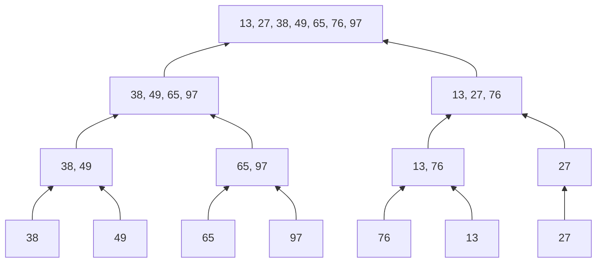

---
tags:
  - 考研
  - 数据结构
  - 算法
  - 排序
  - 归并排序
priority: 10
difficulty: 7
---

> [!abstract] 核心暴论 & 考点透析
> 归并排序是考研排序算法中的**绝对核心**，目标985此节**必须满分**。
> **核心思想**：分治法（Divide and Conquer）。将多个**已有序**的序列合并成一个有序序列。
> **内部排序默认采用**：二路归并。
> **外部排序默认采用**：多路归并。

## 一、 核心命题点：归并的数学性质（选择题/填空题必考）

> [!danger] 提分极速记忆（绝不丢分关键）
> 1. **m路归并的比较次数**：在 $m$ 个元素中选出最小/最大值，**至少需要 $m-1$ 次**关键字对比。
> 2. **二路归并每趟最多比较次数**：将两个有序子表合并为一个长度为 $n$ 的表，最多需要 **$n-1$** 次比较。
> 3. **归并趟数公式**：对 $n$ 个元素进行二路归并，归并树高度为 $h$，满足 $n \le 2^{h-1}$。
>    - **归并趟数 = $h-1 = \lceil \log_2 n \rceil$**（必须向上取整！）

## 二、 算法复现：二路归并过程 (Merge Tree)

归并排序的运行过程可视作一棵**倒立的二叉树（归并树）**。初始状态下，每个元素视为长度为 1 的有序序列。


*注：第1趟归并后序列长度为2，第2趟为4，以此类推。单出来的元素直接保留到下一趟。*

## 三、 核心代码实现（手撕代码防线）

985真题常要求修改或填空 `Merge` 函数，必须烂熟于心。

### 1. 核心操作：`Merge` (合并两个相邻有序表)
**前置条件**：`A[low...mid]` 和 `A[mid+1...high]` 分别有序。
**空间代价**：必须引入与原数组同等大小的**辅助数组 B**。

```cpp
// 辅助数组B，全局或动态分配空间与A相同
int B[MaxSize]; 

void Merge(int A[], int low, int mid, int high) {
    int i, j, k;
    // 1. 将A中所有当前处理元素复制到B中
    for (k = low; k <= high; k++) {
        B[k] = A[k];
    }
    
    // 2. 双指针逐个比较，小者放入A
    for (i = low, j = mid + 1, k = low; i <= mid && j <= high; k++) {
        // 【注意】<= 是保证算法稳定性的关键所在！
        // 如果左边B[i]和右边B[j]相等，优先放左边的，保证原相对顺序不变。
        if (B[i] <= B[j]) { 
            A[k] = B[i++];
        } else {
            A[k] = B[j++];
        }
    }
    
    // 3. 处理剩余的尾部元素（以下两个while只会执行其中一个）
    while (i <= mid)  A[k++] = B[i++]; // 左半部分没处理完
    while (j <= high) A[k++] = B[j++]; // 右半部分没处理完
}
```

### 2. 递归主干：`MergeSort` (俄罗斯套娃)

```cpp
void MergeSort(int A[], int low, int high) {
    if (low < high) { // 递归终止条件：子序列长度为1 (low==high)时停止
        int mid = (low + high) / 2; // 向下取整划分
        
        MergeSort(A, low, mid);      // 递归排序左半部分
        MergeSort(A, mid + 1, high); // 递归排序右半部分
        Merge(A, low, mid, high);    // 归并！
    }
}
```

## 四、 复杂度极致剖析（无死角背诵）

> [!success] 无论初始序列状态如何（正序、逆序、乱序），归并排序的时间复杂度**绝对不变**！

| 指标 | 结果 | 985考点深度解析 |
| :--- | :--- | :--- |
| **最好时间复杂度** | $O(n \log_2 n)$ | 每一趟对比次数约 $n/2$ 到 $n-1$，共 $\lceil \log_2 n \rceil$ 趟。 |
| **最坏时间复杂度** | $O(n \log_2 n)$ | 同上，不受数据初始分布影响。 |
| **平均时间复杂度** | $O(n \log_2 n)$ | 同上，极其稳定的优秀。 |
| **空间复杂度** | **$O(n)$** | 辅助数组占 $O(n)$，递归工作栈占 $O(\log_2 n)$。两者取最高阶 $O(n)$。**（重点防坑：不能只答栈的空间）** |
| **稳定性** | **稳定** | 核心在于 `if(B[i] <= B[j])`，保证了相等时左侧元素先合并。 |
| **适用性** | 顺序表 / 链表 | **链表也可以很方便地实现归并排序**（改链表指针即可，此时空间复杂度可降阶，这是顶级高校常考的变体）。 |
