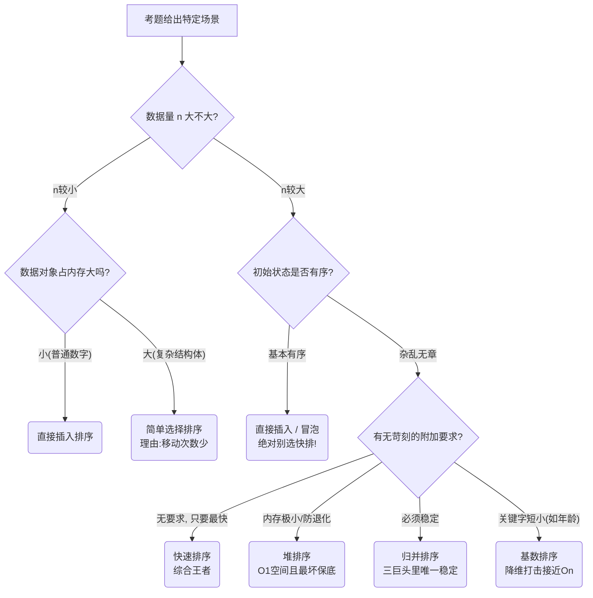

---
tags:
  - 考研
  - 数据结构
  - 排序算法
  - 时间复杂度
  - 空间复杂度
  - 稳定性
priority: 10
difficulty: 8
---

> **💡 上岸导语**：抛弃教材长篇大论，直接把考点拆解成“条件反射”。本篇所有加粗字眼，皆为历年真题题干和挖坑点。目标：看到题眼，3秒内选出正确答案。

### 🔪 一、 维度横向切片（极高频选择题考点）

#### 1. 时间复杂度（谁最快 / 谁不变）
*   **定理（必背）**：任何基于**比较**的排序，最坏时间复杂度**不可能低于 $O(n \log_2 n)$**（由**判定树**证明）。
*   **雷打不动（与初始状态完全无关）**：
    *   **简单选择排序**：无论怎样都死磕 $O(n^2)$。
    *   **堆排序**：无论怎样都建堆调整 $O(n \log_2 n)$。
    *   **归并排序**：无论怎样都无脑对半分 $O(n \log_2 n)$。
*   **天胡开局（最好情况能到 $O(n)$）**：**直接插入、冒泡**（正序时直接下班）。

#### 2. 空间复杂度（内存消耗）
*   **原地排序 $O(1)$**：插、冒、选、希、堆。
*   **递归开销**：**快速排序**（最好/平均 $O(\log_2 n)$，最坏退化成单链表为 $O(n)$）。
*   **烧内存大户 $O(n)$**：**2路归并排序**（需等大辅助数组）。

#### 3. 稳定性（是否发生“跳跃式交换”）
*   **稳如老狗**：**插、冒、归、基**（插入、冒泡、归并、基数）。
*   **跳跃渣男（不稳定）**：**选、快、希、堆**（只要带跨越交换，必不稳定，尤其是**简单选择排序**极易判错！）。

#### 4. 适用存储结构（数组 vs 链表）
*   **只能用顺序表（需随机访问）**：**折半插入、希尔、快速、堆排**。
    *   *判断依据*：用到下标跳跃（如堆排找孩子 $2i$）或双指针飞速逼近（快排）的，链表全做不到。
*   **顺序/链表双修**：直接插入、冒泡、简单选择、归并、基数。
*   **链表御用**：**直接插入、归并**（真题若问“最适合链表的”，优先找这俩）。

---

### 🕵️‍♂️ 二、 过程特征推断（大题/变态选择题杀手）

**解题心法**：看中间结果，找“全局最终归宿”。对比最终全排好序的数组，找谁已经在最终位置！

| 排序算法 | 每一趟的“过程痕迹”（真题破题点） |
| :--- | :--- |
| **快速排序** | 至少有1个元素（基准）在**最终位置**，且**左边全比它小，右边全比它大**！（灵魂考点） |
| **冒泡 / 简单选择** | 必定有1个极值元素在首或尾的**最终位置**，后续不再变动。 |
| **堆排序** | 必定有1个极值元素被扔到数组**尾部（或头部）**，且剩余前缀部分**必定依然满足堆结构**！ |
| **直接插入** | 前 $i$ 个元素**局部有序**（未必在最终位置），**后半截数据一刀未动**（和原数组对应位置完全一样）。 |

---

### 🏥 三、 场景分诊台（综合论述 / 场景选择秒杀）

考研真题如果给你具体业务场景，直接套用以下就医指南：

*   **病历1：数据量 $n$ 极小**
    *   常规选：**直接插入** 或 **简单选择**。
    *   *附加条件*：如果元素本身极其庞大（如几百个字段的结构体），必须选 **简单选择**（因为一趟最多换1次，移动极少；直插挪数据会挪死）。
*   **病历2：数据量 $n$ 极大（三巨头进场）**
    *   杂乱无章要最快：**快速排序**（内部排序实际性能之王）。
    *   内存吃紧 / 怕退化：**堆排序**（只要 $O(1)$ 空间，最坏也是 $O(n \log_2 n)$）。
    *   甲方要求必须稳定：**归并排序**。
*   **病历3：数据基本有序（极高频）**
    *   首选：**直接插入、冒泡**。
    *   **禁忌**：**绝对不要用快排**（会有栈溢出风险且退化至 $O(n^2)$）。
*   **病历4：数据量极大，但关键字位数很短（如排年龄 0-100）**
    *   首选：**基数排序**（打破比较排序下限，接近线性 $O(n)$）。
*   **病历5：数据元素体积庞大，移动巨耗时**
    *   策略：改用**链式存储**（动指针不动数据）。
    *   配药：**直接插入、归并**。

---

### 🗺️ 四、 决策神图（遇到题在脑中检索此图）

