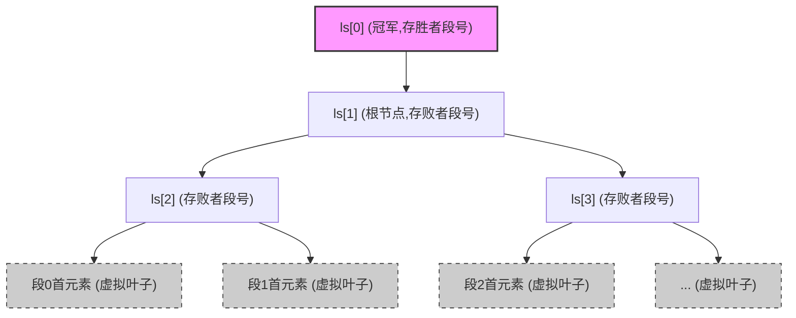

> **核心动机**：外部排序中，增加归并路数 $k$ 可以减少磁盘I/O趟数，但传统方法每找一次最小元素需对比 $k-1$ 次，导致内部CPU耗时激增。败者树将单次查找比较次数从 $O(k)$ 降至 $O(\log_2 k)$。

### 一、 败者树的结构定义
败者树在逻辑上是一棵**完全二叉树**（多加了一个头结点）。

*   **叶子结点（虚拟存在的 $k$ 个）**：代表 $k$ 个归并段当前的**首元素**（实际代码中存在对应的段数组中，不分配在树节点里）。
*   **分支结点（$k-1$ 个）**：记录左右子树对决中的**失败者所在的归并段编号**（注意：存的是段号，不是元素真实值！）。
*   **冠军结点（头结点）**：记录最终的**胜利者所在的归并段编号**。

> **比赛规则**：两个元素PK，**胜者继续向上晋级，败者留在当前分支结点**。（求最小元时，大者为败；求最大元时，小者为败）。

### 二、 核心性能指标（必考点，一分不丢）

| 操作 | 关键字对比次数 | 说明 |
| :--- | :--- | :--- |
| **初次建树** | **$k - 1$** 次 | 找出首个最值，必须两两PK，等同于常规对比。 |
| **后续调整** | 最多 **$\lceil \log_2 k \rceil$** 次 | 替换最值后，新元素只需沿着一条路径向上与之前的“败者”打擂台。 |

*   **层数推导证明（理解防遗忘）**：
    对于 $k$ 路归并，分支结点的层数决定了最多对比次数。
    具有 $h$ 层的完全二叉树，最多有 $2^{h-1}$ 个叶子。要容纳 $k$ 个叶子，需满足 $k \le 2^{h-1}$。
    解得：分支层数 $h-1 = \lceil \log_2 k \rceil$。

### 三、 手算模拟流程（大题/选择题重点）

#### 1. 初始化建树
*   将 $k$ 个归并段的第一个元素作为叶子。
*   两两结对向上比较。
*   **败者（值较大）段号留在父结点，胜者（值较小）带着自己的段号继续往上走**。
*   最终根结点的上方（冠军节点）记录整体最小元素所在的段号。

#### 2. 调整（选出下一个最小元素）
*   **替换**：将冠军节点的元素弹出，用该元素所在归并段的**下一个元素**补充到原来叶子的位置。
*   **向上打擂**：新来的元素直接与其**父结点记录的“败者”**对比。
*   **胜负裁定**：若新元素比老败者更小，新元素继续向上，老败者不动；若新元素更大，新元素的段号留在当前结点，老败者复活向上晋级。
*   重复至冠军结点更新。

### 四、 代码实现思路与数据结构
考研中若考察代码逻辑，必定基于**一维数组**实现，因为它是完全二叉树。

*   只需要一个长度为 $k$ 的整型数组 `int ls[k]` 即可表示败者树的内部节点。
*   `ls[0]`：**冠军结点**（存储最终胜出者的归并段号）。
*   `ls[1] ~ ls[k-1]`：**分支结点**（对应完全二叉树，存储失败者的归并段号）。
*   **叶子结点**不在此数组内，直接读 $k$ 个归并段的当前指针即可。

### 🚨 考研功利避坑指南（极易错点）
1.  **败者树存的是什么？** 绝对**不是真实的数据值**，而是**归并段的段号（索引）**！这样才能知道胜出后下一个元素该去哪个段里取。
2.  **新元素较少时的比较次数**：公式 $\lceil \log_2 k \rceil$ 是**上限**。由于败者树底层可能不满，若新填补的元素落在层数较浅的叶子上，实际对比次数可能小于 $\lceil \log_2 k \rceil$。
3.  **败者树 vs 胜者树**：败者树优化了“向上打擂”的过程。新元素上去直接和父结点（败者）比就行，不需要去找兄弟结点（胜者树找兄弟必须访问兄弟节点的内存，败者树直接拿父节点当前记录的值比对，减少了访存和寻址开销）。
