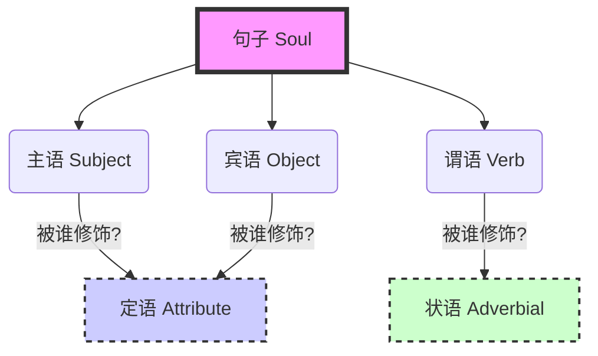

你好！我是你的英语老师。欢迎来到**2024年语法车3.0版本**的文字精讲版。

既然你没听课，我就把课上讲的所有东西，连同我当时脑子里想的、想写在黑板上的、还有我这几年几千篇外刊精读总结出来的经验，全部揉碎了喂给你。

**我们的目标很简单：** 别管你是小学水平还是考研考博，只要你能读懂中文，这堂课后，你的语法体系将完全重塑，向130+分进发。

**【课前警告】：**
不要以为这只是文字就能扫一眼过去。我在视频里说了，**不要倍速，不要跳过**。哪怕是为了省那几十分钟，最后你这里漏一点那里漏一点，这就叫“欲速则不达”。这篇内容，每一个字都要读进脑子里。

---

# 第一部分：英语句子的灵魂（核心架构）

同学们，忘掉你以前学的那些乱七八糟的术语。英语其实非常简单，比中文简单，因为它的**规则极其严格**。中文是模糊的艺术，英文是精确的逻辑。

英语句子的核心，就这五个字：**主、谓、宾、定、状**。（还有一个补语，今天先不细说，那个不影响大局）。

## 1. 铁三角：主谓宾 (The Core)
任何一句话，只要不是感叹词，都得有个“剧本”。
*   **主语 (Subject)** = **主角**。谁发出的动作？
*   **谓语 (Verb)** = **剧本/动作**。主角干了什么？
*   **宾语 (Object)** = **配角**。动作承受者是谁？

> **中文：** 我 (主) 爱 (谓) 你 (宾)。
> **英文：** I (S) love (V) you (O).

这部分中国学生不出错，因为中英文逻辑一样。

## 2. 真正的难点：定语与状语 (Modifiers)
这是你们考不了高分、读不懂长难句的根本原因。中文的修饰成分很随意，英文有严格的位置和规则。

### A. 定语 (Attribute)
*   **功能：** **死死盯住名词**。任何修饰名词（主语或宾语）的成分，都叫定语。
*   **本质：** 给主角或配角“化妆”。
*   **位置：** 这是最大的坑！
    *   简单的（形容词）：放在名词前（Red apple）。
    *   复杂的（短语、句子）：**放在名词后！**（Apple that I ate yesterday）。

### B. 状语 (Adverbial)
*   **功能：** **修饰动词**（也可以修饰形容词或句子）。
*   **本质：** 交代剧本是**怎么发生的**？（时间、地点、原因、方式、程度）。
*   **位置：** 非常灵活，句首、句中、句尾都行。

---

### 【老师的板书图解】



> **【屏幕右下角滚动红字 - 必须死记】：**
> 1. 定语修饰名词。
> 2. 状语修饰动词。
> 3. 英语的一切都在围绕这五个成分转。

---

# 第二部分：词性（英语语法的地基）

英语70%-80%的语法都在词性里。不要用中文的逻辑去脑补英文单词的词性！

## 1. 名词 (Nouns) - 主角本身
名词主要做**主语**和**宾语**。

### A. 可数 vs 不可数
别背单词书！用**逻辑**去判断：
*   **不可数：**
    *   **数不过来的：** Water (水), Air (空气), Rice (米).
    *   **抽象的/液体的/气体的：** Atmosphere (氛围), Liquid (液体), Gas (气体).
    *   **逻辑自检：** 你能拿出一个“氛围”吗？不能，所以不可数。
*   **可数：** 能一个个拎出来的。
*   **特殊情况（阅读理解关键）：** 如果你看到 `waters` 或者 `airs` 加了S，说明作者把它**具象化**了。
    *   *Waters* = 一片水域，或者某种特定种类的水。
    *   不要觉得是印错了，要根据语境去理解“种类”或“成片”的概念。

### B. 动名词 (V-ing as Noun) —— **极重要！**
把动词变成名词，只需要加 `ing`。
*   注意：这里不是正在进行时！是把动作变成了一个**事情**（名词）。
*   既然变成了名词，它就能做**主语**或**宾语**。
    *   *Swimming* is good. (游泳这件事是好的。这里Swimming是主语)

---

## 2. 代词 (Pronouns) - 主角的替身

### A. 宾格 (Object Case) - 中文没有的概念
中文说“我喜欢他”，“他”作为主语和宾语字是一样的。英文不行！
*   名词做宾语不用变，但**代词**必须变身。
*   **He (主) -> Him (宾)**
*   **They (主) -> Them (宾)**
*   **I (主) -> Me (宾)**
*   **特例：** You (主/宾都是You)，It (主/宾都是It)。
*   **应用：** 写作文千万别写出 `I like he` 这种句子，这是低级错误！

### B. 指代逻辑 (Reading Skills)
读文章、听力遇到 `It`, `This`, `That`, `They`，如果你脑子里只翻译成“它/这/那”，你完蛋了。
**必须条件反射：** 它指代了上文的**谁**？找不到指代对象，句子就读不懂。

*   **This / That (单独做主语时)：**
    *   通常指代**上一句话所说的整个事情**。
    *   *例句：* I like you. **That** is good. (这里That指代的是“我喜欢你”这件事)。
*   **Those (单独做主语/宾语时)：**
    *   大概率指代**人**（那些人）。
    *   *例句：* **Those** who believe in magic... (那些相信魔法的人...)

---

## 3. 形容词 (Adjectives) - 名词的化妆师

**核心功能：** 做定语，修饰名词。

### A. 位置的灵活性 (难点)
*   **前置：** *Red* apple. (简单，大家都懂)
*   **后置：** 这是英语的高级用法，也是阅读障碍点。**形容词可以放在名词后面！**
    *   常用于：修饰不定代词 (something important)。
    *   **高阶用法：** 当形容词后面带着一串“拖油瓶”（介词短语等）太长了，必须扔到名词后面。

> **还原老师课上口述的例句：**
> "I like the book **beautiful from my perspective**."
> *   分析：`beautiful` 是形容词，修饰 `book`。
> *   `from my perspective` 是介词短语，修饰 `beautiful`。
> *   因为 `beautiful from my perspective` 这一坨太长了，所以放在 `book` 后面。
> *   **翻译：** 我喜欢这本在我看来很美丽的书。

---

## 4. 动词 (Verbs) - 句子的心脏
这是今天的重头戏。

### A. 及物 (Vt) vs 不及物 (Vi)
不要死记硬背！看意思！
*   **及物 (Vt)：** 动作必须要有一个承受者（宾语）。动作是**作用在别人身上**的。
    *   *Locate*: 意思是“确定...的位置”。你不能光说“我确定位置”，你得说“我确定了**手机的**位置”。
    *   所以 `I want to locate my phone.` (正确)
    *   如果你想把 `locate` 翻译成“位于”，必须用被动：`My phone is located in...` (我的手机被定位在...)。
*   **不及物 (Vi)：** 动作主角自己嗨，不需要别人（无宾语）。
    *   *Happen*: 发生。`Something happened.` (完事了，不需要加宾语)。
    *   *Take place / Occur*: 同理。
    *   **推论：** 不及物动词**没有被动语态**！（因为没有宾语去承受动作）。

---

# 第三部分：时态 (Tense) - 不是规则，是意思！

**【重要观念重塑】：**
**时态 = 意思**。
不要问“这句话用什么时态是对的？”，要问“**你想表达什么意思？**”。你想表达什么意思，就选什么时态。

这里不讲16种时态，只讲最核心、最常用、最容易错的。

## 1. 一般过去时 (Past Simple)
*   **形式：** `did` / `loved`
*   **意思：** 事情发生在过去，**已经结束了**。
*   **潜台词：** 跟现在没啥关系了，或者现在情况不明。
    *   *I loved this book.* (我昨天/以前喜欢这书。今天喜不喜欢？不知道，或者暗示今天不喜欢了。)
    *   **一定要读出这个“过去了”的味道。**

## 2. 完成时 (Perfect Tense) - “话里有话”
*   **形式：** `have/has` + `done` (过去分词)
*   **意思：** 
    1. 动作发生在过去。
    2. **重点是：对当下造成了“影响”！**

> **场景模拟：**
> 朋友问：去看电影吗？
> 你说：**I have watched this movie.** (我已经看过这电影了)。
>
> **这句话的“影响” (话里有话) 是什么？**
> --> 我不想去了。
> --> 我知道剧情了。

> **写作高级用法（老师的绝招）：**
> *   句子：`Developing economy is good because we have already benefited a lot.`
> *   分析：为什么要用完成时？
> *   因为“我们已经受益很多”这个事实，**支撑/影响**了前半句的观点“发展经济是好的”。这就是逻辑上的因果影响。

### 2.1 过去完成时 (Past Perfect) - 时间轴的艺术
*   **形式：** `had` + `done`
*   **意思：** **过去的过去**。对过去某段时间产生影响。
*   **图解逻辑：**
    ```mermaid
    timeline
        title 过去完成时逻辑
        Past(Past): 唐朝(Tang Dynasty)
        Before_Past(Before Past): 唐朝之前的政策 -> 影响了唐朝
        Present(Now): 现在
    ```
*   如果你在描述唐朝的一个政策，这个政策在唐朝那个时期（过去）已经完成了并产生了影响，那就用过去完成时。

### 2.2 现在完成进行时 (Present Perfect Continuous)
*   **形式：** `have been doing`
*   **意思：** **一直**。
*   **中文逻辑：** 从过去某个点开始做，一直做，做到现在还在做，甚至未来还要做。
    *   *I have been teaching English for 10 years.* (我教英语教了10年了，一直在教，现在还在教)。

## 3. 进行时 (Continuous)
*   **形式：** **Be + doing** (注意！必须有Be动词！光有doing那是动名词！)
*   **意思：**
    1. **正在进行：** 此时此刻正在发生。
    2. **将来的延伸：** 既然没停，那就会延伸到未来。
        *   *I am coming.* (我正在来 -> 我马上就到)。
        *   *I am going to do this.* (Be going to 表将来，逻辑源于此)。

> **易错点：** `While` 后面一定要加进行时吗？
> **老师怒吼：** 别背这种死规则！`While` 只是表示“当...时候”，通常那个时候事情正在发生，所以**常用**进行时，但不是**绝对**。一切看意思！

## 4. 将来时 (Future)
*   **形式：** `will do` / `be going to do`
*   **意思：** 
    *   **Will:** 意愿，或者大概率会发生。
    *   **Be going to:** 计划，打算。
*   **灵魂拷问：** `I will do this.` 这件事现在做了吗？
    *   **答案：** **不知道 / 还没做。** 绝对不是已经做了。在写作和阅读时，看到将来时，要明白这事儿目前还是个空气。

## 5. 一般现在时 (Present Simple) - 作文重灾区
*   **形式：** `do` / `is`
*   **意思：** **客观事实，永恒真理，经常发生的动作。**
*   **写作大坑：**
    *   你写：`AI helps us do many things.` (人工智能帮我们做很多事)。
    *   **老师质问：** 这是一定的吗？是客观真理吗？AI就不能帮倒忙吗？
    *   **纠正：** 既然是观点，就不是客观事实。不要用绝对的一般现在时。
    *   **怎么改？** 加情态动词！ -> `AI **can** help us...` 或者 `AI **might** help us...`

---

# 第四部分：语态 (Voice) - 主动与被动

英语里就俩语态：主动，被动。
*   **被动公式：** **Be + Done (过去分词)**
*   **逻辑：** 只有**及物动词**才有被动！（不及物动词没有动作承受者，怎么被动？）
*   **应用：**
    *   主动：I love you.
    *   被动：You **are loved** by me. (注意：is/am/are 根据时态变，loved 是过去分词)。
    *   **切记：** 被动语态本身就是谓语。

---

# 第五部分：情态动词 (Modal Verbs) - 态度与概率

情态动词是给动词加“滤镜”的，表示语气、态度、概率。
*   **规则：** **情态动词 + 动词原形**。
*   **把它们看作一个整体**：`can do` 这一坨是谓语。

## 1. 概率阶梯 (从低到高)
*   **Might / May:** 可能（概率低）。
*   **Could:** 能够/可能（概率中）。
*   **Can:** 能（概率中高）。
*   **Will:** 将要（概率非常高，几乎确定）。
*   **Must:** 必须（命令，或者是100%的推测）。

## 2. Should (作文必用)
*   意思：应该。
*   **逻辑暗示：** **还没做！**
    *   *Schools should educate students.* (学校应该教育学生 -> 暗示学校现在可能没做好)。
    *   **看图作文避坑：** 如果图画里已经画出来这个人在做了，你就不能用 `He should do...`，因为他已经在做了！你要用描述性的时态（进行时或一般时）。

## 3. Need (两面派)
*   **用法1：作情态动词** -> `Need do something` (直接加动词原形)。
*   **用法2：作普通动词** -> `Need to do something` / `Need something`。
    *   作普通动词时，它是及物的，可以有被动：`This book is needed.`

---

# 第六部分：课后总结与练习（还原老师脑补的作业）

**【屏幕右下角滚动红字 - 复习区】**
1.  主语是主角，谓语是剧本，宾语是配角。
2.  定语一定要找它修饰的名词；状语找它修饰的动词。
3.  形容词可以放在名词后面！(Something important / Book written by him)。
4.  时态是意思，不是规则。想表达什么意思，就用什么时态。
5.  将来时 = 还没做。
6.  Should = 还没做。
7.  客观事实才用一般现在时，表达观点记得加情态动词(can/could)。

**【给你的练习题】** (请用今天学的逻辑去分析，不要凭语感)

1.  **翻译：** 我想要定位这只在桌子上睡觉的猫。
    *   *提示：* 动词Locate是及物还是不及物？“在桌子上睡觉”是修饰谁的？做定语应该放在哪？
    *   *参考答案：* I want to **locate** (Vt) the cat **sleeping on the table** (定语后置).

2.  **改错：** `While I walking on the street.`
    *   *提示：* 动词形式对吗？句子有谓语吗？
    *   *解析：* 错。Walking是动名词/分词，不是谓语。进行时必须加Be动词。
    *   *更正：* While I **was** walking...

3.  **深度理解：** 为什么 `Developing AI is good.` 这句话在严谨写作中最好改成 `Developing AI could be good.`?
    *   *解析：* Is good 太绝对，变成客观真理了。Could be good 表示可能性，更客观严谨。
