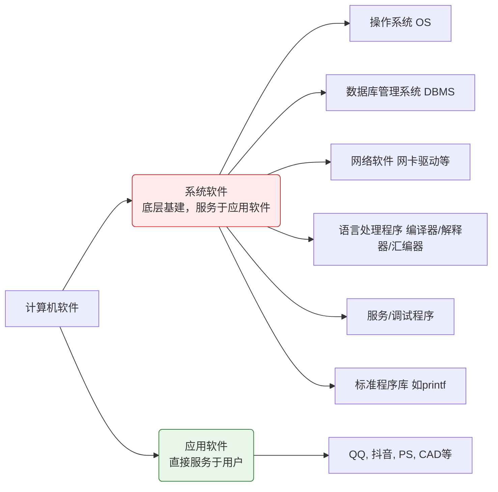
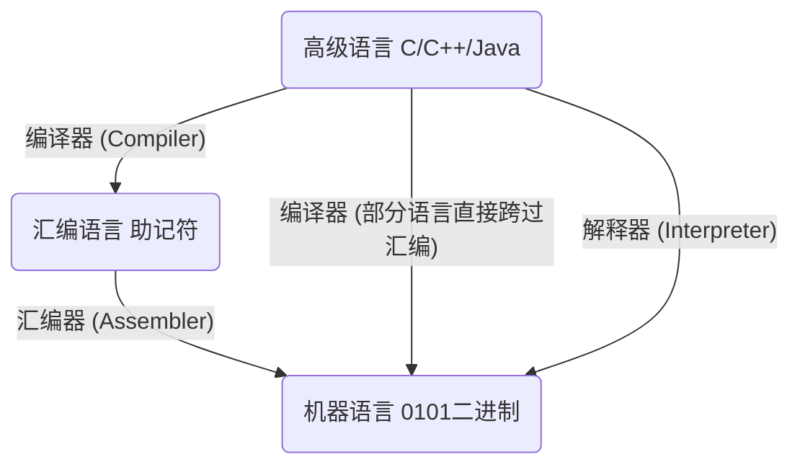

### 一、 计算机软件分类（选择题常设坑点）
**核心考点：** 区分系统软件和应用软件。**注意：数据库、语言处理程序常被误认为是应用软件，这是必考易错点！**

---

### 二、 编程语言与翻译程序（高频单选题）

所有的**翻译程序**（编译、汇编、解释）本质工作都是：**把高级的语言翻译成低级的机器语言。**

#### 1. 语言翻译层级路径

#### 2. 编译程序 vs 解释程序（必考对比）
这是送分题，记住**“翻译时机”**和**“执行效率”**的区别：

*   **编译程序 (Compiler)** = **“整本翻译出书”**
    *   **机制：** 将源程序**一次性全部**翻译成机器语言（如生成 `.exe`），然后再执行。
    *   **特点：** 只翻译一次，后续直接执行机器码。效率高。
*   **解释程序 (Interpreter)** = **“同声传译”**
    *   **机制：** 程序执行时，**每执行一句就翻译一句**成机器指令。
    *   **特点：** 不生成独立的可执行文件。如果遇到循环语句（同一段代码执行多次），**每次都要重新翻译**。效率低。

---

### 三、 软硬件逻辑功能等价性（概念判断题）

**核心定律：同一个逻辑功能，既可以用硬件实现，也可以用软件实现。二者在逻辑功能上是等价的。**

*   **硬件实现（直接造物理电路）：** 
    *   *比喻：* CPU内置乘法器，直接算乘法。
    *   *特点：* 性能高（快） 🚀，成本高（贵） 💰。
*   **软件实现（用基础指令拼凑）：** 
    *   *比喻：* CPU只有加法器，用6条加法指令实现 $\text{985} \times \text{6}$。
    *   *特点：* 性能低（慢） 🐢，成本低（便宜） 📉。

---

### 四、 指令集体系结构 ISA（核心拔高概念）

**考研名片：** `ISA (Instruction Set Architecture)`
*   **是什么：** 它是软件和硬件之间的**界面 / 界限**。
*   **干什么：** 既然软硬件功能等价（都能干活），ISA 就负责规定**“界限划在哪”**（综合平衡性能与成本）。
*   **包含啥：** 规定了计算机能支持**哪些指令**、指令的**作用**、指令的**用法**。

> **💡 985考研复习避坑指南：**
> 1. 看到“翻译程序”，脑子里立刻反应出它包含：编译程序、汇编程序、解释程序。
> 2. 看到“DBMS（数据库管理系统）”，毫不犹豫选**系统软件**。
> 3. 选择题如果说“软硬件逻辑等价意味着软件可以完全取代硬件”，**错！**等价指的是**逻辑功能**，但性能和成本天差地别，且最底层的操作必须有硬件支撑。
