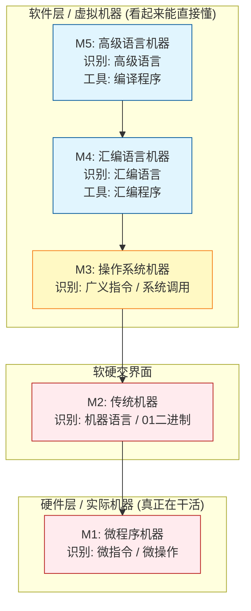

---
tags: [考研, 计算机组成原理, 系统层次, 体系结构, 硬件组装]
priority: 8
difficulty: 2
---

> **核心考法**：本节必出选择题。重点考察**各层的翻译程序对应关系**、**体系结构与组成原理的区别**（高频考点）、以及**“透明”的计算机定义**。

### 📊 计算机系统的五级层次结构

这里直接记住层级划分和每层的“行话”。**下层是上层的基础，上层是下层的扩展。**

#### 💡 核心得分点（选择题秒杀区）
1. **翻译路径**：高级语言代码 $\xrightarrow{编译程序}$ 汇编语言 $\xrightarrow{汇编程序}$ 机器语言。
2. **汇编语言特性**：汇编语言与机器语言（二进制代码）是**一一对应**的关系，只是加上了人类好记的助记符。本质依然是低级语言。
3. **概念等价替换**（考研极爱玩文字游戏）：
   * **系统调用 = 广义指令**（OS提供给程序员的接口）。
   * **微指令 = 微操作**（CPU执行一条机器指令所需划分的最细小步骤，如：取数指令分为9个微操作）。
4. **虚拟机器的本质**：机器其实**根本看不懂**高级/汇编语言，只是通过软件翻译后“看起来像能看懂一样”。

---

### ⚔️ 体系结构 vs 组成原理（极易混淆考点）

做题时遇到判断两者区别，直接套用这个**“乘法比喻”**：

| 概念分类 | 关注点（人话版） | 例子 | 考试视角 |
| :--- | :--- | :--- | :--- |
| **计算机体系结构** *(Architecture)* | **“有没有？”** (软硬件接口设计) | 机器要不要提供“乘法指令”？ (没有的话程序员只能写连加) | 机器语言程序员**可见**的属性（指令集、寄存器结构等概念性结构）。 |
| **计算机组成原理** *(Organization)* | **“怎么做？”** (硬件具体实现) | 这个“乘法指令”是用专门的乘法器电路实现，还是用加法器实现？ | 硬件如何实现接口，对上层程序员**透明（不可见）**。 |

---

### 👻 考研防坑词汇：“透明” (Transparent)

**在计算机专业课中，透明 = 你看不见它（不可见）！**
* 🌰 **比喻**：海贼王里的“透明果实”，吃完人就变透明了，别人就**看不见**他了。
* 📝 **做题应用**：如果题目说“硬件的具体电路实现对高级语言程序员是透明的”，意思是高级语言程序员**不需要也不可能看到**底层的硬件电路长什么样。
