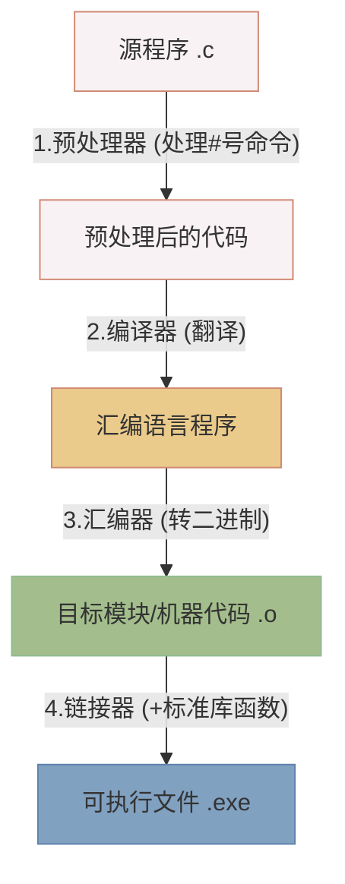
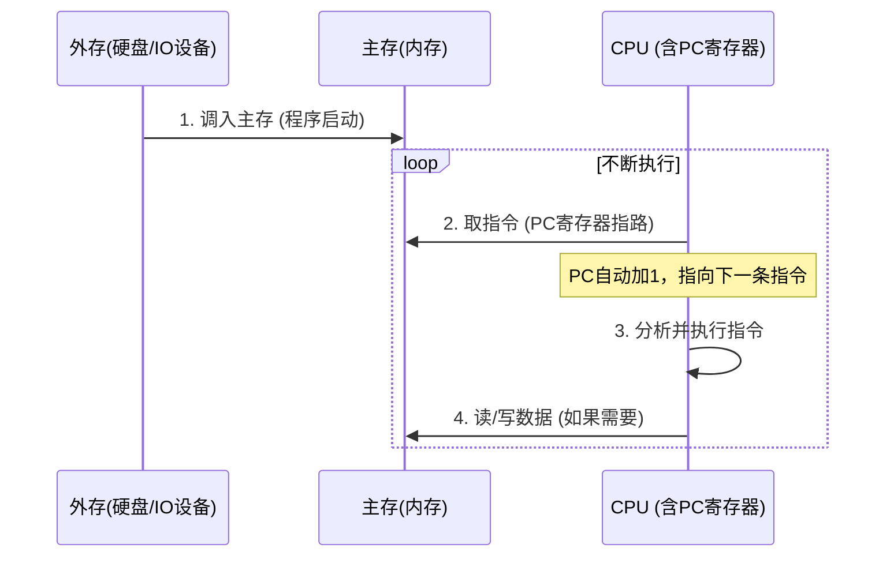

> **核心目标**：彻底拿下“程序如何变可执行文件”及“程序如何运行”的选择题考点。拒绝混淆编译和汇编，秒杀PC寄存器概念。

### ⚙️ 一、 程序的“投胎”全过程（必考选择题）

把我们写的C语言变成能双击运行的`.exe`，需要经过 **4个核心车间**。
**考点核心：记准每个步骤的“输入”和“输出”！**

#### 🧠 功利化记忆（人话翻译）：
1. **预处理器 (Preprocessor)**：**只搞“代换”**。把宏定义（如 `#define PI 3.14`）直接替换成数字，把 `#` 开头的命令先处理掉。（*考点：为了人读着方便写的宏，机器不认，必须先还原*）。
2. **编译器 (Compiler)**：**C语言 ➡️ 汇编语言**。这是最难的一步，把高级语言翻译成底层的汇编。
3. **汇编器 (Assembler)**：**汇编 ➡️ 机器语言(0101二进制)**。生成的文件叫**目标模块 (`.o`)**。此时还是个半成品。
4. **链接器 (Linker)**：**打包拼装**。你代码里用到的 `printf` 等标准库函数，在这步和你的`.o`文件“缝合”，最终生成完整的**可执行文件**。

---

### 🏃‍♂️ 二、 程序运行的底层逻辑（冯·诺依曼精髓）

程序生成后，怎么跑起来？记住以下流程和**3个绝对不丢分的死角**：

#### ⚠️ 考研必秒坑点（直击130分）：
1. **程序存哪里？**
   * 没运行时：躺在**外存（硬盘）**里，属于I/O设备。
   * 运行时：必须先调入**主存（内存）**！CPU不能直接执行硬盘里的程序。
2. **指令和数据怎么存？**
   * **无差别存放！** 指令和数据在主存里都是一堆0101的二进制，都有对应的物理地址。CPU运行程序的过程就是不断去主存找指令和数据的过程。
3. **PC寄存器（程序计数器）是干嘛的？**
   * **死记：永远指向【下一条】即将执行的指令！** 不是当前这条！每执行一条指令，PC就会自动加1（或者加一个指令字长）。
