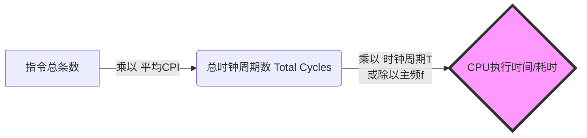

> **复习定调**：本节全篇考点，**极易在选择题和大题的第一问设坑**。核心在于掌握“三大计算（存储、CPU耗时、IPS）”与“一套天坑（单位换算区别）”。切勿死记硬背，看懂逻辑直接秒杀。

### 一、 存储器指标计算（“房间与门牌号”）

核心逻辑：**MAR决定有多少个房间，MDR决定每个房间能装多少人。**

- **MAR（地址寄存器）位数** = $n \rightarrow$ 最大存储单元数（房间数） = $2^n$ 个
- **MDR（数据寄存器）位数** = $m \rightarrow$ 每个存储单元字长（房间大小） = $m$ bit
- **最大总容量** = $2^n \times m$ (bit) = $\frac{2^n \times m}{8}$ (Byte)

> ⚠️ **避坑预警**：题目常给“按字节寻址”或“按字寻址”，注意区分总容量的单位是 `b` (bit/比特) 还是 `B` (Byte/字节，1B = 8b)。做题时，看到 MAR 默认按最大容量算。

### 二、 CPU核心性能指标（必考计算题）

把 CPU 执行指令当成 **“做广播体操”**：
*   **时钟周期 ($T$)**：做一个动作的时间（如纳秒 $ns$）。
*   **主频 ($f$)**：一秒钟喊多少个节拍（如 $GHz$）。$f = \frac{1}{T}$
*   **CPI (Cycles Per Instruction)**：**平均**做完一套操（一条指令）需要几个节拍（时钟周期）。

#### 📌 黄金推导链条（背熟吃透大题）

**两大核心公式：**
1. **CPU执行耗时** = $\frac{\text{指令条数} \times \text{CPI}}{\text{主频 } f}$
2. **IPS（每秒执行指令数）** = $\frac{\text{主频 } f}{\text{平均 CPI}}$ 
   *(若求 MIPS，算出来后再除以 $10^6$)*

> ⚠️ **深度考点（选择题常设坑）**：
> CPI 是一个**平均值/微观无意义**。即使是**同一台CPU**执行**同一条指令**，CPI也可能不同！（受主存当前负荷/Cache命中率等状态影响）。

### 三、 ⚡ 绝对红线：数量单位的“两套标准”（错一个全盘皆输）

考研真题最爱在这里挖坑！**算容量底数是2，算速率/频率底数是10。**

| 符号 | **表示容量、文件大小、地址空间时**   *(如存储器大小)* | **表示频率、速率、性能时**   *(如 主频Hz, IPS, FLOPS, 传输率bps)* |
| :--- | :--- | :--- |
| **K** | $2^{10} = 1024$ | $10^3$ (千) |
| **M** | $2^{20}$ | $10^6$ (百万) |
| **G** | $2^{30}$ | $10^9$ (十亿) |
| **T** | $2^{40}$ | $10^{12}$ |
| **P** | *(大纲新增)* $2^{50}$ | $10^{15}$ |
| **E** | *(大纲新增)* $2^{60}$ | $10^{18}$ |
| **Z** | *(大纲新增)* $2^{70}$ | $10^{21}$ |

*记忆口诀*：新增单位按字母顺序 **PEZ**（PEZ糖果），每升一级乘 $10^3$ 或 $2^{10}$。

### 四、 系统整体指标与“跑分”陷阱

- **数据通路带宽**：数据总线**一次并行**传输的二进制位数。（注：分两次传不如一次传宽带高）。
- **吞吐量**：单位时间内处理的请求数量（考察系统宏观处理能力）。
- **响应时间**：从发请求到给反馈的耗时。

#### 💡 选择题秒杀：反直觉概念辨析
（以下结论直接当做公理判断选择题）
1. **主频越高的 CPU 越快？**
   ❌ **错。** 还要看 CPI 和指令集。别人主频低但 1 个周期做完，你主频高但 10 个周期才做完，你更慢。
2. **主频相同 + 平均 CPI 相同，性能一定一样？**
   ❌ **错。** 还要看指令集架构。A CPU 用一条硬件指令算乘法，B CPU 用 10 条软件加法算乘法，A 吊打 B。
3. **基准程序（跑分软件）得分高，机器一定更好？**
   ❌ **错。** 跑分软件的指令频度（如重度测试图像处理）可能和你的实际使用场景完全不符。跑分仅供参考。
