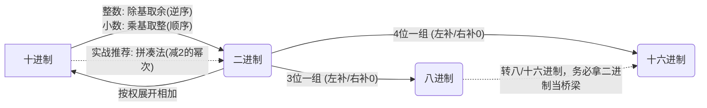

---
tags:
  - 考研
  - 计算机组成原理
  - 数据的表示和运算
  - 进制转换
priority: 8
difficulty: 3
---

> **考研功利导向**：本节属于必拿分的**送分题基础**，大题和选择题的底层基石。核心在于**又快又准**地完成进制转换，重点掌握**拼凑法**秒杀计算，以及避开**小数精度丢失**的选择题陷阱。

### 🗺️ 核心进制转换路线图

---

### 一、 常见进制书写规范（防掉坑）
做题时第一眼看后缀/前缀，别算错基数：
- **二进制 (Binary)**：后缀 `B` (如 $1010B$)
- **十进制 (Decimal)**：后缀 `D` (如 $123D$)
- **十六进制 (Hex)**：后缀 `H` 或 前缀 `0x` (如 $0xFF$ 或 $FFH$)
- **数值映射**：十六进制中 $A=10, B=11, C=12, D=13, E=14, F=15$

---

### 二、 核心转换算法（不丢分绝对指南）

#### 1. 十进制 $\rightarrow$ 二进制（考场**首选拼凑法**，绝不用除法硬算）
**🧠 高效背诵全值（提速必备）**：
- **整数位**：$2^0=1, 2^1=2, 2^2=4, 2^3=8, 16, 32, 64, 128, 256, 512$
- **小数位**：$2^{-1}=0.5, 2^{-2}=0.25, 2^{-3}=0.125$

**💡 实战拼凑法演示**：
> **例 1**：将十进制 $260.75$ 转二进制。
> - 整数部分 $260 = 256 + 4$ $\rightarrow$ 对应权值位置填1，即 $100000100_B$
> - 小数部分 $0.75 = 0.5 + 0.25$ $\rightarrow$ 即 $0.11_B$
> - **秒杀结果**：$100000100.11_B$

> **例 2**：十进制 $533.125$
> - $533 = 512 + 16 + 4 + 1$ $\rightarrow 1000010101_B$
> - $0.125 = 2^{-3}$ $\rightarrow 0.001_B$
> - **秒杀结果**：$1000010101.001_B$

**⚙️ 兜底常规法（遇到拼凑不出的畸形数字时使用）**：
- **整数部分：除基取余法**。不断除以2取余数，**先得到的余数是低位（写在最右，从下往上读）**。
- **小数部分：乘基取整法**。不断乘以2取整数，**先得到的整数是高位（紧贴小数点，从上往下读）**。

#### 2. 二进制 $\leftrightarrow$ 八/十六进制
- **口诀**：八进制3位一组，十六进制4位一组。
- **⚠️ 绝命陷阱（极易失分）：补0规则**
  - **整数部分**：位数不够，在**最高位（最左边）**补0。
  - **小数部分**：位数不够，在**最低位（最右边）**补0。*(考场上极容易把小数右边当成前面导致错位！)*
  - *示例*：$0.11_B$ 转八进制。补齐三位变成 $0.110_B$，值为 $0.6_O$。如果不补0当成 $011_B$ 算成 $0.3$ 就痛失大题分数！

#### 3. 任意进制加法
- **法则**：**逢 $r$ 进 1**（考场上用十进制加完，减去 $r$，往高位进1）。
- *示例*（十六进制）：$5.8_H + 0.9_H$
  - 小数位：$8 + 9 = 17$ (十进制)
  - $17 \ge 16$，逢16进1：$17 - 16 = 1$，留下 $1$，往整数位进 $1$。
  - 整数位：$5 + 0 + 1(进位) = 6$
  - **结果**：$6.1_H$

---

### 三、 🎯 考研选择题高频陷阱总结

1. **小数精度丢失定理（必考判断）**
   - **十进制整数** $\rightarrow$ 二进制：**必定可以精确转换**。
   - **十进制小数** $\rightarrow$ 二进制：**极可能无法精确表示**（如 $0.3$ 乘2取整会无限循环：$0.6 \rightarrow 1.2 \rightarrow 0.4 \rightarrow 0.8 \rightarrow 1.6 \rightarrow 1.2$...）。
   - *结论*：只有当十进制小数可以完全拆解为 $2^{-n}$ 的和时（如 $0.5, 0.75, 0.125$），才能在计算机中无误差精确表示。

2. **真值 vs 机器数**
   - **真值**：人看的，带正负号 `+` `-` 的数值（如 $-75$）。
   - **机器数**：计算机存的，符号被数字化（通常用 `0` 变正，`1` 表负），存入寄存器或内存的纯0/1串。
