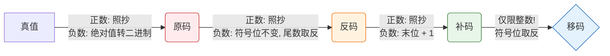

> [!abstract] 核心定调：不要死磕底层逻辑，考研只考**转换规则、表示范围、特殊值（0和最小负数）**。
> **定点数** = 小数点位置钉死（常规数字）。
> **浮点数** = 小数点会跑（科学计数法）。

### 一、 无符号数（全是数值，没有符号）
- **前提**：一般只考**整数**（如C语言的`unsigned int`），不考无符号小数。
- **表示范围**（若有 $n$ 位）：**$0 \sim 2^n - 1$**。
- **考点**：$n$个全1的值等于 $2^n - 1$ （全1加1会产生溢出进位，留下全0，据此可秒杀推导）。

---

### 二、 有符号数：四码转换逻辑（绝对重点）
**默认前提**：机器字长 $n+1$ 位 = **$1$位符号位 + $n$位数值位（尾数）**。
符号位：`0`代表正，`1`代表负。小数点隐含位置：整数在最低位后，小数在符号位后。

#### 1. 转换流水线 (考场大脑反射区)

#### 2. 考场秒杀口诀：
- **正数**：原 = 反 = 补。（正数三码合一，只有移码是符号位取反）
- **负数转补码**：原码连同符号位不动，**尾数取反，末位加1**。
- **补码逆向求原码**：别去减1再取反！直接用同等操作：**尾数取反，末位加1**，殊途同归！另一种方法：**从右往左看，找到第一个1，1及右边不变，左边的数字全取反**。
- **补码算真值**：**位权法**：最高位（符号位的权重）是负数，其余所有位的权重都是正数。补码1011的真值：$1*(-2^3)+0*(2^2)+1*(2^1)+1*(2^0) = -5$

> [!tip] ⚡ 高阶秒杀技：已知 $[x]_补$ 求 $[-x]_补$
> **连同符号位在内，全部取反，末尾加1。**
> *示例*：$[13]_补 = 0,0001101$ ➔ $[-13]_补 = 1,1110010 + 1 = 1,1110011$。极大节省做题时间！

---

### 三、 核心考点：表示范围与“真值0”的坑
> [!warning] 命题人最爱考：多出来的那个负数去哪了？
> 原码、反码的 `0` 都有两种表示（$+0$ 和 $-0$），导致浪费了一个编码。
> 补码、移码的 `0` 只有一种表示，**把原本$-0$的位置，拿去表示了一个更小的负数！**

#### 1. 范围对比表（字长 $n+1$ 位：1位符号 + $n$位数值）

| 码制 | 定点整数范围 | 定点小数范围 | 真值0的表示 | 特殊点/用途 |
| :--- | :--- | :--- | :--- | :--- |
| **原码** | $-(2^n - 1) \sim 2^n - 1$ | $-(1 - 2^{-n}) \sim 1 - 2^{-n}$ | 2种 ($+0, -0$) | 符合人类直觉 |
| **反码** | $-(2^n - 1) \sim 2^n - 1$ | $-(1 - 2^{-n}) \sim 1 - 2^{-n}$ | 2种 ($+0, -0$) | 仅作中间过渡用 |
| **补码** | $\mathbf{-2^n} \sim 2^n - 1$ | $\mathbf{-1} \sim 1 - 2^{-n}$ | **1种** (全0) | 计算机硬件御用，**多表示一个负数** |
| **移码** | $-2^n \sim 2^n - 1$ | **(不用于表示小数)** | **1种** ($10...0$) | 保持递增，用于比大小（浮点数阶码） |

#### 2. 死记硬背的“极值”二进制形态
如果你在卷面上看到符号位为 `1`，尾数全 `0` （即 `1000...0`）：
- 在 **原码** 中：它是 **$-0$**
- 在 **反码** 中：它是 **$-127$** (假设8位，即 $-(2^n-1)$)
- 在 **补码** 中：它是 **$-128$** (整数：$-2^n$) 或 **$-1$** (小数) 👈 **极高频考点**
- 在 **移码** 中：它是 **最小值** (即 $-128$)

---

### 四、 移码的降维打击理解
为什么要有移码？为了**骗过硬件**让它直接比大小。
- 补码中：`-128` 是 `10000000`，`+127` 是 `01111111`。硬件直接当无符号数比的话，反而觉得负数大。
- **移码操作**：把补码符号位翻转。`-128` 变成了 `00000000`，`+127` 变成了 `11111111`。
- **结论**：**移码看作无符号数时，全0最小，全1最大，单调递增。**（注：移码只针对整数）。
