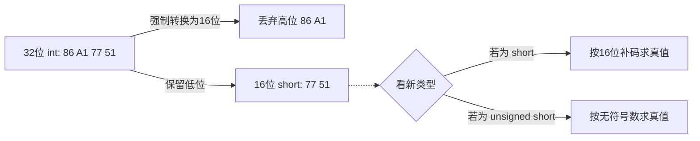

> [!abstract] 考点本质（直击130分核心）
> C语言中的定点整数强制类型转换，**底层只干两件事**：
> 1. **改解释方式**（长短不变时）：内存里的0和1**绝对不变**，只换个“滤镜”看它。
> 2. **改变机器码长度**（长短变化时）：必须动内存，长变短“暴力砍头”，短变长“巧妙填补”。
> 
> 🎯 **做题铁律：短变长（扩展）时，无论怎么补，数据的真值（十进制值）绝对不能变！**

### 一、 长度不变：有符号 ↔ 无符号
**【口诀】不动内存，只换视角**

*   **底层动作**：二进制机器码（补码）**原封不动**复制。
*   **真值变化**：可能发生巨变！正数不变，负数会变成巨大的正数。

**🌰 考试场景复现**：
`short x = -4321;` (补码: `1110 1111 0001 1111`)
`unsigned short y = (unsigned short)x;`
> 内存中 `y` 的机器码依然是 `1110 1111 0001 1111`，但 CPU 此时把它当做纯正数（无符号）来算，它就变成了 `61215`。全取对的关键：**千万别去转什么原码反码，直接按位原样抄下来！**

---

### 二、 长变短：`int` → `short`
**【口诀】暴力砍头，只留低位**

*   **底层动作**：直接把多出来的高位字节截断丢弃。
*   **真值变化**：大概率发生改变（数据丢失）。截断后剩下的低位，根据**新类型**（是否有符号）重新解释。

---

### 三、 短变长：`short` → `int`（高频必考❗）
**【口诀】无补零，有补符**

为什么需要扩展？因为 CPU 寄存器和 ALU 的位宽是固定的（比如32位），短数据进去算之前必须先“撑大”。为了保证**真值不变**，必须按原类型规则填补高位：

| 原数据类型 | 扩展方式 | 怎么补？（多出来的高位） | 结果真值 |
| :--- | :--- | :--- | :--- |
| **无符号数** (`unsigned`) | **零扩展** | 高位全部补 **`0`** | **绝对不变** |
| **有符号数** (`int`/`short`) | **符号扩展** | 高位全部补 **原符号位** | **绝对不变** |

#### 1. 零扩展（Zero Extension）
*   **适用**：无符号数 (`unsigned`)
*   **做法**：缺多少位，高位就补多少个 `0`。
*   **示例**：8位 `1010 0110` (166) ➜ 16位 `0000 0000 1010 0110` (依然是 166)

#### 2. 符号扩展（Sign Extension）—— 考研超级重点
*   **适用**：带符号整数（底层是补码）
*   **做法**：缺多少位，高位就全填上原本的**符号位**（正数填0，负数填1）。
*   **示例 (正数)**：8位 `0101 1010` (90) ➜ 16位 `0000 0000 0101 1010` (正数补0)
*   **示例 (负数)**：8位 `1010 0110` (-90补码) ➜ 16位 `1111 1111 1010 0110` (负数全补1)

> [!danger] 避坑警告：考研常设陷阱
> 命题人极喜欢考：**负数的符号扩展**。
> 别去想“原码反码中间加塞”，那太慢且容易错！
> **最高效做题法**：看到负数补码变长，直接在它最左边**疯狂复制`1`**，直到凑够位数。拓展后的真值和原真值严格相等。

---

### 🧠 满分综合推演（拿走130分的底气）

如果遇到连环转换：`short x = 负数` ➜ `unsigned int p`，机器怎么做？
1. **先变长，后变性**（这是C语言的默认隐式规则，如果显式拆解就是网课逻辑）：
   `x` 先进行**符号扩展**变成32位带符号补码（高位全补1）。
2. 然后进行**解释视角的转换**，机器码不动，按无符号数去读，变成一个巨大的正数。

**只要记住：“换长短看补位规则，换符号只换看戏的眼睛”，这部分的分数你就一分都不会丢。**
