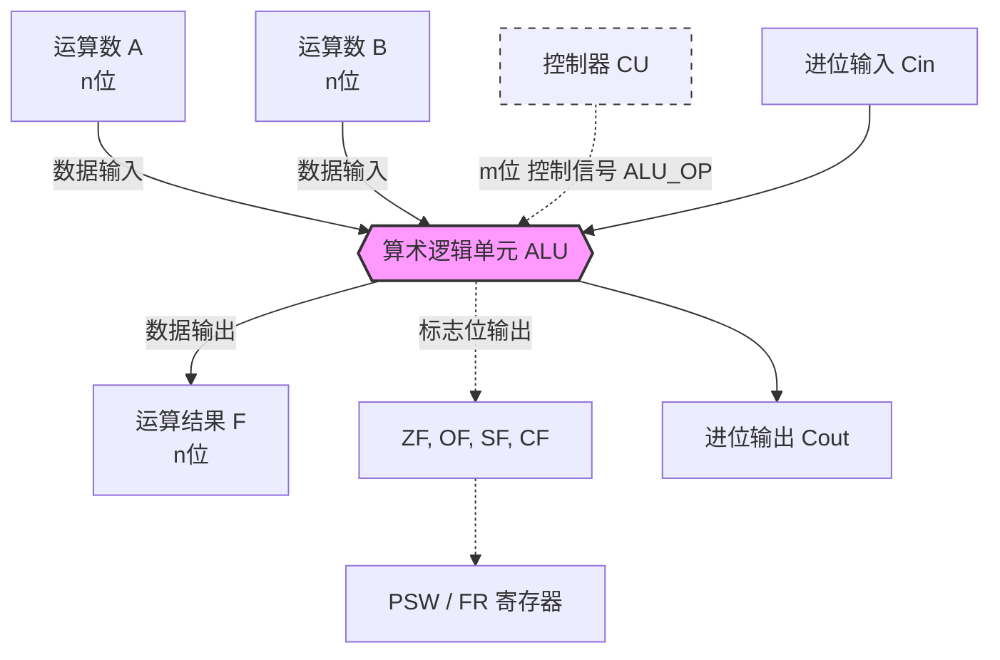

# 【计组】算术逻辑单元 ALU 核心考点剖析

> [!abstract] 核心提要
> 本节内容是计组**大题看懂硬件数据通路图**的基础。
> **功利性指导：** ALU内部的**电路实现细节（比如多路选择器怎么连线）绝对不考**，不要浪费时间！我们要掌握的是：**它的地位、它的引脚（输入输出到底是什么）、以及控制信号位数的计算。**

## 一、 ALU 的“套娃”地位（🌟必秒选择题）
只要考地位，记住这个“套娃”包含关系：
* **CPU** 包含 **运算器**（和控制器）
* **运算器** 的核心是 **ALU（算术逻辑单元）**
* **ALU** 的核心是 **加法器**
> 💡 **人话翻译**：加法器是老祖宗，不管加减乘除最终都要靠底层的加法器来算。

## 二、 核心考点：看懂 ALU 硬件图示（🌟大题必备）

在考研大题（特别是综合题）中，ALU会以一个“漏斗形”或方块图形出现。**你必须清楚它四周连线的含义！**

### 必考细节剖析（一分不能丢）：
1. **数据位宽 $n$**：ALU的输入端（A、B）和输出端（F）的比特位数 $n$，**等于这台计算机的机器字长！**（考研常结合机器字长出题，比如告诉你机器字长16位，你就要知道这几根线的宽度就是16）。
2. **控制信号 $m$ 的计算（高频考点！）**：
   * 控制信号来自**控制器(CU)**。
   * **公式**：如果 ALU 支持 $k$ 种功能，控制信号至少需要 $m$ 位，则满足： $$m \ge \lceil \log_2 k \rceil$$
   * **举个栗子**：ALU 能算加减乘除、与或非等共 **11种** 运算。问需要几根控制线？
     * $2^3 = 8 < 11$ （不够）
     * $2^4 = 16 \ge 11$ （够了！） $\rightarrow$ 所以控制信号 $m$ 至少为 **4位**。
3. **标志位（状态信息）去哪了？**
   * ALU 算完后，会产生附加状态信息：
     * `ZF` (Zero): 结果是否为 0
     * `OF` (Overflow): 有符号数是否溢出（如果溢出，说明这趟白算了，结果是错的）
     * `SF` (Sign): 有符号数正负
     * `CF` (Carry): 无符号数进位/借位
   * ⚠️ **重要雷区**：这些标志位会**自动存入** `PSW (程序状态字寄存器)`。在某些题目/教材中，PSW 也被称为 `FR (标志寄存器 Flag Register)`。**做题时看到 FR，把它当成 PSW 即可，穿马甲我也认识它。**

## 三、 ALU 到底能干嘛？（功能盘点）
除了基本的加减乘除（算术）、与或非异或（逻辑）外，注意两个特殊功能：
1. **求补码**：输入原码，给个求补信号，直接吐出补码。（为了方便底层全部用加法器做减法）。
2. **直送 (Passthrough)**：**怎么进，怎么出。** 不对数据做任何处理。
   * *为什么要直送？* 计组的大题里，数据要在各种总线和部件里穿梭。有时候数据只是想借道路过一下 ALU，不需要运算，这时候就给 ALU 发送“直送”信号，让数据原封不动溜过去。

---
> [!success] 复习Checklist（看完这篇自测）
> - [ ] 运算器核心是谁？ALU核心是谁？
> - [ ] 如果ALU支持15种操作，控制信号ALU_OP至少几位？(答案:4位)
> - [ ] ALU的数据输入输出位数由什么决定？(答案:机器字长)
> - [ ] ALU算完后的ZF、OF等标志位，被送去了哪个寄存器？这个寄存器的另一个名字叫什么？(答案:PSW / FR)
