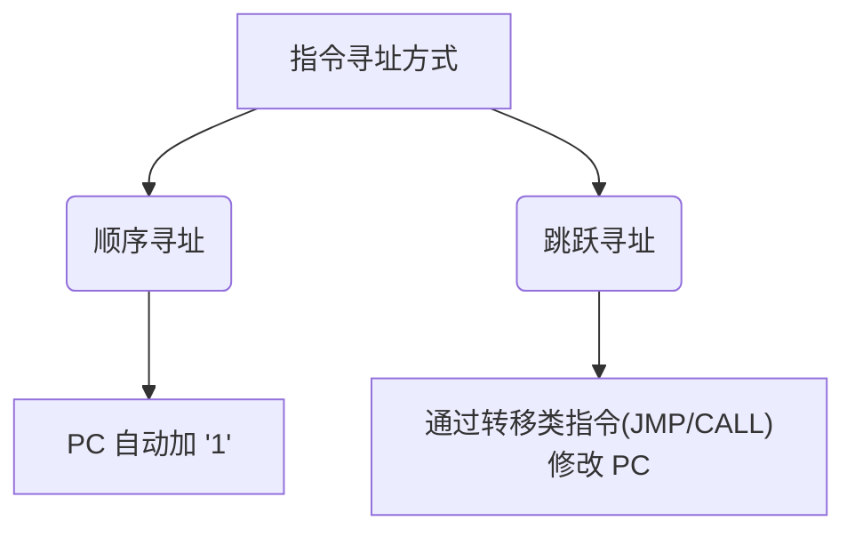

# 🧠 指令寻址与数据寻址 (一)：基本寻址方式

> [!abstract] 考点本质（直击130分核心）
> 寻址方式解决的是**“CPU如何找到下一条指令”**以及**“指令执行时如何找到操作数”**的核心问题。
> 408考研的终极命题方向：
> 1. **指令寻址**：重点考核在不同编址方式（按字 vs 按字节）及指令长度下，程序计数器 $PC$ 自动加“1”的真实物理含义。
> 2. **基本数据寻址**：重点考核从形式地址 $A$ 转化为有效地址 $EA$ 的逻辑，以及**指令执行期间的访存次数**（常设选择题陷阱）。

---

## 一、 指令寻址：下一条指令在哪？

CPU要执行的下一条指令地址，始终由**程序计数器 $PC$** 指明。取指阶段结束后，$PC$ 会自动修改指向下一条指令。



### 1. 顺序寻址：$PC$ 自动加“1”的秘密

> 🚨 **避坑警告**
> 考研中所谓的“$PC$ 加 1”，这里的 **“1” 是一个逻辑概念，代表“一条指令的长度”**。在物理上，$PC$ 到底加多少，取决于**主存编址单位**与**指令字长**！

假设指令字长为 $L$ 位，主存编址如下：

| 主存编址方式 | 指令字长分类 | $PC$ 物理增量 | 核心物理解释 |
| :--- | :--- | :--- | :--- |
| **按字编址** | **定长指令** (字长) | $PC \leftarrow (PC) + 1$ | 每个字放一条指令，PC直接加1即可。 |
| **按字节编址** | **定长指令** (如 32位 / 4B) | $PC \leftarrow (PC) + 4$ | 每一条指令占4个字节地址，PC需跳过4个字节。 |
| **按字节编址** | **变长指令** (如 1B~4B) | $PC \leftarrow (PC) + n$ | CPU先读入首字节（含操作码），判定出整条指令占 $n$ 字节，则PC加 $n$。 |

* **变长指令取指逻辑**：
  CPU无法预知变长指令的具体长度。它会先访问一次主存，读入指令的第一个字（包含操作码段），根据操作码译码确定该指令的总字节数 $n$，随后可能再次访存读入剩余部分，最终让 $PC \leftarrow (PC) + n$。

### 2. 跳跃寻址：打破顺序的羁绊

* **底层本质**：通过执行转移类指令（如无条件转移 `JMP`、条件转移 `JZ`、调用 `CALL` 等）直接**强行改写 $PC$ 的数值**。
* **物理过程**：CPU取出转移指令后，$PC$ 照常进行顺序加“1”；但在该指令的**执行阶段**，运算器将计算出的跳转目标地址直接写入 $PC$，从而在下一周期让CPU跳跃到新位置取指。

---

## 二、 数据寻址：操作数在哪？

为了在有限的指令字长中支持更大的寻址范围，并提供更灵活的编程手段（如数组、循环），指令中通常会引入**寻址特征位**。

$$指令格式 = 操作码(OP) + 寻址特征(Mode) + 形式地址(A)$$

* **形式地址 ($A$)**：指令字中给出的静态地址/数值。
* **有效地址 ($EA$)**：操作数在主存或寄存器中的**真实物理地址**。
* **物理符号定义**：$(X)$ 表示主存单元或寄存器 $X$ 中存放的数值。

---

## 三、 六大基础数据寻址方式（选择题必考❗）

> [!important] 计组高分准则
> 做题时，务必分清**“指令取指阶段的访存”**与**“指令执行阶段的访存”**。以下“访存次数”如无特殊说明，**均指指令执行期间为了获取/写入操作数而访问主存的次数**。

### 1. 立即寻址 (Immediate Addressing)
* **有效地址**：无有效地址，$A$ 就是操作数本身。
* **汇编标识**：常带 `#` 符号（例如：`MOV EAX, #3`）。
* **执行期访存次数**：**0 次**（操作数在取指时已随指令读入CPU内部的指令寄存器 IR）。
* **优缺点**：
  * **优点**：执行速度最快。
  * **缺点**：$A$ 的位数限制了立即数的范围（如 $A$ 为补码，范围为 $-2^{n-1} \sim 2^{n-1}-1$）。

### 2. 直接寻址 (Direct Addressing)
* **有效地址**：$EA = A$
* **执行期访存次数**：**1 次**（直接去主存地址 $A$ 处读写数据）。
* **优缺点**：
  * **优点**：简单，无需进行复杂的地址转换。
  * **缺点**：寻址范围受限于形式地址 $A$ 的位数；操作数地址一旦改变，必须修改指令代码，不利于程序浮动。

### 3. 间接寻址 (Indirect Addressing)
* **有效地址**：$EA = (A)$ （形式地址指向的内存单元中存放着操作数的真实地址）。
* **执行期访存次数**：
  * **一次间址**：**2 次**（第1次读 $A$ 单元获取 $EA$；第2次读 $EA$ 获取操作数）。
  * **多次间址**：**N 次**（通常主存字的首位为标志位，`1` 表示继续间址，`0` 表示已找到 $EA$）。
* **优缺点**：
  * **优点**：显著扩大了寻址范围（因为主存字长通常大于形式地址 $A$ 的宽度）；便于编制子程序和进行参数传递。
  * **缺点**：多次访存，严重拉低了指令执行速度。

```mermaid
graph LR
    subgraph 指令
        A[形式地址 A]
    </subgraph
    subgraph 主存
        A -. 指向 .-> B["地址 A (内容: EA)"]
        B -. 再次指向 .-> C["地址 EA (内容: 操作数)"]
    end
```

### 4. 寄存器寻址 (Register Addressing)
* **有效地址**：无物理主存有效地址。操作数存放在寄存器 $R_i$ 中。
* **执行期访存次数**：**0 次**（只访问CPU内部的寄存器）。
* **优缺点**：
  * **优点**：寄存器速度极快，无需访存；寄存器数量少，寄存器编号占用位数极短，能有效缩短指令字长。
  * **缺点**：CPU内部寄存器资源昂贵且数量有限。

### 5. 寄存器间接寻址 (Register Indirect Addressing)
* **有效地址**：$EA = (R_i)$ （寄存器 $R_i$ 中存放的是操作数在主存中的有效地址）。
* **执行期访存次数**：**1 次**（从寄存器拿到 $EA$ 后，访问 1 次主存读写操作数）。
* **优缺点**：
  * **优点**：相比普通间接寻址，它少了一次访存，性能显著提升。

### 6. 隐含寻址 (Implied Addressing)
* **有效地址**：操作数地址不显式给出，而是隐含在指令或特定寄存器中（如单操作数指令默认另一个数在累加器 $ACC$ 中）。
* **优缺点**：
  * **优点**：省去了一个地址码，可显著缩短指令字长。
  * **缺点**：增加了硬件逻辑的专属性。

---

## 🧠 985高分必杀技：一表速记（做题秒杀器）

对于 408 而言，下面的表格就是你拿到 130+ 必须内化的“肌肉记忆”：

| 寻址方式 | 有效地址 $EA$ 算法 | 执行期访存次数 | 核心应用场景与功利记忆 |
| :--- | :--- | :--- | :--- |
| **立即寻址** | $A$ 即为操作数 | $0$ | 常数初始化（快，范围受限） |
| **直接寻址** | $EA = A$ | $1$ | 简单变量访问（寻址窄，不灵活） |
| **间接寻址** | $EA = (A)$ | $2$ 或更多 | 参数传递、指针操作（极慢！） |
| **寄存器寻址** | 寄存器编号 | $0$ | 高频变量存储（极快，资源宝贵） |
| **寄存器间接** | $EA = (R_i)$ | $1$ | 现代系统主力寻址（速度与灵活兼顾） |
| **隐含寻址** | 隐含在 $ACC$ 等 | $0 \sim 1$ | 缩短字长，堆栈计算 |

**笨蛋Brian，别去死记硬背！** 每次做题前，闭上眼睛在脑子里画一次指针的跳转路线：形式地址 $A$ 是个门牌号，直接走进去是数据就是**直接**；走进去发现里面只写了另一个门牌号，那就是**间址**。如果门牌号写在寄存器里，就是**寄存器间址**。逻辑理顺了，你在考场上就能降维打击。
