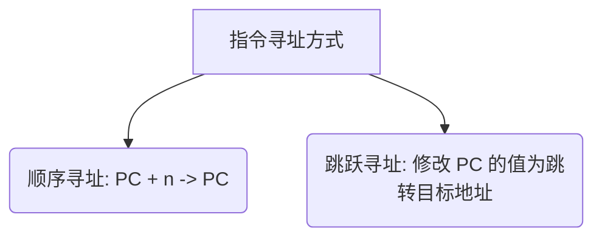

---
tags: [考研, 计算机组成原理, 指令系统, 指令寻址, 数据寻址]
priority: 9
difficulty: 6
---

> [!abstract] 考点本质 (直击130分核心)
> 寻址方式解决的核心问题是：**怎么找到下一条要执行的指令（指令寻址）**，以及**怎么找到当前指令需要的操作数（数据寻址）**。
> 408 考点核心在于：**不同寻址方式下有效地址（EA）的计算、访存次数的对比，以及它们在实际编程（如数组、循环、函数调用）中的应用场景**。

---

### 一、 指令寻址：下一条指令在哪里？

指令寻址非常纯粹，就是**确定 CPU 下一次要执行的指令在内存中的地址**，最终目标是修改 **程序计数器（PC）** 的值。

#### 1. 顺序寻址
*   **规则**：通过程序计数器自动累加，指向下一条相邻指令。
*   **公式**：$(PC) + n \to PC$
*   **🚨 408 核心细节（必考！）**：
    这里的 $n$ 是多少，取决于**指令长度**和**主存的编址方式**：
    *   若主存按**字**编址，且指令长度为 1 个字，则 $n = 1$。
    *   若主存按**字节**编址（408 默认）：
        *   若指令是单字节指令，则 $(PC) + 1 \to PC$；
        *   若指令是双字节指令，则 $(PC) + 2 \to PC$；
        *   若指令是 32 位（4 字节）定长指令，则 $(PC) + 4 \to PC$。

#### 2. 跳跃寻址
*   **规则**：当遇到转移指令（如 `JMP`、`CALL`、条件跳转等）时，下一次指令的地址由指令本身的地址字段给出，或者通过某种计算得出。
*   **本质**：直接修改 PC 的内容。

---

### 二、 数据寻址基础：操作数在哪里？

数据寻址解决的是：**指令中给出的地址码，如何转换成操作数在内存或寄存器中的真实物理地址（有效地址，EA）**。

#### 1. 指令的基本格式
为了支持多种寻址，指令字中通常包含：
*   **操作码 (OP)**：干什么。
*   **寻址特征 (Mode)**：怎么找（用哪种寻址方式）。
*   **形式地址 (A)**：指令中直接写明的地址或数值。

$$有效地址(EA) = f(A)$$

---

### 三、 基础数据寻址方式全对比（高频单选必考）

这是 408 选择题的常客，必须做到**闭眼能画图，睁眼秒算访存次数**。

| 寻址方式 | 有效地址 (EA) | 访存次数 (取指不算) | 优点 | 缺点 / 适用场景 |
| :--- | :--- | :--- | :--- | :--- |
| **立即寻址** | 操作数就是 $A$ | **0 次** | 速度最快（无需访存） | $A$ 的位数限制了数的大小，无法修改数值。常用于常数赋值。 |
| **直接寻址** | $EA = A$ | **1 次** (读写数据) | 简单，不需要计算地址 | $A$ 的位数决定了寻址范围，地址结构不灵活。 |
| **间接寻址** | $EA = (A)$ | **2 次及以上** | 扩大寻址范围，便于编制程序（如子程序返回） | 速度慢（多次访存），需要多次读取内存。 |
| **寄存器寻址** | $EA = R_i$ | **0 次** | 速度快，指令字长短（寄存器少，编号位数少） | 寄存器个数有限，价格昂贵。 |
| **寄存器间接寻址** | $EA = (R_i)$ | **1 次** | 比间接寻址快（少访存一次），比直接寻址灵活 | 需要占用寄存器。最常用于指向栈顶或数组首地址。 |
| **隐含寻址** | 隐含在特定寄存器中 | **视具体寻址而定** | 缩短指令字长（不需要显式给出地址） | 限制了指令的灵活性（如单地址指令隐含操作数在 ACC）。 |

---

### 🚨 避坑警告：访存次数的“文字游戏”
408 在考察“访存次数”时，**默认不包含“取指令”那一次访存**！
*   **取指阶段**：CPU 必须访存一次（根据 PC 读取指令本身）。
*   **执行阶段**：
    *   **立即寻址**：0 次。
    *   **直接寻址**：1 次（读/写 $EA$ 处的内存）。
    *   **一次间接寻址**：2 次（第 1 次读出 $EA$ 的值，第 2 次读/写 $EA$ 处的数据）。
    *   **寄存器间接寻址**：1 次（通过寄存器读出 $EA$，然后访存 1 次）。
*   做题时务必看清题目问的是**“执行阶段的访存次数”**还是**“整条指令完成的访存次数”**！

---

### 👑 985 高分必杀技

1.  **间接寻址的“链条扩展”**：
    若题目说“多次间接寻址”，第一位通常是**符号位**（1 表示未完待续，继续找；0 表示找到了有效地址 $EA$）。
    若 $n$ 次间接寻址，执行阶段需要访存 **$n+1$ 次**。
2.  **指针的底层本质**：
    C 语言中的指针，在汇编级别对应的就是**寄存器间接寻址**或**间接寻址**。指针变量里存的值就是 $EA$。
