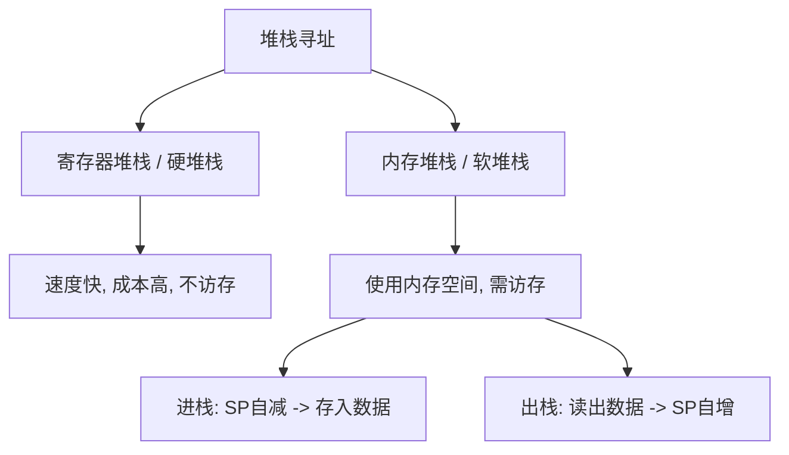

> [!abstract] 考点本质 (直击130分核心)
> 偏移寻址（基址、变址、相对）是 **408 核心大题与选择题的王牌考点**！它们都采用统一的数学形式：**$EA = (某个寄存器) + A$**。
> 它们的本质区别不在于公式本身，而在于**那个“某个寄存器”是谁，以及它们是为解决什么实际编程问题而设计的**。

---

### 一、 三大偏移寻址：终极对比与本质区分

| 寻址方式 | 公式 | 谁变？谁不变？ | 面向对象与控制者 | 核心应用场景与目的 |
| :--- | :--- | :--- | :--- | :--- |
| **基址寻址** | $EA = (BR) + A$ | $BR$ 不变（由 OS 维护） $A$ 可变（指令给出） | **系统/操作系统** 程序员无法直接修改 $BR$ | **多道程序设计**、动态重定位。 解决“程序装入内存哪个位置”的问题，扩大寻址空间。 |
| **变址寻址** | $EA = (IX) + A$ | $IX$ 可变（用户程序递增） $A$ 不变（数组首地址） | **用户/程序员** 程序员可通过指令修改 $IX$ | **数组遍历、循环操作**。 非常适合处理一维数据。 |
| **相对寻址** | $EA = (PC) + A$ | $PC$ 自动变 $A$ 是偏移量（补码） | **控制流跳转** 由跳转指令指定偏移量 | **程序浮动与跳转**（分支/循环）。 无论程序装在内存哪里，相对跳转距离永远不变。 |

---

### 二、 偏移寻址深度剖析

#### 1. 基址寻址：系统动态定位的基石
*   **物理意义**：基址寄存器 $BR$ 存放程序的**起始地址**（基地址），形式地址 $A$ 作为相对于起点的**偏移量**。
*   **为什么程序员不能改 $BR$？**
    如果程序员能直接修改 $BR$，就能访问其他程序的内存空间，导致严重的系统安全隐患。

#### 2. 变址寻址：数组遍历的绝对王者
*   **物理意义**：形式地址 $A$ 存放的是数组的**首地址**（固定不变），变址寄存器 $IX$ 存放的是**偏移量**（不断变化）。
*   **🌰 408 大题高频模拟**：
    遍历一个 `int` 数组：`for(int i=0; i<100; i++) { sum += arr[i]; }`
    *   $A$ 填入 `arr` 数组在内存的首地址。
    *   在循环体内，每次执行完一次，将 $IX$ 的值自增 1 个单位（若为 32 位 `int` 且按字节编址，则 $IX \gets IX + 4$）。
    *   非常契合**指令只写一遍，但通过改变寄存器实现批量数据处理**的思想。

#### 3. 相对寻址：跳转指令的灵魂（🚨 🚨 🚨 408 连环大坑！）
*   **物理意义**：以当前执行指令的 PC 为基准，加上形式地址 $A$（用**补码**表示的偏移字节数）得到跳转地址。
*   **计算黄金铁律（错一次，大题丢 5 分！）**：
    $$\text{有效地址 } EA = (PC)_{\text{当前}} + A$$
    **这里的 $(PC)_{\text{当前}}$ 绝对不是这条转移指令本身的地址，而是“本条转移指令被取出后，PC 已经自动加完的值”！**
    *   **按字节编址下**：
        若转移指令长 2 字节：$(PC)_{\text{当前}} = \text{转移指令首地址} + 2$
        若转移指令长 4 字节：$(PC)_{\text{当前}} = \text{转移指令首地址} + 4$

> [!danger] 避坑警告：相对寻址大题必杀陷阱
> 题目往往给你一条转移指令的十六进制码，比如地址为 `0800H` 的转移指令，长 2 字节，偏移量 $A$ 是 `FFFAH`。
> 1. 先算自动加完后的 $(PC)_{\text{当前}} = 0800H + 2 = 0802H$。
> 2. 将 $A$（十六进制补码 `FFFAH`）进行符号扩展为 32 位（或按 16 位补码计算，真值为 $-6$）。
> 3. $EA = 0802H + (-6) = 07FCH$。
> **如果直接用 $0800H + (-6)$，就会得到错误答案 $07FAH$！**

---

### 三、 堆栈寻址：函数调用的底座

堆栈寻址通过一个特定的寄存器——**堆栈指针（SP）**来隐式定位操作数。

#### 1. 堆栈的生长方向（408 默认：向下生长）
在绝大多数现代架构（如 x86）中，堆栈是**向低地址生长**的。
*   **进栈操作 (PUSH)**：
    1.  $SP$ 指针向低地址移动：$(SP) - 1 \to SP$（若按字节编址且压入 32 位数，则 $(SP) - 4 \to SP$）。
    2.  写入数据：$(SP) \gets \text{数据}$。
*   **出栈操作 (POP)**：
    1.  读出数据：$\text{数据} \gets (SP)$。
    2.  $SP$ 指针向高地址移动：$(SP) + 1 \to SP$（或 $+4$）。

#### 2. 访存次数
*   **硬堆栈**：0 次。
*   **软堆栈**：PUSH 和 POP 过程各自需要 **1 次主存读/写**（不计取指）。

---

### 👑 985 高分必杀技：相对寻址偏移量 $A$ 的反向求解
考研大题非常喜欢考：**“给出转移指令和目标指令的十六进制地址，求转移指令中偏移量字段 $A$ 的机器码”**。
*   **公式反推**：
    $$A = EA - (PC)_{\text{当前}}$$
    $$A = \text{目标指令首地址} - (\text{转移指令首地址} + \text{转移指令字长})$$
*   算出的 $A$ 是十进制有符号数，最后必须转换成**目标字长的补码**形式写入指令。
