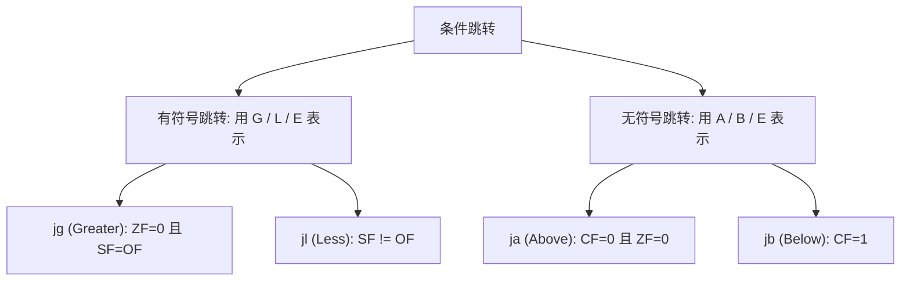

> [!abstract] 考点本质 (直击130分核心)
> 计算机没有高级语言中的大括号 `{}`，控制流的改变只能依靠 **“条件码标志位 + 条件跳转指令”** 的底层机制。
> 408 核心考点：**根据 `EFLAGS` 的标志位判断条件跳转指令的逻辑、根据条件跳转指令的逻辑反推 C 语言中的比较符号（如 `<` 或 `>`）、以及分析循环的汇编框架与迭代次数**。

---

### 一、 控制流的发动机：标志寄存器 EFLAGS

CPU 执行算术逻辑运算后，ALU 会输出一组标志位并锁存到标志寄存器中。后续跳转指令就是根据这些标志位决定是否拐弯的：

| 标志位 | 英文全称 | 物理定义 | 考研人话解释 |
| :--- | :--- | :--- | :--- |
| **ZF** | Zero Flag | 零标志位 | 运算结果是否为 **0**。若为 0，则 $ZF=1$；否则 $ZF=0$。 |
| **SF** | Sign Flag | 符号标志位 | 运算结果的**最高位（符号位）**。若为负数，则 $SF=1$；否则 $SF=0$。 |
| **OF** | Overflow Flag | 溢出标志位 | **带符号数**运算是否发生了**溢出**。溢出则 $OF=1$，否则 $0$。 |
| **CF** | Carry Flag | 进位/借位标志位 | **无符号数**运算最高位是否有**进位（加法）**或**借位（减法）**。 |

---

### 二、 标志位改写与条件跳转指令

#### 1. 核心指令：`cmp` 与 `test`
*   `cmp a, b`：**本质是减法运算 `a - b`**，但**不把差写回寄存器**，仅仅利用减法的结果去影响 $ZF, SF, OF, CF$。
    *   **🚨 408 AT&T 格式超级大坑**：
        `cmpl %eax, %ebx` 实际计算的是 **`%ebx - %eax`**！
*   `test a, b`：**本质是按位与运算 `a & b`**，不写回结果，用来测试操作数的某些位是否为 0。
    *   **高频写法**：`test %eax, %eax`。若 `%eax` 为 0，则 $ZF=1$；若为负数，则 $SF=1$。常用于判断指针是否为空或变量是否为 0。

#### 2. 条件跳转指令（带符号 vs 无符号）



*   **有符号数大小比较**（看 $SF$ 和 $OF$ 的异同）：
    *   `jg` (Jump if Greater)：带符号大于。条件是：$ZF=0 \text{ 且 } SF=OF$。
    *   `jl` (Jump if Less)：带符号小于。条件是：$SF \neq OF$。
*   **无符号数大小比较**（看进位位 $CF$）：
    *   `ja` (Jump if Above)：无符号大于。条件是：$CF=0 \text{ 且 } ZF=0$。
    *   `jb` (Jump if Below)：无符号小于。条件是：$CF=1$。
*   **等值比较**（不管符号）：
    *   `je`/`jz`：相等/为零跳转。条件是 $ZF=1$。
    *   `jne`/`jnz`：不相等/不为零跳转。条件是 $ZF=0$。

> [!important] 👑 985 高分必杀技：为什么有符号小于 `jl` 的触发条件是 $SF \neq OF$？
> 我们知道，带符号减法结果的真值为：$Result = a - b$。
> 1. **若未溢出 ($OF=0$)**：结果的符号就是正确的真值符号。若 $a < b$，则差为负，符号位 $SF=1$。此时 $SF=1, OF=0 \implies SF \neq OF$。
> 2. **若溢出 ($OF=1$)**：发生了溢出，说明实际符号被颠倒了。若 $a < b$，本应为负，但因为溢出变成了正数，所以 $SF=0$。此时 $SF=0, OF=1 \implies SF \neq OF$。
> **总结：无论溢出与否，只要 $a < b$，就必然有 $SF \neq OF$！**

---

### 三、 选择语句的机器级表示 (if-else)

C 语言的 `if-else` 结构在汇编中通常被重构为“逆向条件跳转”：

*   **C 语言结构**：
    ```c
    if (a < b) {
        c = 1;
    } else {
        c = 2;
    }
    ```
*   **汇编重构逻辑**（假定 `a` 在 `%eax`，`b` 在 `%ebx`）：
    ```assembly
    cmpl %ebx, %eax     # 计算 a - b (有符号比较)
    jge  .L_ELSE        # 逆向跳转条件：如果 a >= b，跳到 ELSE 分支
    movl $1, c          # IF 分支：c = 1
    jmp  .L_END         # 跳过 ELSE 分支
    .L_ELSE:
    movl $2, c          # ELSE 分支：c = 2
    .L_END:
    ```

---

### 四、 循环语句的机器级表示 (for / while)

408 经常考查**循环次数的计算**，需要理解汇编中循环的三种结构。

#### 1. `while` 循环汇编逻辑（先跳转判断，再循环）
*   **汇编框架**：
    ```assembly
    jmp .L_TEST
    .L_LOOP_BODY:
    # 循环体代码
    .L_TEST:
    # 比较条件 (cmp)
    # 满足条件则跳转到 .L_LOOP_BODY
    ```

#### 2. `for` 循环汇编逻辑
*   **C 语言结构**：`for (int i = 0; i < n; i++) { ... }`
*   **汇编翻译**：
    ```assembly
    movl $0, %ecx       # 初始化 i = 0
    jmp .L_TEST
    .L_LOOP_BODY:
    # 循环体代码
    addl $1, %ecx       # 步长迭代：i++
    .L_TEST:
    cmpl n, %ecx        # 比较 i 和 n
    jl .L_LOOP_BODY     # 如果 i < n，跳转回循环体
    ```

> [!danger] 避坑警告：循环大题中容易数错的“循环次数”
> 在 408 分析大题中，一定要注意循环变量 `i` 的初值、终止条件和自增量。
> 汇编中通常使用 `jl` (小于跳转) 或 `jle` (小于等于跳转) 作为循环判定条件。
> *   `jl`：若比较指令是 `cmpl %edx, %eax` (即 `EAX - EDX`)，`jl` 触发代表 `EAX < EDX`。
> *   注意无符号数循环溢出导致的“无限死循环”陷阱。
