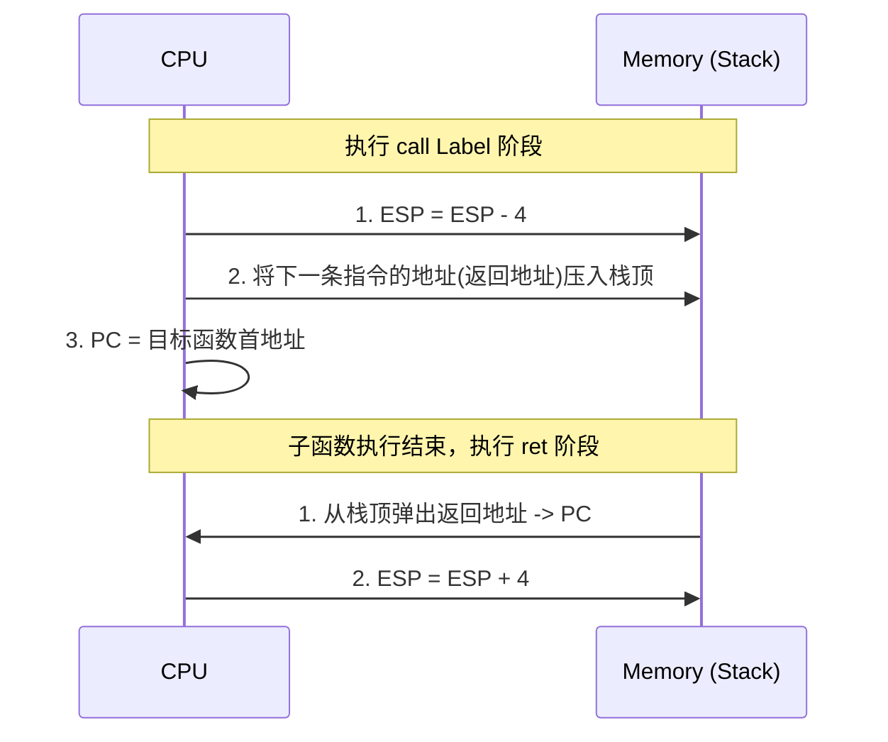

---
tags: [考研, 计算机组成原理, 指令系统, x86汇编, 函数调用, 栈帧, call, ret]
priority: 10
difficulty: 9
---

> [!abstract] 考点本质 (直击130分核心)
> 函数调用的本质是：**利用内存中的“堆栈（Stack）”来保存临时变量、函数参数以及“回家”的路径（返回地址）**。
> 408 核心考点：**`call` 和 `ret` 指令执行时 PC 和 ESP 的底层物理变化、栈帧的开辟与销毁过程、参数和局部变量在栈中的相对位置（通过 EBP 偏移量定位）**。

---

### 一、 函数调用的两大法宝：`call` 与 `ret`

`call` 和 `ret` 是隐式操作堆栈的特权指令，它们的执行细节在选择题中极高频出现！



#### 🚨 避坑警告：返回地址是谁？
`call` 指令压入栈中的“返回地址”，是 **`call` 指令下一条指令的物理地址**，而不是 `call` 指令自身的地址！

---

### 二、 栈帧 (Stack Frame) 的物理模型

在 x86 架构中，每个正在执行的函数都拥有一个独立的存储区域，称为**栈帧**。它由两个通用寄存器“一头一尾”锁死边界：
*   **ESP (栈顶指针)**：指向当前栈帧的顶部（低地址）。
*   **EBP (栈底指针/基址指针)**：指向当前栈帧的底部（高地址）。

```
           +-------------------------+  <- 高地址 (栈底)
           |   参数 2                |  [ebp + 12]
           |   参数 1                |  [ebp + 8]
           |   返回地址              |  [ebp + 4]  (由 call 自动压入)
EBP ---->  |   保存的父函数 EBP 值   |  [ebp]      (由 push %ebp 压入)
           |   被保存的寄存器 (可选) |  [ebp - 4]
           |   局部变量 1            |  [ebp - 8]
ESP ---->  |   局部变量 2            |  [ebp - 12] <- 低地址 (栈顶)
           +-------------------------+
```

---

### 三、 栈帧切换流程：保家卫国四步法

当父函数 `caller` 调用子函数 `callee` 时，为了不破坏父函数的数据，栈帧必须进行平滑的平移和复原。

#### 1. 建立子函数栈帧（子函数入口处，必背！）
```assembly
pushl %ebp          # 1. 把父函数的基址指针 EBP 压栈保存 (为了以后能回得去)
movl  %esp, %ebp    # 2. 把当前 ESP 的值赋给 EBP (将子函数的栈底挪到当前栈顶)
subl  $24, %esp     # 3. 将 ESP 减少一个常数 (在栈上为子函数分配局部变量空间)
```

#### 2. 销毁子函数栈帧并返回（子函数出口处，必背！）
```assembly
movl  %ebp, %esp    # 1. 释放局部变量空间 (让 ESP 回归到 EBP 的位置)
popl  %ebp          # 2. 弹出原本保存的父函数 EBP 值，赋给 EBP 寄存器 (恢复父栈底)
ret                 # 3. 弹出栈顶的返回地址送给 PC，跳转回父函数 (ESP 自动加 4)
```
> [!tip] 985 高分必杀技：`leave` 指令的妙用
> 编译器通常会将出口处的 `movl %ebp, %esp` 和 `popl %ebp` 合并为一条单字节的特权指令 **`leave`**。
> 因此，在汇编中你常会看到：
> ```assembly
> leave
> ret
> ```

---

### 四、 参数传递与局部变量访问（大题死穴）

在 IA-32 默认规则下，参数完全通过堆栈传递：

#### 1. 寻找参数（往上找：`[ebp + 偏移]`）
*   由于 `EBP` 指向的是“被保存的父 EBP”，`EBP + 4` 存放的是“返回地址”，因此**第一个参数**存放在 **`[ebp + 8]`**，**第二个参数**存放在 **`[ebp + 12]`**，以此类推。

#### 2. 寻找局部变量（往下找：`[ebp - 偏移]`）
*   局部变量在新建栈帧时被开辟在低地址方向，所以访问它们需要减去偏移。例如，第一个局部变量通常存放在 **`[ebp - 4]`**。

#### 3. 返回值传递
*   绝大多数情况下，子函数计算完毕后，会将结果写入 **`EAX`** 寄存器。父函数直接读取 `EAX` 即可拿到返回值。

---

### 👑 985 高分必杀技：栈帧演练真题直击

**【408 核心问法预测】**：
在子函数的某处，`EBP` 值为 `0x0012FF00`，`ESP` 值为 `0x0012FEC0`：
1.  该子函数的栈帧大小是多少？
    答：$\text{栈帧大小} = EBP - ESP = 0x0012FF00 - 0x0012FEC0 = 0x40 \text{ 字节} = 64 \text{ 字节}$。
2.  若要获取该函数的第一个参数，有效地址是多少？
    答：第一个参数的地址是 $EBP + 8 = 0x0012FF00 + 8 = 0x0012FF08$。
3.  若执行了 `popl %ebx` 指令后，`ESP` 的值变成多少？
    答：出栈操作使栈顶向高地址移动 4 字节，所以 $ESP = 0x0012FEC0 + 4 = 0x0012FEC4$。
