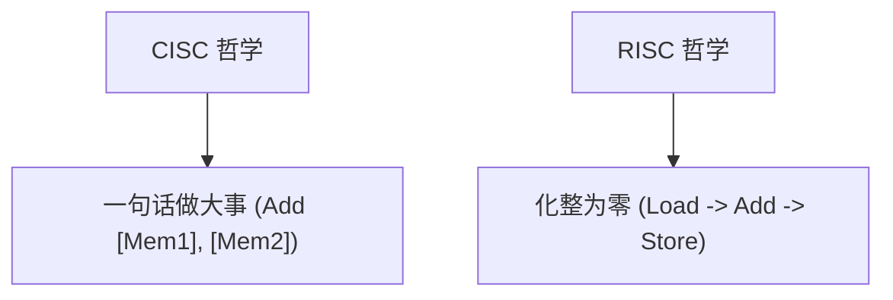

> [!abstract] 考点本质 (直击130分核心)
> CISC (复杂指令集) 和 RISC (精简指令集) 代表了两种截然不同的计算机设计哲学。
> 408 考点非常纯粹：**以选择题形式对比两者的各项技术指标（指令长度、访存限制、寄存器数量、控制器实现、流水线支持度）**。

---

### 一、 CISC vs RISC 终极对比表（选择题秒杀神器）

记住这块表格，这部分的分数你就拿稳了：

| 技术指标 | CISC (Complex Instruction Set) | RISC (Reduced Instruction Set) |
| :--- | :--- | :--- |
| **指令系统** | 数量极多 (通常几十到几百条)，有些很复杂 | 数量精简 (仅保留最常用的核心指令) |
| **指令字长** | **可变/不等长** | **定长/规整** (如 ARM 均为 32 位) |
| **寻址方式** | 丰富多样，极其复杂 | 极少，多为寄存器寻址和偏移寻址 |
| **访存限制** | **无限制**，绝大多数指令都可直接访存 | **极严限制**，只有 **Load/Store** 指令可访存，其他一律在寄存器间算 |
| **通用寄存器** | 较少 (因为可以用内存操作数) | **非常多** (必须依赖大量寄存器中转数据) |
| **时钟周期 (CPI)** | 差异极大，有些复杂指令需要几十个 CPI | 绝大多数指令在 **1 个时钟周期** 内完成 |
| **控制器实现** | 默认采用 **微程序控制 (ROM)** | 默认采用 **硬布线控制 (组合逻辑门)** |
| **流水线支持** | 较难支持，效率低下 | **天然适配流水线**，能极大压低实际 CPI |
| **典型代表** | Intel x86 架构 | ARM, MIPS, RISC-V 架构 |

---

### 二、 核心哲学解析

#### 1. CISC：用硬件复杂性换取软件便利性
*   **时代背景**：早期内存（DRAM）极度昂贵，软件编译器也很落后。设计者希望用一句汇编（甚至一条硬件指令）就搞定一个复杂逻辑（如矩阵乘法），从而缩短目标代码的长度，节省内存空间。
*   **副作用**：指令系统极其臃肿，芯片设计难度爆炸，且大量高级复杂指令在实际程序中只占了不到 20% 的运行频率，造成极大的硬件资源浪费。

#### 2. RISC：大道至简，速度至上
*   **80/20 法则**：研究表明，计算机中 80% 的时间都在执行最简单的 20% 的指令。因此，RISC 选择彻底剥离那 80% 难用、低频的复杂指令。
*   **寄存器-寄存器（Register-Register）架构**：由于省去了复杂的内存寻址译码逻辑，RISC 节省出大片芯片面积，用于塞入成百上千个通用寄存器。
    *   **核心逻辑**：如果要算 `a + b`，必须先用 `Load` 指令把它们搬到寄存器里，算完再用 `Store` 搬回内存。

---

### 🚨 避坑警告：考研核心易错概念

1.  **“精简”指的是指令系统，而不是硬件体积**：
    RISC 的控制逻辑确实精简了，但因为集成了海量的寄存器和多段流水线硬件，芯片实际物理尺寸和复杂度并不一定比 CISC 小。
2.  **现代 CISC 的“叛变”**：
    现代 x86 CPU（CISC）在内部其实采用了“微码拆解”技术——在译码阶段把复杂的 CISC 指令拆解为类似 RISC 的微操作（$\mu\text{ops}$），再送入流水线执行。但这**并不改变**它在软件层面依然被定义为 CISC 架构的事实。

---

### 👑 985 高分必杀技

做题时只要看到**“指令不等长”**、**“除 Load/Store 外还能直接访存”**、**“采用微程序”**，直接无脑选 **CISC**；
看到**“指令定长”**、**“只能通过 Load/Store 访存”**、**“寄存器多”**、**“硬布线控制”**，直接无脑选 **RISC**。
这两者是考研中绝对不会产生二义性的互斥概念。
