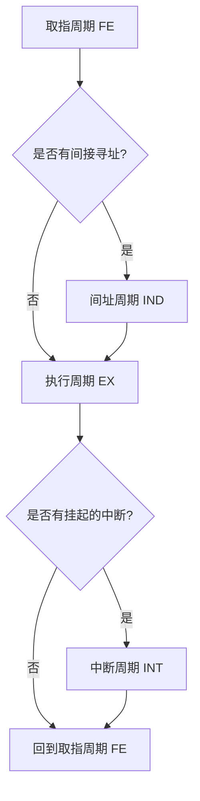

> [!abstract] 考点本质 (直击130分核心)
> CPU 的物理本质是一个**大型有限状态机**。
> 408 核心考点：**区分 CPU 内部哪些寄存器对程序员可见（可操作）与不可见、掌握指令周期的四个子周期（取指、间址、执行、中断）的底层微操作流（Micro-operations）**。

---

### 一、 CPU 的基本内部结构

CPU 由**控制器 (Control Unit, CU)** 和 **执行器/运算器 (Arithmetic Logic Unit, ALU)** 组成，内部布满了各种功能寄存器：

```
       +---------------------------------------------+
       |                  CPU 内部                   |
       |  +-------------------+  +----------------+  |
       |  |     运算器 ALU     |  |   控制器 CU    |  |
       |  +-------------------+  +----------------+  |
       |  +-------------------+  +----------------+  |
       |  |  通用寄存器 (可见) |  |   IR (不可见)  |  |
       |  +-------------------+  +----------------+  |
       |  +-------------------+  +----------------+  |
       |  |   PC (程序计数器) |  |  MAR (不可见)  |  |
       |  +-------------------+  +----------------+  |
       |  +-------------------+  +----------------+  |
       |  |    PSW (状态字)   |  |  MDR (不可见)  |  |
       |  +-------------------+  +----------------+  |
       +---------------------------------------------+
```

#### 🚨 极其重要：寄存器的“程序员可见性”（选择题必考！）
*   **用户可见寄存器**（程序员可以通过汇编指令读取或修改）：
    *   **PC (程序计数器)**：存放下一条指令的地址。
    *   **PSW / EFLAGS (程序状态字寄存器)**：存放各种状态标志。
    *   **通用寄存器组** (EAX, EBX, ECX 等)。
    *   **基址/变址寄存器** (BR, IX)。
*   **用户不可见寄存器**（由 CPU 内部硬件自动控制，程序员**无法**通过汇编直接读写）：
    *   **IR (指令寄存器)**：保存当前正在执行的指令。
    *   **MAR (内存地址寄存器)**：缓存即将访问的内存单元物理地址。
    *   **MDR (内存数据寄存器)**：缓存即将写入或刚刚读出内存的数据。
    *   **暂存寄存器 (Y / Z)**：用于暂存 ALU 输入/输出的中间数据，防止单总线结构下发生数据冲突。

---

### 二、 指令周期的四大子阶段与微操作流水线

一条指令的完整生命周期称为**指令周期**。它可以划分为四个截然不同的子周期，CPU 内部通过四个触发器 **FE（取指）、IND（间址）、EX（执行）、INT（中断）** 来标识当前处于哪一个状态。



---

### 三、 四大子周期的微操作流（大题硬核背诵！）

在 408 数据通路大题中，你需要写出每个阶段的控制信号与微操作：

#### 1. 取指周期 (Fetch Cycle)——把指令读入 IR
目标：将主存中 PC 指向的指令读入 IR，并修改 PC。
1.  $PC \to MAR$：将当前 PC 的值送到地址寄存器。
2.  $Mem(MAR) \to MDR$：发出读信号，将内存对应单元的指令读入数据寄存器。
3.  $MDR \to IR$：把读出的指令送入指令寄存器。
4.  $(PC) + 4 \to PC$：PC 自动加 1（假设按字节编址且指令长 32 位）。

#### 2. 间址周期 (Indirect Cycle)——取有效地址
目标：对于间接寻址指令，将指令中的形式地址 $A$ 转化为有效地址 $EA$ 并送入暂存器/IR。
1.  $IR(Address) \to MAR$：将指令中的形式地址字段送往地址寄存器。
2.  $Mem(MAR) \to MDR$：发出读信号，读出有效地址 $EA$。
3.  $MDR \to IR(Address)$：将真正的有效地址写回指令的地址字段（或直接送入暂存寄存器）。

#### 3. 执行周期 (Execute Cycle)——干活
*   这个阶段微操作完全取决于指令的类型（如 `ADD`、`JMP`、`MOV`）。
*   例如，加法指令：$EA \to MAR \to 读主存 \to MDR \to ALU \to ACC$。

#### 4. 中断周期 (Interrupt Cycle)——保存断点（PC）并跳转
目标：在执行周期结束时，若检测到中断请求，需保存当前 PC（断点）到堆栈中，并让 PC 指向中断服务程序入口。
1.  $SP - 4 \to SP, SP \to MAR$：栈顶指针向下移动 4 字节，送入 MAR（准备压栈）。
2.  $PC \to MDR$：将要保存的断点地址（当前 PC）送入 MDR。
3.  $MDR \to Mem(MAR)$：发出写信号，将断点写入堆栈对应的物理地址。
4.  $\text{中断向量地址} \to PC$：将中断服务程序的入口地址写入 PC。

---

### 🚨 避坑警告：时钟周期、机器周期与指令周期

*   **时钟周期 (Clock Cycle / T周期)**：CPU 的最小时间单位，由晶振频率决定（如 2GHz 代表 0.5ns 周期）。
*   **机器周期 (CPU Cycle)**：通常等于**一次访存（读/写）所需的时间**。一个机器周期包含数个时钟周期。
*   **指令周期**：执行完一条指令所需的全部时间。一个指令周期由数个**机器周期**（如取指周期、执行周期）组成。

> 🎯 **做题公式**：
> $$\text{时钟周期 } T = \frac{1}{\text{主频 } f}$$
> $$\text{CPI} = \text{一条指令包含的 T 周期个数}$$
