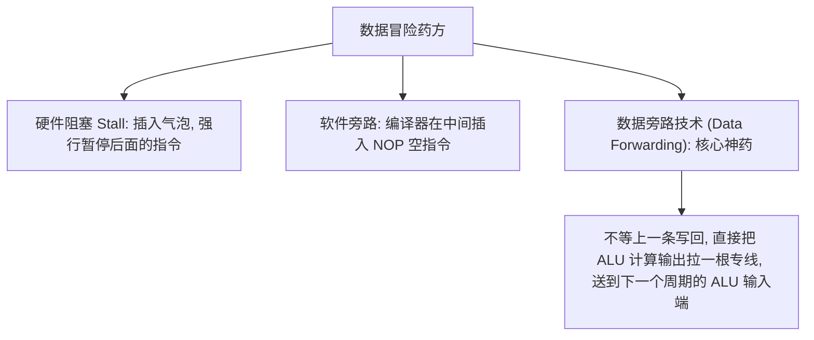

> [!abstract] 考点本质 (直击130分核心)
> 流水线（Pipelining）的本质是**时间的并行利用**。它通过把任务切分成多个阶段，让不同的子部件同时处理不同指令的对应阶段，从而极大提高 CPU 的吞吐量。
> 408 核心考点：**三大性能指标（吞吐率、加速比、效率）的公式套用计算、流水线三大冒险（结构、数据、控制冒险）的物理起因与核心解决方案（特别是数据旁路技术）**。

---

### 一、 流水线核心时空图与三大性能指标

假设流水线共有 $k$ 个阶段（段），每一段耗时为 $\Delta t$（通常取最慢的那一段耗时作为时钟周期）。
执行 $n$ 条指令时，**时空图**是分析流水线的终极武器：

```
段数 (k)
  | 
k |                 [ I1 ] [ I2 ] ... [ In ]
...
2 |          [ I1 ] [ I2 ] 
1 |   [ I1 ] [ I2 ] [ I3 ] 
  +---------------------------------------------> 时间 (T)
      1      2      3   ...   k   k+1  ... (k+n-1) 个 T
```

#### 1. 吞吐率 (Throughput, TP)
*   **定义**：单位时间内流水线完成的指令条数。
*   **计算公式**：
    $$TP = \frac{n}{T_{\text{总}}} = \frac{n}{(k + n - 1) \Delta t}$$
*   **极限状态 ($n \to \infty$)**：最大吞吐率 $TP_{max} = \frac{1}{\Delta t}$。
    *   **985 结论**：流水线的吞吐率只受限于**最慢的那一个阶段的物理耗时**！

#### 2. 加速比 (Speedup, S)
*   **定义**：不使用流水线（串行）耗时与使用流水线耗时的比值。
*   **计算公式**：
    $$S = \frac{T_{\text{串行}}}{T_{\text{流水}}} = \frac{n \cdot k \cdot \Delta t}{(k + n - 1) \Delta t} = \frac{n \cdot k}{k + n - 1}$$
*   **极限状态 ($n \to \infty$)**：最大实际加速比 $S_{max} = k$。

#### 3. 效率 (Efficiency, E)
*   **定义**：流水线中各部件的实际设备利用率。
*   **物理几何意义**：时空图中“被指令占用的格子数”与“总格子数”的比值。
*   **计算公式**：
    $$E = \frac{n \cdot k \cdot \Delta t}{k \cdot T_{\text{总}}} = \frac{n}{k + n - 1} = \frac{TP}{TP_{max}}$$

---

### 二、 流水线三大冒险（流水线杀手）

在执行过程中，流水线会遇到各种阻碍，迫使流水线**“暂停（Stall）”**，从而导致实际 CPI 大于 1。

#### 1. 结构冒险（资源冲突）
*   **病因**：多条指令在同一时刻争抢同一个**物理硬件资源**。
*   **典型场景**：流水线中的取指段（IF）正在读内存，而访存段（MEM）也在读/写内存。
*   **药方**：
    1.  **哈佛架构**：将指令存储器和数据存储器从物理上彻底分开（在 CPU 内部表现为 **I-Cache** 和 **D-Cache** 分立）。
    2.  **插入气泡（Stall）**：让后面冲突的指令等一个周期。

#### 2. 数据冒险（数据冲突）
*   **病因**：下一条指令需要使用上一条指令尚未写入寄存器的数据（写后读 RAW 最常见）。
*   **经典错误代码**：
    `I1: ADD R1, R2, R3` (计算 R2+R3 ➜ R1，写回 R1 在第 5 阶段)
    `I2: SUB R4, R1, R5` (需要读取 R1，读 R1 在第 2 阶段)
    *   如果 I2 紧跟 I1，在 I2 试图读取 R1 时，I1 还没有把结果写回到 R1，I2 读到了脏数据！



#### 3. 控制冒险
*   **病因**：遇到跳转指令（如 `jmp`, `je`）、中断或异常时，改变了 PC 的值，导致流水线之前已经提前取出的多条后续指令全部作废。
*   **药方**：
    1.  **分支预测**：静态预测（永远预测不跳转或跳转）与动态预测（根据历史记录跳转）。
    2.  **延迟槽（Delay Slot）**：让跳转指令后面的那一两个槽位放置无关指令，无论跳不跳转都执行它们。
    3.  **清空流水线**：发现跳偏了，直接把已取进来的指令打上“无效化（Invalid）”标记。

---

### 🚨 避坑警告：数据冒险的三种类型
408 经常在选择题中考这三个英文简称的学术定义：
*   **RAW (Read After Write, 写后读)**：高频重点。后面的指令要读，前面的指令还没写。
*   **WAR (Write After Read, 读后写)**：后面的指令要写，前面的指令还没读。
*   **WAW (Write After Write, 写后写)**：后面的指令要写，前面的指令还没写完。
*(注：在经典的顺序单发五段流水线中，WAR 和 WAW 是不可能发生的，只有 RAW 才会发生。)*

---

### 👑 408 大题秒杀：流水线性能计算完整例题

> [!example] 例题 1：等长段流水线
> 某指令流水线分为 **5 段**（IF, ID, EX, MEM, WB），每段耗时均为 $\Delta t = 100\text{ns}$。
> 连续执行 **100 条指令**，不考虑冒险。求吞吐率、加速比和效率。

**解题步骤：**

$$T_{\text{流水}} = (k + n - 1) \times \Delta t = (5 + 100 - 1) \times 100 = 10400 \text{ ns}$$

$$TP = \frac{n}{T_{\text{流水}}} = \frac{100}{10400} \approx \mathbf{0.0096 \text{ 条/ns}} = \mathbf{9.6 \text{ MIPS}}$$

$$S = \frac{n \times k}{k + n - 1} = \frac{100 \times 5}{104} \approx \mathbf{4.81}$$

$$E = \frac{n}{k + n - 1} = \frac{100}{104} \approx \mathbf{96.2\%}$$

> [!example] 例题 2：不等长段流水线（高频陷阱❗）
> 某流水线分为 4 段，各段耗时分别为：$90\text{ns}$、$80\text{ns}$、$70\text{ns}$、$100\text{ns}$。
> 连续执行 **50 条指令**，求实际吞吐率和加速比。

**关键陷阱**：不等长时，时钟周期取**最慢段**的耗时！

$$\Delta t = \max(90, 80, 70, 100) = \mathbf{100 \text{ ns}}$$

$$T_{\text{流水}} = (4 + 50 - 1) \times 100 = 5300 \text{ ns}$$

$$TP = \frac{50}{5300} \approx \mathbf{0.0094 \text{ 条/ns}}$$

$$T_{\text{串行}} = 50 \times (90 + 80 + 70 + 100) = 50 \times 340 = 17000 \text{ ns}$$

$$S = \frac{17000}{5300} \approx \mathbf{3.21}$$

> [!danger] 避坑警告
> **不等长段的加速比永远达不到理论最大值 $k$！** 因为最慢段会拖慢整条流水线。这就是为什么实际 CPU 设计要尽量让各段耗时一致（"段平衡"）。

---

### 👑 Forwarding（数据旁路）路径示例

```
时间:  1    2    3    4    5    6    7
I1:   IF   ID  [EX]  MEM  WB        ← ALU 在第3周期算出结果
I2:        IF  [ID]  EX   MEM  WB   ← 第3周期需要读R1
                ↑------┘
         Forwarding 旁路: ALU输出端 → ALU输入端（跨1个周期）
```

> [!tip] 💡 Forwarding 口诀
> **"EX→EX 旁路"**：上一条的 EX 阶段输出，直接送给下一条的 EX 阶段输入，**只需 0 个气泡**。
> **"MEM→EX 旁路"**：上一条是 LOAD 指令（MEM 阶段才能拿到数据），下一条 EX 阶段就要用 → **必须插入 1 个气泡**（这就是著名的 "Load-Use Hazard"）。
