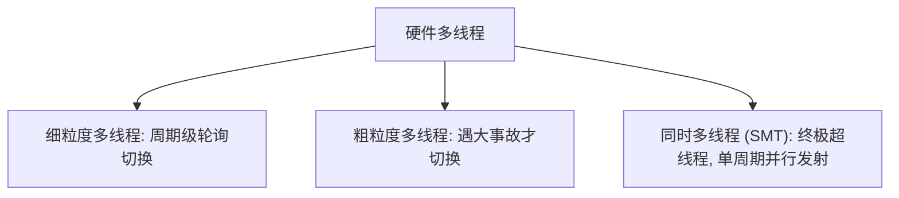

> [!abstract] 考点本质 (直击130分核心)
> 为了突破单核 CPU 的性能瓶颈，现代计算机走向了**多核与多线程的并行之路**。
> 408 核心考点：**Flynn 分类法（SISD, SIMD, MIMD）的物理定义与典型实例、多核与多处理器的物理区别、以及三种硬件多线程技术（细粒度、粗粒度、SMT）的切换机制对比**。

---

### 一、 Flynn 分类法（计算机体系结构的分类基石）

根据**指令流（Instruction Stream）**和**数据流（Data Stream）**的并行程度，Flynn 将计算机系统分为四大类：

| 分类 | 英文全称 | 物理本质与工作机制 | 典型物理实例 |
| :--- | :--- | :--- | :--- |
| **SISD** | Single Instruction Single Data | 传统的**单核/单处理器**架构。一次发射一条指令，处理一个数据。 | 早期 8086、奔腾 CPU |
| **SIMD** | Single Instruction Multiple Data | **单指令流多数据流**。由一个控制单元发出一条指令，控制多个 ALU 并行处理不同的数据。**空间上的并行**。 | 向量处理器、GPU（显卡）、CPU 的 SSE/AVX 向量指令集 |
| **MISD** | Multiple Instruction Single Data | **多指令流单数据流**。实际上**不存在**（或仅用于极其苛刻的高可靠性容错航天计算）。 | 理论模型 |
| **MIMD** | Multiple Instruction Multiple Data | **多指令流多数据流**。多个独立的处理器各自执行不同的指令流，处理不同的数据。 | 现代**多核 CPU**、多处理器服务器、超级计算机 |

---

### 二、 多处理器与多核 CPU (Multi-core) 的本质区别

很多同学分不清“多核”和“多处理器”，做题时盯住**“物理芯片（Die）的边界”**：

*   **多核 CPU (Multi-core / 单芯片多处理器 SMP)**：
    *   将两个或多个完整的**处理器核心**集成在**同一块物理芯片（硅片）**上。
    *   核心之间物理距离极近，通常共享 **L3 Cache（三级缓存）**，通过片上总线通信，速度极快。
*   **多处理器系统 (Multi-processor / 芯片外多处理器)**：
    *   在一块主板上插上**多个独立的物理 CPU 芯片**。
    *   芯片之间通过板级系统总线（如 QPI、UPI）进行通信，通信延迟远高于多核 CPU。

---

### 三、 硬件多线程技术 (Hardware Multithreading)

#### 1. 为什么需要“硬件”多线程？
传统的软件线程切换，必须由操作系统（OS）介入，把当前线程的寄存器、PC 压栈保存，再把新线程的上下文读入寄存器，开销极大（需要成百上千个 CPU 周期）。
**硬件多线程**的做法是：**在 CPU 内部直接复制多套寄存器组和 PC**。当切换线程时，硬件只需一瞬间切换指向的寄存器组，实现**零开销（或极低开销）切换**。

#### 2. 三大硬件多线程对比（选择题必考！）

*   **细粒度多线程 (Fine-grained Multithreading)**：
    *   **机制**：**轮询（Round-robin）切换**。每个时钟周期轮流从不同线程中读取指令送入流水线。
    *   **效果**：线程交替发生在**时钟周期级别**。若某个线程挂起，流水线跳过它，不会浪费时钟。
*   **粗粒度多线程 (Coarse-grained Multithreading)**：
    *   **机制**：**遇大事才切**。当前线程正常连续执行，只有当它发生**严重挂起事件**（如 Cache 缺失、大延时访存）时，才触发硬件切换到另一个线程。
    *   **缺点**：线程切换需要清空当前流水线，有几个周期的开销。
*   **同时多线程 (SMT / Simultaneous Multithreading)**：
    *   **机制**：**终极并行**。充分利用**超标量（Superscalar）**架构的多个执行单元。在**同一个时钟周期内**，可以把多个不同线程的指令同时发射到不同的执行部件中运行。
    *   **商业代号**：Intel 的 **超线程技术 (Hyper-Threading)**。

> [!important] 🚨 避坑警告：SMT 超线程是真正的“多核”吗？
> 超线程（SMT）是在**单核内部复制寄存器和控制资源**，让操作系统误以为有两个“逻辑核”，但**运算器（ALU）和 Cache 依然是共享的**。
> 如果两个线程同时疯狂做加法，它们依然要排队抢 ALU。因此，双核 CPU 的性能远强于单核双线程（SMT）CPU！
