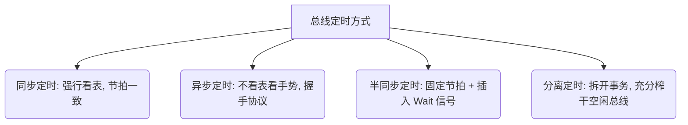

---
tags: [考研, 计算机组成原理, 总线, 总线事务, 同步定时, 异步定时, 握手协议, 全互锁]
priority: 8
difficulty: 6
---

> [!abstract] 考点本质 (直击130分核心)
> 总线操作和定时解决的核心问题是：**两个速度完全不同的部件挂在总线上，发送方怎么发，接收方怎么安全、准确地收**。
> 408 核心考点：**四大总线定时方式的工作原理对比、异步定时的三种“握手协议（不互锁、半互锁、全互锁）”执行流判定**。
> *(注：大纲已删减总线仲裁与总线标准，复习时坚决不花冤枉时间！)*

---

### 一、 总线事务的四个阶段

一次完整的总线事务（从申请到释放）包含以下四个物理阶段：

1.  **申请分配阶段**：主设备（能控制总线的设备）发出总线请求，由硬件进行分配（大纲已删仲裁过程）。
2.  **寻址阶段**：主设备向总线发出它要访问的从设备**物理地址**及**读/写命令**。
3.  **传输阶段**：主设备和从设备开始在数据总线上进行数据读写。
4.  **结束阶段**：主设备撤销总线上的数据、地址和控制信号，交出总线使用权。

---

### 二、 四大总线定时方式（选择题高频对比点）

定时指的是**通信双方在时间上如何配合以实现信息交互**。

#### 1. 同步定时方式
*   **规则**：通信双方完全依靠**统一的系统时钟信号（Clock）**来控制数据传输。每一个步骤都在固定的时钟节拍内强行完成。
*   **特点**：
    *   **优点**：控制逻辑极其简单，传输速率高。
    *   **缺点**：**强行向最慢的设备妥协**。如果外设是个极慢的设备，CPU 也必须在同步周期内“干等”，造成极大的时钟资源浪费。
*   **适用场景**：挂载在总线上的各部件速度相差不大、总线长度较短的系统（如 CPU 内部总线）。

#### 2. 异步定时方式（高频重难点！）
*   **规则**：**不看表，看手势**。完全没有系统时钟，依靠主/从设备之间拉出的**“握手（应答）信号线”**来确定每一步的发生。
*   **特点**：
    *   **优点**：极其灵活，可以连接速度跨度极大的各类设备，效率高。
    *   **缺点**：握手控制逻辑非常复杂，速度受到握手信号线往返物理延迟的限制。
*   **三种握手（互锁）协议深度对比（选择题必考！）**：

| 协议类型 | 动作流程（以读数据为例） | 可靠性与速度特征 |
| :--- | :--- | :--- |
| **不互锁方式** | 1. 主设备发出“请求”信号，**不管从设备收到没有，等一会儿自动撤销**。 2. 从设备收到请求后发出“应答”，**不管主设备收到没有，等一会儿自动撤销**。 | **最不可靠**。 若从设备太慢，可能会漏掉请求；速度最快。 |
| **半互锁方式** | 1. 主设备发出“请求”。 2. 从设备收到请求后发出“应答”。 3. 主设备收到应答后，**才撤销“请求”**。 4. 从设备发出“应答”后，**等一会儿自动撤销**（不看主设备有没有撤消请求）。 | **中等**。 保证了从设备一定能收到请求；但主设备可能因为从设备提前撤销应答而发生紊乱。 |
| **全互锁方式** | 1. 主设备发出“请求”。 2. 从设备收到请求后发出“应答”。 3. 主设备收到应答后，**才撤销“请求”**。 4. 从设备**检测到主设备“请求”已经撤销后，才撤销“应答”**。 | **最安全可靠**。 四次手势完整锁死，绝不会发生数据丢失；但速度最慢。 |

#### 3. 半同步定时方式
*   **规则**：折中方案。在**同步时钟**的控制基础上，引入一条**“等待（Wait）”信号线**。
*   **机制**：若慢速设备在指定的时钟内无法准备好数据，就向 $Wait$ 线发送有效信号，总线控制器收到后就会**自动在时钟周期中插入若干个“等待周期（Wait State）”**，直到设备准备好并撤销 $Wait$ 信号。

#### 4. 分离定时方式（985 高分点）
*   **痛点**：在上述三种定时中，一旦主设备开始寻址，到从设备吐出数据的这一大段“从设备准备时间”内，**总线是完全闲置且被锁死的**，其他设备无法使用。
*   **机制（彻底榨干总线）**：
    *   **子事务 1**：主设备申请总线，发出地址和读命令，然后**立即释放总线，下线等待**。此时总线空闲，别的设备可以使用。
    *   **子事务 2**：从设备自己在后台默默准备数据。数据准备好后，从设备**反客为主，作为主设备申请总线**，把数据强行发送给原主设备。
