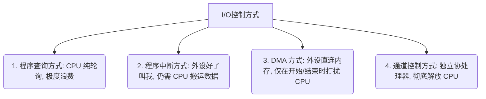

---
tags: [考研, 计算机组成原理, 输入输出系统, IO控制方式, 磁盘存储器, 旋转延迟]
priority: 8
difficulty: 5
---

> [!abstract] 考点本质 (直击130分核心)
> I/O 系统解决了**主机（高速度、电平规范）与千奇百怪的外设（低速度、各式信号）之间的数据交互问题**。
> 408 核心考点：**四种 I/O 控制方式的进化主线（对 CPU 解放程度）、以及磁盘存储器参数（特别是旋转延迟、磁盘传输率）的经典套路计算**。

---

### 一、 I/O 控制方式的演进主线（解放 CPU 史）

I/O 控制方式的演进本质上是**如何不断减少 CPU 的干预，让 CPU 专注于运算**。

1.  **程序查询方式**：
    *   **机制**：CPU 必须通过执行指令不断轮询（Polling）外设的忙/闲标志位。
    *   **缺点**：**CPU 必须全程等待**，期间什么都干不了，效率极度低下。
2.  **程序中断方式**：
    *   **机制**：外设在默默准备数据时，CPU 正常执行别的程序。数据准备好后，外设向 CPU 发出**中断请求**，CPU 暂停当前程序去搬运数据。
    *   **进步**：CPU 与外设实现了**部分并行**；但搬运数据依然需要 CPU 执行指令通过寄存器（ACC）中转。
3.  **DMA (Direct Memory Access, 直接内存存取) 方式**：
    *   **机制**：在主存和外设之间拉一根专用硬件通道。数据传输过程由 **DMA 控制器**主导，直接在主存和外设间传输，**完全不需要 CPU 搬运**。
    *   **进步**：CPU 只在数据块“传输开始前（初始化）”和“传输结束后（中断收尾）”介入，传输过程中 CPU 正常跑自己的程序。
4.  **通道控制方式**：
    *   **机制**：引入专用的**通道协处理器**。CPU 只需发一条 I/O 命令，通道就会从主存读取“通道程序”并执行，控制成百上千个设备。

---

### 二、 外部设备：磁盘存储器计算大户（408 核心计算点）

在 408 中，外设的理论概念（如显示器指标）以简单选择题为主，但**磁盘（机械硬盘）参数计算是绝对的大分重镇**！

#### 1. 磁盘物理结构
*   **记录面**：磁盘片有两面，都可以涂上磁性物质记录数据。
*   **磁道 (Track)**：磁盘面上的同心圆。
*   **扇区 (Sector)**：磁道被划分为若干个扇区（通常是 512 字节/扇区），是磁盘**读写的最小物理单位**。
*   **柱面 (Cylinder)**：所有盘片上相同半径的磁道组合成的圆柱面。**寻址时首先定位柱面（磁道）**。

#### 2. 磁盘寻址三部曲与时间计算公式（必背！）
向磁盘读写一个数据块的总时间为：
$$T_{\text{总}} = T_{\text{寻道}} + T_{\text{旋转延迟}} + T_{\text{传输时间}}$$
*   **寻道时间 ($T_{\text{寻道}}$)**：磁头移动到目标磁道（柱面）所需的时间（题目一般直接给出平均值）。
*   **旋转延迟 ($T_{\text{旋转延迟}}$)（🚨 🚨 🚨 考研核心大坑）**：
    磁头到了磁道，必须等目标扇区转到磁头下方。
    *   **做题黄金铁律**：**平均旋转延迟默认取磁盘旋转一周所需时间的一半**！
        $$T_{\text{旋转延迟}} = \frac{1}{2 \times \text{转速 } r}$$
*   **传输时间 ($T_{\text{传输}}$)**：读出对应数据所需的时间。
    $$T_{\text{传输}} = \frac{\text{要传输的字节数 } b}{\text{磁盘数据传输率 } Dr}$$

#### 3. 磁盘数据传输率 ($Dr$) 计算
*   **公式**：若磁盘转速为 $r$（转/秒），每个磁道上有 $N$ 个字节，则磁盘每秒转过 $r$ 个磁道，传输速率为：
    $$Dr = r \times N \text{ (字节/秒)}$$

---

### 👑 985 高分必杀技：磁盘容量计算

题目常问磁盘的**非格式化容量**和**格式化容量**：
*   **格式化容量**：指磁盘可以用来存放用户**有效数据**的净容量。
    $$\text{格式化容量} = \text{盘面数} \times \text{每面磁道数} \times \text{每道扇区数} \times \text{每个扇区字节数}$$
*   **非格式化容量**：包含物理扇区之间的缝隙、扇区头尾的同步码、校验码等物理开销。
    $$\text{非格式化容量} = \text{盘面数} \times \text{每面磁道数} \times \text{磁道记录密度 (位/mm)} \times \text{内圈磁道周长}$$
*   **做题注意**：如果题目直接问“容量”且没有明确说明非格式化，**默认一律按“格式化容量（扇区乘积）”来计算**！
