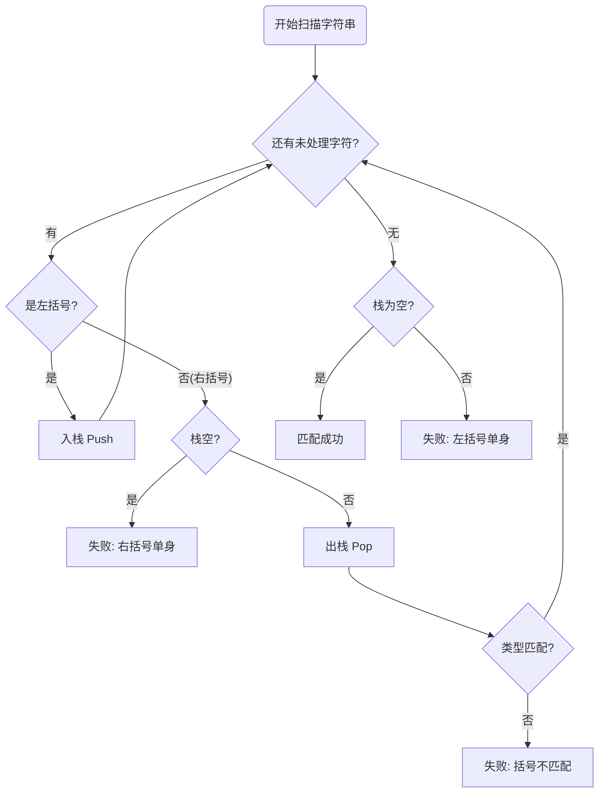

> [!abstract] 核心考点速记
> **栈 (Stack)** 的 LIFO (后进先出) 特性完美契合嵌套结构。
> **口诀**：左括压栈，右括弹栈比对，终了判空。

### 1. 算法逻辑可视化 (Mermaid)



### 2. 不丢分代码模板 (C语言描述)

> [!tip] 阅卷技巧
> 考研手写代码时，可以直接使用 `InitStack`, `Push`, `Pop`, `StackEmpty` 等标准接口，但**务必写上中文注释**说明其功能，既节省时间又能向老师展示你的规范性。

```c
bool BracketCheck(char str[], int length) {
    SqStack S;
    InitStack(S); // 初始化栈
    
    for (int i = 0; i < length; i++) {
        char cur = str[i];
        
        // 1. 遇到左括号：入栈
        if (cur == '(' || cur == '[' || cur == '{') {
            Push(S, cur);
        }
        // 2. 遇到右括号：处理
        else {
            // 情况A：扫描到右括号，但栈空 -> 失败 (右括号单身)
            if (StackEmpty(S)) 
                return false; 
            
            char topElem;
            Pop(S, topElem); // 弹出栈顶元素
            
            // 情况B：左右形状不匹配 -> 失败
            if (cur == ')' && topElem != '(') return false;
            if (cur == ']' && topElem != '[') return false;
            if (cur == '}' && topElem != '{') return false;
        }
    }
    
    // 3. 扫描结束：检查栈是否为空
    // 情况C：栈不空 -> 失败 (左括号单身)
    return StackEmpty(S); 
}
```

### 3. "绝不丢分"的三大判据

在设计测试用例或手动模拟时，必须覆盖以下三种错误情况：

| 错误类型 | 触发时机 | 逻辑含义 | 示例 |
| :--- | :--- | :--- | :--- |
| **右括号单身** | 扫描到右括号时，`StackEmpty(S) == true` | 右括号多余 | `())` |
| **形状不匹配** | `Pop` 出的左括号与当前右括号不成对 | 嵌套错误 | `(]` |
| **左括号单身** | 循环结束后，`StackEmpty(S) == false` | 左括号多余 | `(()` |

### 4. 备考细节 (Obsidian Callout)

> [!example] 补充练习 (基础薄弱必看)
> 如果题目要求**不使用封装好的栈接口**，而是直接操作数组：
> *   定义：`char stack[MaxSize]; int top = -1;`
> *   入栈：`stack[++top] = cur;`
> *   判空：`if (top == -1)`
> *   出栈：`char topElem = stack[top--];`
> *   **注意**：考试首选标准接口写法，除非题目强制要求手写栈实现。

> [!info] 进阶考点
> 虽然考试通常用**顺序栈** (定长数组)，但在实际工程中，若括号串极长，顺序栈可能**溢出**，此时应提及可以使用**链栈** (Linked Stack) 来优化，这在面试或简答题中是加分项。
