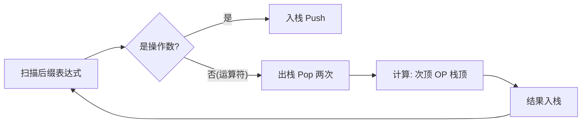
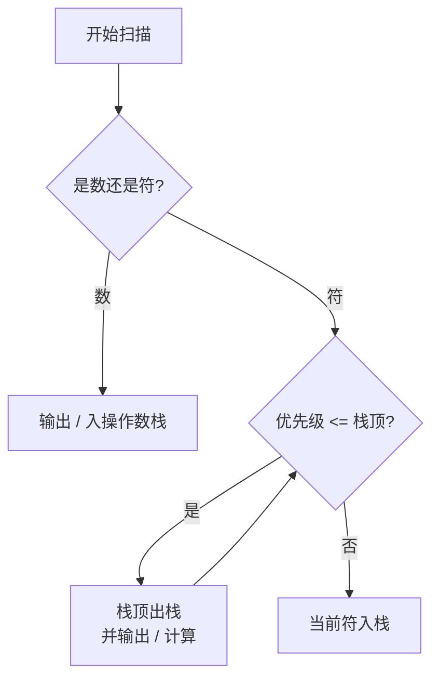

---
tags:
  - 考研
  - 数据结构
  - 栈
  - 表达式求值
  - status/archivepriority: 10
difficulty: 7.5
---

> [!important] 功利化备考指南
> **核心目标**：上岸985，不仅要“会算”，还要结果“唯一”。
> **考点权重**：极高。选择题必考，大题常结合栈的代码实现。
> **拿分痛点**：手算结果不唯一（导致选错答案）、操作数左右顺序搞反（导致计算错误）。
> **核心法则**：**左优先原则**（后缀）、**右优先原则**（前缀）。

## 1. 三种表达式极简速记

| 表达式类型 | 别名 | 运算符位置 | 特点 | 考查概率 |
| :--- | :--- | :--- | :--- | :--- |
| **中缀 (Infix)** | - | 居中 (A + B) | 人类最熟悉，含括号，**界限符不可省** | 题目输入 |
| **后缀 (Postfix)** | **逆波兰式** | 居后 (AB +) | **计算机最爱**，无括号，从左往右算 | ⭐⭐⭐⭐⭐ |
| **前缀 (Prefix)** | 波兰式 | 居前 (+ AB) | 较冷门，从右往左算 | ⭐⭐ |

---

## 2. 转换方法（不丢分的关键）

虽然数学上同一种中缀可以转成多种后缀（如 `a+b-c` 可转为 `ab+c-` 或 `abc-+`），但**计算机算法具有确定性**，考试标准答案通常基于**“左优先”**原则。

### 2.1 中缀转后缀（核心：左优先）

> **左优先原则**：只要左边的运算符能先计算，就优先算左边的。保证转换结果**唯一**。

**操作步骤（手算“加括号法”）：**
1.  按**“左优先”**及运算优先级（先乘除后加减，先括号内），确定运算顺序。
    *   *Trick：把运算顺序标成 ① ② ③ ...*
2.  对每一步运算，将运算符移到操作数**后面**。
3.  去掉所有括号。

**示例**：`A + B - C * D / E`
1.  **确定顺序（左优先）**：
    *   先乘除：`C*D` (左边先算) -> `(C*D)/E`
    *   后加减：`A+B` (左边先算) -> `(A+B) - ((C*D)/E)`
2.  **转换**：
    *   `A B +`
    *   `C D *`
    *   `C D * E /`
    *   `A B + C D * E / -`
3.  **结果**：`AB+CD*E/-`

### 2.2 中缀转前缀（核心：右优先）

> **右优先原则**：为了保证确定性，优先处理右边能算的运算符。

**操作步骤**：同上，只是将运算符移到操作数**前面**。

---

## 3. 表达式求值（机算模拟）

考试常考：给你一个后缀表达式，问栈的变化或最终结果；或者写代码逻辑。

### 3.1 后缀表达式求值（必考）

**规则**：从**左往右**扫描。
- 遇到**操作数**：压入栈（Push）。
- 遇到**运算符**：弹出（Pop）栈顶两个元素进行运算，结果压回栈。

> [!WARNING] 致命陷阱：操作数顺序
> 后缀计算时，**先弹出**的是**右**操作数，**后弹出**的是**左**操作数。
> 公式：`Result = 后出 (Op) 先出`
> *例：栈顶是 B，次顶是 A，遇到除号。计算为 A / B，而不是 B / A。*

### 3.2 前缀表达式求值（了解）

**规则**：从**右往左**扫描。
- 遇到**操作数**：压入栈。
- 遇到**运算符**：弹出栈顶两个元素运算，结果压回栈。

> [!NOTE] 顺序差异
> 前缀计算时，**先弹出**的是**左**操作数，**后弹出**的是**右**操作数。
> 公式：`Result = 先出 (Op) 后出`

---

## 4. 985 高分避坑指南

1.  **唯一性验证**：做题时，如果手动转换出的后缀表达式看起来很怪（比如除法在最后，但乘法在很前面），检查是否违反了“左优先”原则。考试答案通常对应标准的算法输出。
2.  **界限符**：中缀表达式离不开括号（界限符），但后缀和前缀表达式**不需要**括号，顺序本身包含了优先级。
3.  **栈的深度**：题目常问“求值过程中栈的最大深度是多少”。
    *   *解法*：在草稿纸上模拟入栈出栈过程，记录同时存在于栈中的最大元素个数。
4.  **减法与除法**：遇到 `a-b` 和 `a/b` 这种不满足交换律的运算，在出栈计算时，一定要死死盯住**谁在左，谁在右**（见上文3.1警告）。

## 5. 极简复习卡片

*   **中转后**：左优先，运算符放后面。
*   **中转前**：右优先，运算符放前面。
*   **算后缀**：左扫到右，遇符这就退栈算，**先出是右数**。
*   **算前缀**：右扫到左，遇符这就退栈算，**先出是左数**。

---

> [!important] 985上岸·功利化指南
> **考点聚焦**：上一节讲的是“手算”，这一节讲的是**“机器实现”**（即代码逻辑）。
> **命题形式**：选择题（问某一时刻栈内的元素是什么）、算法题（手写或填空求值逻辑）。
> **核心痛点**：手算很快，但模拟栈时容易搞错**“出栈时机”**（尤其是优先级相等时）。
> **拿分铁律**：**优先级 $\le$ 栈顶，必须弹！**

## 1. 中缀转后缀：栈的实现逻辑

计算机不像人眼能看完整个式子，它只能从左往右扫描。我们需要一个**栈 (Operator Stack)** 来暂存“还不能确定生效顺序”的运算符。

### 1.1 核心扫描规则表（背诵）

| 扫描到的元素 | 处理动作 | 备注 |
| :--- | :--- | :--- |
| **操作数** (A, B, 1, 2) | **直接输出** | 加入后缀表达式结果串 |
| **界限符 `(`** | **直接入栈** | 作为一个缓冲标记 |
| **界限符 `)`** | **持续出栈**并输出 | 直到弹出 `(` 为止（`(` 不输出，丢弃） |
| **运算符** (+ - * /) | **比较优先级** (见下文) | **这是考点核心！** |

### 1.2 运算符处理逻辑（重点）

当扫描到运算符 `Op_new`，需与栈顶运算符 `Op_top` 比较优先级：

> [!danger] 黄金法则：左优先原则的机器实现
> **若 `Priority(Op_new) > Priority(Op_top)`**：
> *   `Op_new` **入栈**。
> *   *理由：后面可能还有更高级的，先存着。*
>
> **若 `Priority(Op_new) <= Priority(Op_top)`**：
> *   `Op_top` **出栈**并输出 -> **重复比较**新的栈顶 -> 直到 `Op_new > 栈顶` 或栈空 -> `Op_new` **入栈**。
> *   *理由：同级先算左边的（左优先），高级的更要先算。*

**优先级速记**： `(*, /)` > `(+, -)` > `(`

### 1.3 示例模拟 (A + B - C * D / E)

*重点关注步骤 4 和 9 的**连续出栈**或**相等出栈***。

| 步骤 | 扫描元素 | 栈内变化 (底 -> 顶) | 后缀表达式 (输出) | 解释 |
| :--- | :--- | :--- | :--- | :--- |
| 1 | A | (空) | A | 操作数直接输 |
| 2 | + | `+` | A | 栈空，入栈 |
| 3 | B | `+` | A B | 操作数直接输 |
| 4 | **-** | **`-`** | A B **+** | **关键点**：`-` 优先级 $\le$ `+`，`+` 出栈；然后 `-` 入栈 |
| 5 | C | `-` | A B + C | - |
| 6 | * | `- *` | A B + C | `*` > `-`，入栈 |
| 7 | D | `- *` | A B + C D | - |
| 8 | **/** | **`- /`** | A B + C D ***** | **关键点**：`/` $\le$ `*`，`*` 出栈；`/` > `-`，`/` 入栈 |
| 9 | E | `- /` | A B + C D * E | - |
| 10 | (结束) | (空) | ... * E **/** **-** | 栈中剩余依次弹出 |

---

## 2. 中缀表达式求值：双栈法

这是“中缀转后缀”和“后缀求值”的合体。考试通常不考代码，只考过程。

### 2.1 数据结构
需要两个栈：
1.  **操作数栈 (Operand Stack)**：存数。
2.  **运算符栈 (Operator Stack)**：存符号（逻辑同上）。

### 2.2 核心流程

从左往右扫描：
1.  **遇数**：压入【操作数栈】。
2.  **遇符**：
    *   逻辑同“中缀转后缀”。
    *   **不同点**：每当从【运算符栈】**弹出**一个符号时，立即从【操作数栈】**弹出两个数**进行计算。
    *   **计算结果**：立即压回【操作数栈】。

### 2.3 避坑指南（绝对不能丢分点）

> [!WARNING] 计算顺序与减除法
> 当弹出一个运算符（如 `-` 或 `/`）进行计算时：
> *   **第一个**弹出的数是 **右操作数 (Right)**
> *   **第二个**弹出的数是 **左操作数 (Left)**
> *   **公式**：`Result = Left Op Right`
>
> *例：栈顶是 B，次顶是 A，弹出 `/`。计算为 `A / B`。如果搞反，直接0分。*

---

## 3. 考研实战技巧总结

### 3.1 栈的深度问题
*   **题目类型**：给一个中缀表达式，问转换过程中，**运算符栈**的最大深度是多少？
*   **解题技巧**：不用写出全过程。只需关注**连续入栈**的情况。
    *   `+` 入栈，`(` 入栈，`*` 入栈... 这种时候深度最大。
    *   遇到 `)` 或者低优先级符号，栈就开始变浅了。

### 3.2 括号的处理
*   左括号 `(` 也是进运算符栈的，但它优先级在**入栈前极高**（谁都拦不住它进栈），**入栈后极低**（谁都能压在他头上，直到右括号来救它）。
*   在比较优先级时，**千万不要把 `(` 弹出来**，除非遇到了 `)`。

### 3.3 验证算法正确性
*   如果你模拟出来的后缀表达式，运算符顺序和**“全括号法”**（左优先原则手算）不一致，说明你有一步“优先级相等或更低时”忘记出栈了。

[点击查看动画网页（有bug）](栈表达式动画.html)
