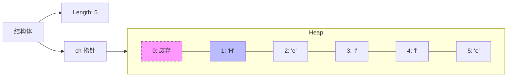

### 1. 核心考点直击
**串 (String)**：内容受限的线性表（数据元素仅为 `char`）。
- **985上岸策略**：串的考察重点在于**模式匹配算法（KMP）**，但本节的存储结构是基础。手写代码题中，**下标处理（从0还是1开始）**是主要扣分点，务必遵循王道/教材规范。

---

### 2. 串的存储结构 (Schema)

#### A. 顺序存储 (主要考察方式)
代码题默认采用此结构。

**方案对比 (必背，简答题素材):**

| 方案 | 实现方式 | 优点 | 缺点/隐患 |
| :--- | :--- | :--- | :--- |
| **方案一 (定长)** | `char ch[MAX]; int length;` | 简单，无需手动管理内存 | 长度不可变，易溢出 (Static) |
| **方案二 (堆分配)** | `char *ch; int length;` (malloc) | 长度可动态调整 | 需手动 `free`，易内存泄露 |
| **方案三 (C语言)** | 以 `\0` 结尾 | 节省空间 | 获取长度需 $O(n)$ 遍历；截断风险 |
| **方案四 (长度位)** | `ch[0]` 存长度 | 紧凑 | **致命伤**：长度受限 (0-255)，考研不推荐 |
| **⭐ 王道/统考规范** | **舍弃 `ch[0]`，另设 `int length`** | **位序与下标对齐 (1对1)**，代码不易错 | 多浪费一个字符空间 (可忽略) |

**结构体定义 (背诵版):**
```c
// 堆分配存储（动态数组），更灵活，大题首选
typedef struct {
    char *ch;   // 指向堆分配的存储区首地址
    int length; // 串的实际长度
} HString;

// 规范：ch指向的空间中，ch[0]闲置不用，字符从ch[1]开始存
```

**可视化：王道规范存储**


#### B. 链式存储
- **特点**：类似线性链表，每个节点存储字符。
- **存储密度问题 (简答题考点)**：
    - 若 `Node` 存 1 个 `char` (1B) + 1 个 `next` 指针 (4B/32位系统)，密度极低 (20%)。
    - **优化**：**块链结构**。每个节点存储多个字符（如4个），未满处用 `#` 或 `\0` 填充。
- **优缺点**：
    - 优：插入/删除方便（不仅改指针，若用块链还需处理分裂/合并，其实并不算特别方便，但在逻辑上优于移动数组）。
    - 缺：**丧失随机存取能力**，空间利用率低。

---

### 3. 基本操作实现 (不丢分细节)

> **⚠️ 高能预警**：
> 1.  以下代码逻辑基于 **下标从 1 开始**（王道规范）。
> 2.  **边界检查**是985阅卷老师重点检查的地方，漏写必扣分。

#### ① 求子串 (SubString)
**逻辑**：将 `S` 中第 `pos` 个字符起，长度为 `len` 的片段复制到 `Sub`。

*   **防坑点**：`pos` 的合法范围是 `[1, S.length]`，且 `pos + len - 1` 不能超过 `S.length`。
```c
// 伪代码核心逻辑
bool SubString(SString &Sub, SString S, int pos, int len) {
    // 1. 严格的边界检查 (考研不写这个直接扣分)
    if (pos < 1 || len < 0 || pos + len - 1 > S.length)
        return false; 

    // 2. 复制字符 (注意下标从1开始)
    for (int i = 0; i < len; i++) {
        Sub.ch[i + 1] = S.ch[pos + i]; // Sub从1开始，S从pos开始
    }
    
    // 3. 更新长度
    Sub.length = len;
    return true;
}
```

#### ② 比较操作 (StrCompare)
**逻辑**：字典序比较。若 `S > T` 返回 `>0`，`S = T` 返回 `0`，`S < T` 返回 `<0`。
```c
int StrCompare(SString S, SString T) {
    // 同步遍历
    for (int i = 1; i <= S.length && i <= T.length; i++) {
        if (S.ch[i] != T.ch[i])
            return S.ch[i] - T.ch[i]; // 只要出现不同，直接返回差值
    }
    // 前缀都相同，长度长的更大
    return S.length - T.length;
}
```

#### ③ 定位操作 (Index) - 朴素模式匹配
**逻辑**：利用上述两个基本操作，在主串 `S` 中寻找子串 `T`。
```c
int Index(SString S, SString T) {
    int i = 1;
    int n = S.length;
    int m = T.length;
    SString sub; // 用于暂存子串
    
    // 只要剩下的长度还够截取一个T，就继续循环
    while (i <= n - m + 1) {
        SubString(sub, S, i, m); // 1. 取出S中从i开始，长度为m的子串
        if (StrCompare(sub, T) == 0) // 2. 对比
            return i; // 匹配成功，返回位序
        else
            i++; // 匹配失败，位移+1
    }
    return 0; // 匹配失败
}
```
*注：下一节会讲不依赖基本操作的直接数组访问法（即朴素模式匹配的底层实现）以及KMP。*

---

### 4. 985 答题防坑指南

1.  **位序 vs 下标**：
    - 题目若未明确说明，**默认认为位序 = 下标**（即数组 `ch[0]` 弃用）。
    - 优点：逻辑直观，第 `i` 个字符就是 `ch[i]`。
    - 缺点：多浪费 1 字节空间（但在算法题中可忽略）。
    - **策略**：若手写代码，开头注释写一句 `// 假设串采用下标为1起始的存储方式`，展现专业性。

2.  **变量类型**：
    - 涉及长度、索引，一律用 `int`。
    - 涉及字符，用 `char`。

3.  **内存管理**：
    - 如果使用 `malloc` (堆分配)，在函数结束前或清空操作时，提及 `free` 是加分项，体现系统编程素养。

4.  **术语修正**：
    - 视频中提到的 "onion tap" 其实是 **`ElemType`** (线性表元素类型)。
    - "allen type" 是 **`ElemType`**。
    - "my lock" 是 **`malloc`**。
    - "lens" 是 **`length`**。
    - **一定要写标准的计算机术语，不要写音译！**
