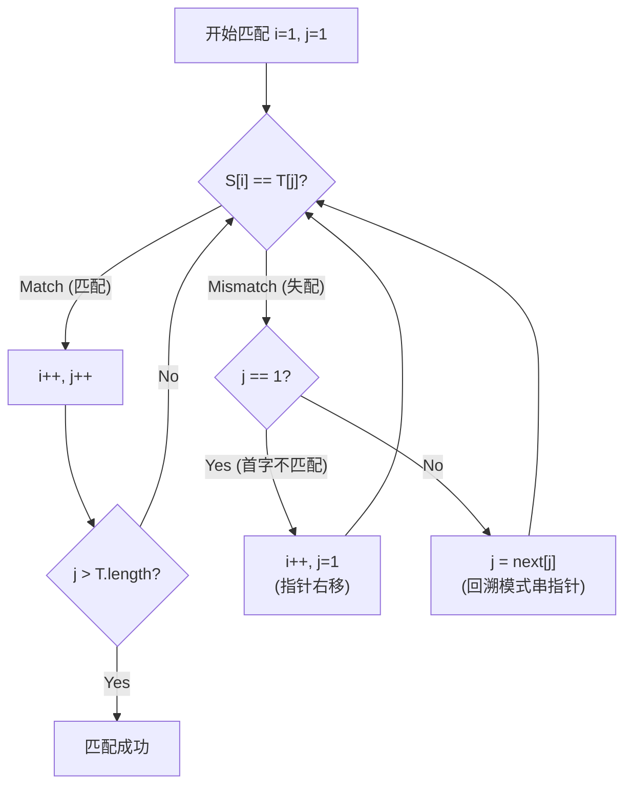

> [!tip] 核心考点速览（功利化视角）
> 1.  **本质**：主串指针 $i$ **绝不回溯**（好马不吃回头草），只回溯模式串指针 $j$。
> 2.  **核心工具**：`next` 数组（决定 $j$ 回退的位置）。
> 3.  **考察方式**：90% 考**手求 next 数组**（选择题），10% 考代码逻辑/复杂度。
> 4.  **时间复杂度**：$O(m+n)$。

### 一、 朴素模式匹配 vs. KMP

| 特性 | 朴素模式匹配 (Brute-Force) | KMP 算法 |
| :--- | :--- | :--- |
| **思路** | 暴力对比，一旦失配，全部推倒重来。 | 利用模式串本身的**部分匹配信息**，跳过无效对比。 |
| **主串指针 $i$** | **频繁回溯** (回到子串起点的下一位)。 | **永不回溯** (一路高歌猛进)。 |
| **模式串指针 $j$** | 简单重置为 1。 | 回退到 `next[j]` 指定的位置。 |
| **最坏复杂度** | $O(n \times m)$ | **$O(n + m)$** |

---

### 二、 KMP 运作机制可视化

#### 1. 为什么能优化？
当主串与模式串在第 $k$ 个字符失配时，说明前 $k-1$ 个字符是**完全匹配**的。
KMP 利用这“已匹配”的部分信息，计算出模式串应该向右滑动多远，而不是傻傻地只挪一位。

#### 2. 匹配流程逻辑 (Mermaid)



---

### 三、 核心难点：Next 数组 (手算必拿分)

`next[j]` 的含义：当模式串第 $j$ 个字符匹配失败时，主串 $i$ 不动，模式串指针 $j$ 应回退到的新位置。

#### 1. 文本案例推演 (Pattern: `A B A A B C`)
根据讲义中的逻辑，手算推导如下（假设数组下标从 1 开始）：

| 失配位置 $j$ | 对应的字符 | 讲义逻辑分析 | next[j] 值 |
| :---: | :---: | :--- | :---: |
| **6** | C | 前面 `ABAA B` 已匹配。头部 `AB` 与尾部 `AB` 相同，可跳过，直接从第 3 位开始比。 | **3** |
| **5** | B | 前面 `ABA A` 已匹配。头部 `A` 与尾部 `A` 相同，从第 2 位开始比。 | **2** |
| **4** | A | 前面 `AB A` 已匹配。头部 `A` 与尾部 `A` 相同，从第 2 位开始比。 | **2** |
| **3** | A | 前面 `A B` 已匹配。无相同前后缀，只能回到第 1 位。 | **1** |
| **2** | B | 前面 `A` 已匹配。无相同前后缀，只能回到第 1 位。 | **1** |
| **1** | A | 第一个字符就挂了，特殊处理：先设 $j=0$，随后 $i++, j++$。 | **0** |

> [!NOTE] 考研通法（通用解题技巧）
> 讲义中是“直觉式”推导，考研真题做题时请使用 **"最长相等前后缀长度 + 1"** 规则（部分教材定义的 `next` 可能会整体右移或 -1，请以报考院校参考书或 408 统考标准的 1-based 索引为准）：
> - **串**：`A B A A B C`
> - **位置**：`1 2 3 4 5 6`
> - **Next值**：`0 1 1 2 2 3`

#### 2. 代码实现逻辑
```cpp
// 只需要记住这两个关键点，不丢分
void Index_KMP(String S, String T, int next[]) {
    int i = 1, j = 1;
    while (i <= S.length && j <= T.length) {
        // j==0 代表第一个字符就失配，需主串后移
        if (j == 0 || S.ch[i] == T.ch[j]) {
            ++i; 
            ++j;
        } else {
            // ==核心==：i 不动，j 回退
            j = next[j]; 
        }
    }
    if (j > T.length) return i - T.length; // 匹配成功
    else return 0;
}
```

---

### 四、 复杂度分析 (背诵)

*   **预处理 (求 Next 数组)**: $O(m)$，只与模式串长度 $m$ 有关，与主串无关。
*   **匹配过程**: 最坏 $O(n)$，主串指针不回头。
*   **整体时间复杂度**: $O(m + n)$。
*   **空间复杂度**: $O(m)$，需要一个数组存储 `next` 值。

---

### 五、 避坑指南 (防丢分)

1.  **索引陷阱**：考题给出的数组是从 0 开始还是从 1 开始？
    *   若从 1 开始（严蔚敏/408标准）：`next[1] = 0`。
    *   若从 0 开始：`next[0] = -1`。
2.  **依赖关系**：`next` 数组的计算**只依赖于模式串**，与主串（S）的内容、长度、当前匹配位置完全无关。
3.  **回溯次数**：KMP 中 $i$ 回溯次数为 0。
