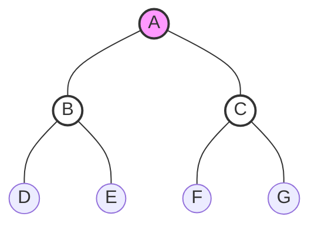
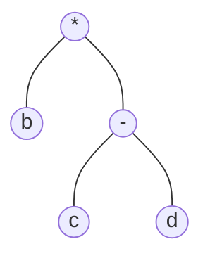

# 二叉树的遍历 (Pre/In/Post Order)

> [!danger] 功利化备考指南
> **985上岸必读**：本节是数据结构的**绝对送分题**，也是算法大题的**地基**。
> 1.  **选择/填空**：必须做到“秒杀”且准确率100%。手算速度要快，方法要固定。
> 2.  **算法大题**：几乎所有二叉树算法题（求深度、宽度、路径等）都是遍历算法的变种。**理解递归的本质（栈帧压栈/弹栈）比背代码更重要。**

## 1. 核心规则 (The Iron Rules)

二叉树基于**递归**特性定义：根结点 + 左子树 + 右子树。

| 遍历名称 | 英文 | 规则口诀 | 访问顺序示意 |
| :--- | :--- | :--- | :--- |
| **先序遍历** | PreOrder | **根** $\to$ 左 $\to$ 右 | `Root` $\to$ `Left` $\to$ `Right` |
| **中序遍历** | InOrder | 左 $\to$ **根** $\to$ 右 | `Left` $\to$ `Root` $\to$ `Right` |
| **后序遍历** | PostOrder | 左 $\to$ 右 $\to$ **根** | `Left` $\to$ `Right` $\to$ `Root` |

> [!TIP] 记忆技巧
> "先、中、后" 指的是 **根结点 (Root)** 被访问的时机。

---

## 2. 必杀技：手算遍历序列 (不丢分关键)

考场上不要去想复杂的递归代码，直接用**视觉化方法**。

### 方法一：全路径描边法 (从你的全世界路过) —— **推荐，最快最稳**

**操作步骤**：
1.  **补空**：把所有叶子结点的空指针（虚线）画出来。
2.  **描边**：拿笔从根结点出发，沿着树的外轮廓紧贴着画一圈，直到回到根结点。
3.  **记录**：
    *   **先序**：线条**第 1 次**经过节点左侧时，记录。
    *   **中序**：线条**第 2 次**经过节点底部（即从左子树回来，要把控节点）时，记录。
    *   **后序**：线条**第 3 次**经过节点右侧（即从右子树回来）时，记录。


*如上图简单的满二叉树：*
*   **先序 (1st pass)**: A B D E C F G
*   **中序 (2nd pass)**: D B E A F C G
*   **后序 (3rd pass)**: D E B F G C A

### 方法二：分层展开法 (递归思维)

适用于树结构非常复杂，或者大脑CPU过载时，逐层拆解。
*   **逻辑**：Pre(Tree) = Root + Pre(Left) + Pre(Right)
*   **例子**：先序遍历 A (B子树) (C子树) $\to$ A (B D E) (C F G) $\to$ A B D E C F G

---

## 3. 核心应用：表达式树 (Expression Tree)

这是真题考点（栈的应用结合）。算术表达式的分析树：
*   **先序序列** = **前缀表达式** (波兰式)
*   **中序序列** = **中缀表达式** (标准算术式，注意：需**手动加括号**处理优先级)
*   **后序序列** = **后缀表达式** (逆波兰式)

**示例**：
STT中提到的算术树：`b * (c - d)`
*   结构：根是`*`，左孩子`b`，右孩子`-`；`-`的左孩子`c`，右孩子`d`。


*   先序：`* b - c d`
*   中序：`b * c - d` (注意：还原表达式需结合逻辑加括号 $\to$ `b * (c - d)`)
*   后序：`b c d - *`

---

## 4. 代码与递归底层 (算法题基础)

跨考同学务必理解**函数调用栈 (Call Stack)**。

### 递归代码模板 (C++伪码)

```cpp
void PreOrder(BiTree T) {
    if (T != NULL) {
        visit(T);            // 1. 访问根 (先序位置)
        PreOrder(T->lchild); // 2. 递归左
        PreOrder(T->rchild); // 3. 递归右
    }
}
// 中序：visit(T) 移到 2 和 3 之间。
// 后序：visit(T) 移到 3 之后。
```

### 深度解析 (考研考察点)
1.  **空间复杂度**：
    *   递归通过系统栈实现。
    *   **最坏情况**：$O(h)$，其中 $h$ 是树的高度。如果是单支树（退化成链表），则为 $O(n)$。
    *   **最好情况**：完全二叉树，$O(\log_2 n)$。
2.  **执行流路过次数**：
    *   每个节点都会被递归函数路过 **3次**。
    *   第一次路过（刚进入函数） $\to$ 此时访问 = 先序。
    *   第二次路过（左子树递归返回） $\to$ 此时访问 = 中序。
    *   第三次路过（右子树递归返回，准备return） $\to$ 此时访问 = 后序。
    *   *注：叶子节点也要理解为左右孩子是空链域，依然会“虚空”路过空节点并返回。*

### 算法题变种 (举一反三)
*   **求树深度**：其实是**后序遍历**的变种。
    *   逻辑：`Height = max(Height(Left), Height(Right)) + 1`
    *   解释：必须先算出左右子树的高度（后序逻辑），才能算出当前根的高度。

---

## 5. 易错点总结

1.  **中序遍历与中缀表达式**：中序遍历输出的序列往往**不带括号**，如果题目问“对应的算术表达式”，务必根据运算符优先级补全括号。
2.  **空结点处理**：手算“描边法”时，一定要脑补叶子节点下方的两个空指针，否则线条容易画错位置。
3.  **唯一性**：
    *   知 {先序} + {中序} $\to$ 可唯一确定二叉树。
    *   知 {后序} + {中序} $\to$ 可唯一确定二叉树。
    *   **知 {先序} + {后序} $\to$ 无法唯一确定二叉树** (重要选择题考点)。
