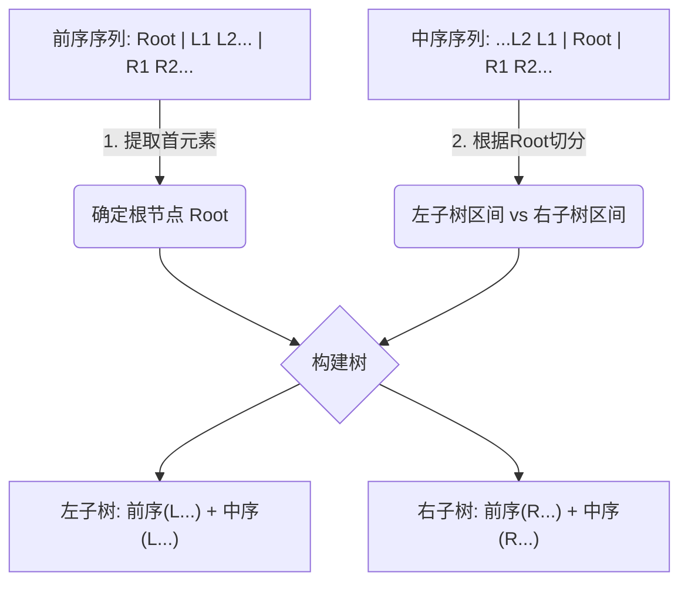
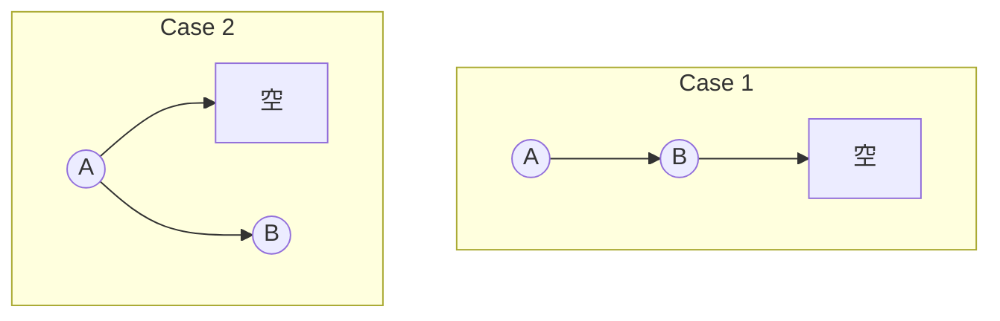
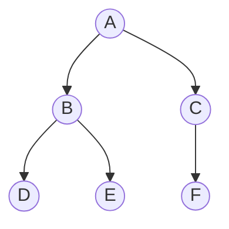

### 核心结论 (必背)

**唯一确定一棵二叉树的条件：**
必须包含 **中序遍历 (In-Order)**，加上 **前序 (Pre)**、**后序 (Post)** 或 **层序 (Level)** 中的任意一种。
> [!FAILURE] **易错点**
> 仅有 `前序 + 后序`、`前序 + 层序` 或 `后序 + 层序` **无法** 唯一确定二叉树。（无法区分左右子树为空的情况）

---

### 解题通用逻辑：找根 -> 切分 -> 递归

无论哪种组合，解题步骤高度统一，考场上像机器一样执行即可：
1.  **找根节点**：利用前/后/层序的特性，锁定当前子树的根。
2.  **划分左右**：去 **中序序列** 中找到该根节点，根节点左边是左子树，右边是右子树。
3.  **递归处理**：对左子树和右子树重复上述步骤。

---

### 场景一：前序 + 中序 (Pre + In)

*   **口诀**：前序“首”是根，中序定左右。
*   **逻辑**：
    1.  `Pre` 序列的 **第一个** 元素是当前树的 Root。
    2.  在 `In` 序列中找到该 Root，将 `In` 分为 `[Left_In] Root [Right_In]`。
    3.  根据 `Left_In` 的长度，在 `Pre` 中截取对应的 `[Left_Pre]` 和 `[Right_Pre]`。

**可视化演示：**

---

### 场景二：后序 + 中序 (Post + In)

*   **口诀**：后序“尾”是根，中序定左右。
*   **逻辑**：
    1.  `Post` 序列的 **最后一个** 元素是当前树的 Root。
    2.  在 `In` 序列中找到该 Root，将 `In` 分为 `[Left_In] Root [Right_In]`。
    3.  根据长度在 `Post` 中截取（注意：后序通常是 `[Left_Post] [Right_Post] Root`）。

**操作流：**
1.  看 Post 最后一个字符 -> 确定 Root。
2.  看 In，找到 Root 位置 -> 左边是左子树，右边是右子树。
3.  **关键点**：数一下左子树有几个节点（假设 $k$ 个），回到 Post 序列，从头数 $k$ 个就是左子树的后序，剩下的（除去最后一位Root）是右子树的后序。

---

### 场景三：层序 + 中序 (Level + In)

*   **口诀**：层序“先现”是根，中序定左右。
*   **逻辑**：
    1.  `Level` 序列中，**最先出现** 在当前子树节点集合中的元素，是 Root。
    2.  在 `In` 中定位 Root，划分左右子树。
    3.  **难点**：下一层的根节点如何找？
        *   **左子树的根**：是 `Level` 序列中，属于左子树节点集合且最靠前的那个。
        *   **右子树的根**：是 `Level` 序列中，属于右子树节点集合且最靠前的那个。

> [!TIP] **手算技巧**
> 在纸上做题时，每确定一个根，就在层序序列中把该节点划掉。接下来在层序中遇到的第一个属于“左子树范围”的节点就是左子树的根。

---

### 避坑指南：为什么 Pre + Post 不行？

**考点**：如果是选择题，常考反例。
**原因**：当某节点只有一个孩子时，无法判断是左孩子还是右孩子。

**反例可视化**：
前序：AB，后序：BA。

Case 1 (B是左孩子) 和 Case 2 (B是右孩子) 的前序、后序完全一致。**必须有中序才能区分左右。**

---

### 极简手绘答题法 (考场Draft)

不要在脑子里想，直接在草稿纸上画线：

**题目**：前序 `A B D E C F`，中序 `D B E A F C`

**步骤**：
1.  前序由 `A` 开头 -> **A 是根**。
2.  中序看 `A`：`[D B E] A [F C]`。
    *   左子树元素：D, B, E
    *   右子树元素：F, C
3.  看左子树 `D, B, E`：
    *   在前序中顺序是 `B D E` -> **B 是根**。
    *   在中序中看 `B`：`[D] B [E]` -> D是B左孩，E是B右孩。
4.  看右子树 `F, C`：
    *   在前序中顺序是 `C F` -> **C 是根**。
    *   在中序中看 `C`：`[F] C` -> F是C左孩。

**最终树**：

