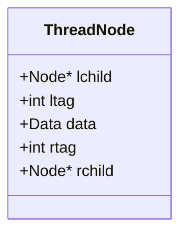

# 线索二叉树 (Threaded Binary Tree)

> [!summary] **核心考点速记**
> 1.  **目的**：利用 $n+1$ 个空链域，$O(1)$ 找到前驱/后继，方便遍历。
> 2.  **结构**：增加 `ltag` 和 `rtag` 标志位（**0孩1线**）。
> 3.  **手绘**：先写出遍历序列，再将空指针指序列中的前后节点。

## 1. 为什么要引入线索二叉树？

### 痛点（普通二叉树的缺陷）
1.  **空间浪费**：$n$ 个结点的二叉树，有 **$n+1$** 个空指针域（NULL），未被利用。
2.  **找前驱/后继困难**：
    *   节点的前驱/后继是基于**遍历序列**定义的（线性关系），而非树的逻辑结构（父子关系）。
    *   给定某节点指针 $p$，无法直接找到其前驱（只能从根重新遍历）。
    *   找后继通常也需要遍历（除非 $p$ 有右孩子）。
3.  **遍历不便**：每次遍历必须从根节点开始。

### 解决方案
*   **线索化**：利用空链域存放指向**某种遍历序列**（中/先/后）下的前驱和后继的指针。
*   **线索 (Thread)**：指向前驱或后继的指针。

---

## 2. 存储结构设计（**必考**）

为了区分`lchild`/`rchild`到底是指向孩子（树结构）还是指向前驱后继（线索），引入两个标志位：`ltag` 和 `rtag`。

### 结点结构图示

### 标志位含义（口诀：0孩1线）

| 标志位 | 值 | 含义 | 指针指向 |
| :--- | :---: | :--- | :--- |
| **ltag** | **0** | 有左孩子 | `lchild` 指向 **左孩子** |
| **ltag** | **1** | 无左孩子 | `lchild` 指向 **前驱** (线索) |
| **rtag** | **0** | 有右孩子 | `rchild` 指向 **右孩子** |
| **rtag** | **1** | 无右孩子 | `rchild` 指向 **后继** (线索) |

> [!warning] 易错点
> 只有当指针域为 **NULL** 时，才会被利用来建立线索。如果本来就有左孩子，`lchild` 依然指向左孩子，`ltag` 为 0。

---

## 3. 三种线索二叉树（手算/绘图方法）

**通用手算步骤（不丢分法则）：**
1.  **写序列**：根据要求（先/中/后序）写出普通二叉树的**遍历序列**。
2.  **找空域**：观察二叉树图形，找到所有空指针（NULL）。
3.  **连线索**：
    *   若某节点无左孩子：将其 `lchild` 指向序列中的**前一个**元素。
    *   若某节点无右孩子：将其 `rchild` 指向序列中的**后一个**元素。
4.  **处理首尾**：序列第一个元素无前驱（`lchild`=NULL），最后一个元素无后继（`rchild`=NULL）。

### (1) 中序线索二叉树 (In-order)
*   **特点**：利用率最高，应用最广。
*   **后继查找**：
    *   `rtag==1`: 直接通过 `rchild` 找后继。
    *   `rtag==0`: 后继是右子树中“最左下”的节点。

### (2) 先序线索二叉树 (Pre-order)
*   **特点**：
    *   **先序前驱**难找（因为先序是 根->左->右，无法直接通过孩子指针找父节点，除非有三叉链表）。
    *   **先序后继**容易找（左右孩子都是后继的一部分）。
*   **注意**：在编程实现遍历时，需要防止“左孩子线索化后指回自己”导致的死循环（手算绘图不影响）。

### (3) 后序线索二叉树 (Post-order)
*   **特点**：
    *   **后序后继**难找（后序是 左->右->根，根节点的后继需要找父节点的其他孩子或父节点本身，普通二叉链表做不到）。
    *   **后序前驱**容易找。

---

## 4. 核心概念辨析（选择题陷阱）

| 概念 | 解释 | 例子 |
| :--- | :--- | :--- |
| **树的前驱/后继** | 逻辑结构。一个节点唯一前驱是父节点，可能有多个后继（孩子）。 | - |
| **遍历的前驱/后继** | 线性序列关系。依赖于具体的遍历方式（先/中/后）。 | 中序序列 `D B E`，`B` 的前驱是 `D`，后继是 `E`。 |
| **线索** | 指向线性序列中前驱/后继的指针。 | 虚线箭头通常表示线索。 |

## 5. 总结与Obsidian复习策略

*   **看到“线索二叉树”：** 马上反应出 `n+1` 个空指针和 `0孩1线`。
*   **看到“画出线索树”：** 必须先在草稿纸写出**遍历序列**，然后对着序列连线。
*   **看到“找前驱/后继”：**
    *   中序：前后都好找。
    *   先序：找前驱难（需父指针）。
    *   后序：找后继难（需父指针）。
