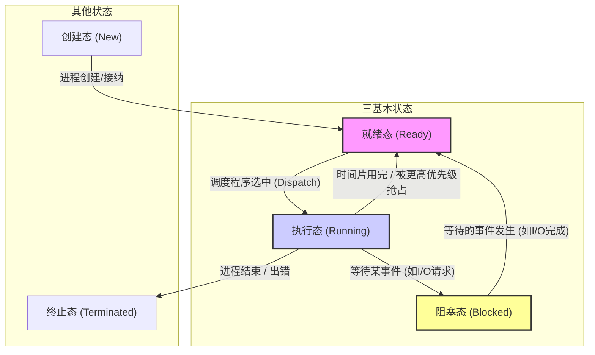

好的，同学！看到你对操作系统（OS）这门课有这么高的目标，并且已经开始刷题了，这非常好！目标90分确实不低，但这绝对是可以通过系统学习和深入理解达成的。基础有点不足没关系，关键在于我们接下来一步一个脚印地把知识点学扎实。

你提供的这些练习题覆盖了操作系统课程中非常核心的几个章节，包括**操作系统引论、进程管理、处理机调度与死锁、存储器管理（包括虚拟存储器）、输入输出系统和文件管理**。这几乎是OS课程的骨架了。

我的任务不是直接给你答案，而是把这些题目背后所考察的知识点，**系统地、由浅入深地**讲给你听，让你不仅知其然，更知其所以然。我会尽量用通俗易懂的语言，结合实例和比喻，并且在关键地方帮你梳理脉络、构建体系。学完这些内容后，你再回头看这些题目，应该就能游刃有余了。

我们现在就开始，按照知识模块逐一攻克：

---

### 第一部分：操作系统引论 (对应 P1 的题目)

**1. 什么是操作系统 (OS)？**

*   想象一下，电脑硬件（CPU、内存、硬盘、键盘、鼠标、显示器等）是一堆钢铁和硅片，它们本身并不能直接为我们工作。操作系统就像一个**工头**或者**大管家**，它负责管理和协调这些硬件资源，并为我们（用户）和我们运行的应用程序提供一个方便、高效、安全的工作环境。
*   **正式定义**：操作系统是计算机系统中的一个**系统软件**，它是**硬件基础上的第一层软件**，也是其他软件运行的基础。它管理计算机的软硬件资源，控制程序运行，改善人机界面，并为应用软件提供支持。

**2. 现代OS的主要目标是什么？(对应 P1 Q1)**

设计现代操作系统的主要目标通常有以下几个：

*   **方便性 (Convenience)**：让用户更容易地使用计算机。想想如果没有Windows或MacOS的图形界面，你需要用命令行去操作，是不是麻烦很多？OS提供了用户接口（命令行、图形界面）和各种服务（如文件管理），极大地简化了用户操作。
*   **有效性 (Efficiency)**：也叫**效率**。指操作系统能高效地管理和利用计算机资源（CPU、内存、I/O设备等），提高系统吞吐量（单位时间内完成的任务量）、资源利用率和响应速度。比如，允许多个程序同时运行（并发），就是为了提高CPU和设备的利用率。
*   **可扩充性 (Extensibility)**：指操作系统能够方便地增加新的功能和模块，或修改现有功能，以适应硬件技术的发展和用户需求的变化。就像给房子加盖一层或者重新装修一样。**微内核 (Microkernel)** 结构就是提高可扩充性的一个重要手段（后面会讲）。
*   **开放性 (Openness)**：指操作系统遵循国际标准规范，使得基于它开发的软硬件能方便地移植和互连。比如都遵循POSIX标准，那么为Linux写的某个程序可能稍作修改就能在其他类Unix系统上运行。

**3. OS的作用体现在哪些方面？(对应 P1 Q2)**

可以从两个视角来看：

*   **用户视角 (OS作为用户与计算机硬件系统之间的接口)**：
    *   提供**命令接口**：允许用户直接或间接控制程序运行（如 Shell 命令、批处理命令）。
    *   提供**程序接口 (API - Application Programming Interface)**：也叫系统调用（System Call），允许程序员在程序中请求操作系统服务（如创建进程、读写文件）。
    *   提供**图形用户接口 (GUI - Graphical User Interface)**：如Windows桌面、图标、菜单等，操作直观方便。
*   **系统视角 (OS作为计算机系统资源的管理者)**：
    *   **处理机管理 (Processor Management)**：决定哪个程序使用CPU，如何使用（进程调度）。
    *   **存储器管理 (Memory Management)**：管理内存的分配和回收，确保程序有足够的空间运行，且互不干扰。
    *   **文件管理 (File Management)**：管理外存（如硬盘）上的文件，提供创建、读写、删除、按名存取等功能。
    *   **设备管理 (Device Management)**：管理各种输入输出设备，提供统一的接口，屏蔽硬件细节。

**4. 多道批处理系统 (Multiprogramming Batch System) 的形成和发展动力是什么？(对应 P1 Q4)**

*   **背景**：早期计算机是**单道批处理**，内存中只有一个程序，CPU执行它，遇到I/O操作时CPU就**空闲等待**。但CPU速度远快于I/O设备速度，导致CPU利用率极低。
*   **核心思想**：为了提高**资源利用率** (特别是CPU利用率) 和**系统吞吐量**。
*   **做法**：允许多个作业 (程序和数据) 同时驻留在内存中。当一个作业因I/O操作暂停执行时，操作系统可以迅速切换到另一个已就绪的作业，让它使用CPU。这样，CPU就不太会闲着了。
*   **主要动力**：
    *   **提高CPU利用率**：这是最根本的动力。
    *   **提高内存利用率**：内存中同时放多个作业。
    *   **提高I/O设备利用率**：一个作业I/O时，其他作业可以用CPU或其他I/O设备。
    *   **增加系统吞吐量**：单位时间内完成的作业更多了。

**5. 脱机I/O (Offline I/O) 和 联机I/O (Online I/O) (对应 P1 Q5)**

这是早期为了缓解主机CPU与慢速I/O设备矛盾的技术。

*   **联机I/O (Online I/O)**：I/O设备直接连接在主机上，受主机CPU直接控制。比如你现在用键盘输入，就是联机I/O。缺点是慢速设备会拖慢高速CPU。
*   **脱机I/O (Offline I/O)**：在输入/输出设备和主机之间增加一个**外围控制机**（通常是小型机或微型机）。比如，先把用户程序和数据通过卡片机输入到**磁带**上（由外围机控制），主机要用时直接从磁带高速读入；主机输出结果先高速写到磁带上，再由外围机控制打印机慢慢打印。这样，主机CPU主要和高速磁带打交道，慢速的输入输出由外围机承担。
    *   **关键**：输入输出操作**不**直接由主机CPU控制完成。
    *   **SPOOLing技术** (后面会讲) 可以看作是在操作系统控制下实现的“虚拟”脱机I/O。

**6. 为什么要引入实时操作系统 (Real-time Operating System, RTOS)? (对应 P1 Q8)**

*   **背景**：通用操作系统（如Windows, Linux）追求的是高吞吐量、好的人机交互，但对**响应时间**没有严格保证。
*   **需求**：在某些应用领域，如工业控制（机器人、生产线）、武器控制、航空航天、医疗设备、多媒体系统等，系统必须在**严格限定的时间内**对外部事件做出响应。如果响应超时，可能会导致严重后果（如生产事故、系统崩溃）。
*   **目标**：实时操作系统的首要目标是**及时响应**和**高可靠性**。它必须保证任务在指定的截止时间 (Deadline) 内完成。
*   **分类**：
    *   **硬实时 (Hard Real-time)**：必须严格满足时间限制，任何超时都是不可接受的。 (如飞机飞行控制系统)
    *   **软实时 (Soft Real-time)**：偶尔超时可以接受，但系统性能会下降。(如在线视频播放)

**7. OS的几大特征及其最基本特征是什么？(对应 P1 Q11)**

操作系统有四大基本特征：

*   **并发 (Concurrency)**：这是OS**最基本、最重要**的特征。指两个或多个事件在**同一时间间隔内**发生。在操作系统中，指宏观上看起来有多个程序在同时运行，但微观上，单核CPU在任一时刻只执行一个程序的一条指令，通过快速切换来实现“同时”运行的假象。（多核CPU可以实现真正的并行）。**注意与并行的区别**：并行(Parallelism)是同一时刻发生。
*   **共享 (Sharing)**：指系统中的资源（硬件资源如CPU、内存、I/O设备，或软件资源如文件、数据）可以被内存中多个并发执行的进程共同使用，而不是被一个进程独占。共享有两种方式：
    *   **互斥共享**：一个资源在一段时间内只允许一个进程访问（如打印机）。
    *   **同时共享**：允许多个进程在一段时间内同时访问（如可重入代码、磁盘文件）。
*   **虚拟 (Virtuality)**：指通过某种技术把一个物理实体变成若干个逻辑上的对应物。操作系统利用虚拟技术实现：
    *   **时分复用**：虚拟处理机（通过多道程序技术，让每个用户感觉自己独占CPU）。
    *   **空分复用**：虚拟存储器（让程序感觉自己拥有比实际物理内存大得多的空间）、虚拟设备（如SPOOLing技术）。
*   **异步 (Asynchrony)**：由于资源有限和进程走走停停（执行、等待I/O、被中断等），进程的执行不是一贯到底的，而是以不可预知的速度向前推进。你无法精确知道一个进程何时执行、何时暂停、何时完成。

**最基本的特征是并发**。没有并发，共享就失去意义（只有一个程序，无需共享）；虚拟技术（如虚拟处理机）很大程度上也是为了支持并发；异步性也是并发执行导致的。

**8. 什么是微内核OS (Microkernel OS)? (对应 P1 Q20)**

*   **背景**：传统的操作系统内核（称为**宏内核/单内核 Monolithic Kernel**）把所有核心功能（进程管理、内存管理、文件系统、设备驱动等）都放在内核空间运行，内核庞大、复杂、不易维护和扩展。
*   **微内核思想**：只将**最最基本**的功能（如进程/线程管理、低级存储管理、中断/异常处理、进程间通信IPC）保留在内核中，而将其他许多服务（如文件系统、设备驱动程序、网络协议栈等）作为**运行在用户态的服务进程**来实现。
*   **结构**：
    ```mermaid
    graph LR
        subgraph "用户态 (User Mode)"
            App1["应用程序1"]
            App2["应用程序2"]
            FS["文件系统服务进程"]
            Net["网络服务进程"]
            Dev["设备驱动服务进程"]
            OtherSrv["其他服务进程"]
        end
        subgraph "内核态 (Kernel Mode)"
            Microkernel["微内核 (核心机制: IPC, 低级调度, 低级内存管理)"]
        end
        subgraph "硬件 (Hardware)"
            HW["CPU, 内存, 设备"]
        end

        App1 -- "系统调用/消息" --> Microkernel
        App2 -- "系统调用/消息" --> Microkernel
        FS -- "消息" --> Microkernel
        Net -- "消息" --> Microkernel
        Dev -- "消息" --> Microkernel
        OtherSrv -- "消息" --> Microkernel

        Microkernel -- "进程间通信 (IPC)" --> FS
        Microkernel -- "IPC" --> Net
        Microkernel -- "IPC" --> Dev
        Microkernel -- "IPC" --> OtherSrv

        Microkernel -- "控制硬件" --> HW
    ```
*   **优点**：
    *   **可扩展性好**：增加新服务只需添加用户态进程。
    *   **可靠性高**：服务进程崩溃一般不影响内核和其他服务。
    *   **灵活性好**：可以方便地替换或修改服务。
    *   **可移植性强**：内核小，与硬件相关的部分少。
    *   **支持分布式系统**：通过IPC机制可以透明地调用本机或远程机器上的服务。
*   **缺点**：
    *   **性能相对较低**：用户态服务和内核之间、服务与服务之间需要频繁进行**进程间通信 (IPC)**，这通常比宏内核内部的函数调用开销大。

---

### 第二部分：进程与线程 (对应 P2 的题目)

**1. 前趋图 (Precedence Graph) (对应 P2 Q2)**

*   前趋图是一个**有向无环图 (DAG, Directed Acyclic Graph)**，用于描述一组语句（或任务、进程）之间存在的**执行先后顺序**（依赖关系）。
*   图中的**结点**代表一个语句（或任务、进程），**有向边**从结点Si指向Sj表示Si必须在Sj开始执行之前完成。
*   **如何画？** 分析语句之间的数据依赖关系：
    *   S1: `a = x + y;` (写 a)
    *   S2: `b = z + 1;` (写 b)
    *   S3: `c = a - b;` (读 a, 读 b, 写 c)
    *   S4: `w = c + 1;` (读 c, 写 w)
    *   **依赖关系**：
        *   S3 必须在 S1 和 S2 完成后才能执行 (因为S3要读a和b，而a由S1产生，b由S2产生)。
        *   S4 必须在 S3 完成后才能执行 (因为S4要读c，而c由S3产生)。
        *   S1 和 S2 之间没有依赖关系，可以并行执行。
    *   **画图** (用Mermaid表示)：
        ```mermaid
        graph LR
            S1["S1: a = x+y"] --> S3["S3: c = a-b"]
            S2["S2: b = z+1"] --> S3
            S3 --> S4["S4: w = c+1"]
        ```

**2. 程序并发执行的特征 (对应 P2 Q3, Q4)**

当多个程序（或进程）并发执行时，由于它们共享资源和交叉执行（宏观并行，微观串行），会带来几个不同于顺序执行的特征：

*   **间断性 (Intermittence)** (Q3)：程序在执行过程中可能会被中断。并发程序是“走走停停”的，它执行一个时间片后，可能因为时间片用完、等待I/O、等待某个资源或被更高优先级的进程抢占而暂停执行。CPU会切换到其他程序。
*   **失去封闭性 (Loss of Closure)** (Q4)：
    *   **封闭性**：指程序在封闭环境（即不受外界干扰）下运行时，其执行结果只取决于初始条件。
    *   **失去封闭性**：并发程序共享系统资源，它们的执行会受到其他并发程序的影响。例如，一个程序读取的共享变量的值可能被另一个程序修改了。因此，程序的运行环境不再是封闭的，执行结果不仅取决于自身，还取决于并发伙伴的执行时序。
*   **不可再现性 (Non-reproducibility)** (Q4)：由于失去封闭性以及执行的相对速度不可预测（异步性），一个程序多次执行（即使初始条件相同）可能会得到不同的结果。例如，两个进程都对共享变量 `count` 执行 `count++` 操作，最终 `count` 的值可能不是加2，而是加1（取决于指令交错的时序）。

**3. 为什么要引入进程 (Process) 的概念？(对应 P2 Q5)**

*   **背景**：在多道程序环境下，为了让多个程序能**并发**执行，并能对并发执行的程序加以**描述和控制**，仅仅有“程序”的概念是不够的。程序是静态的代码集合，而并发执行需要一个**动态的执行过程**。
*   **引入进程的目的**：
    *   **作为资源分配的基本单位**：操作系统以进程为单位分配内存、文件、I/O设备等资源。
    *   **作为独立调度和分派的基本单位**：操作系统以进程（或线程）为单位进行CPU时间的调度。
    *   **刻画并发性**：用进程来体现多个程序并发执行的活动。
*   **影响**：引入进程使得操作系统的**并发性**得以实现，极大地提高了资源利用率和系统吞吐量。但也带来了管理的复杂性，需要解决进程同步、互斥、通信和死锁等问题。

**4. 进程与程序的比较 (对应 P2 Q6)**

| 特征       | 进程 (Process)                               | 程序 (Program)                                    |
| :--------- | :------------------------------------------- | :------------------------------------------------ |
| **定义**   | 程序的一次执行过程；是动态的                 | 存放在存储介质上的指令和数据的有序集合；是静态的 |
| **生命周期** | 动态产生、变化和消亡                         | 静态存在                                          |
| **组成**   | 程序段、数据段、进程控制块 (PCB)             | 指令和数据                                        |
| **并发性** | 进程是并发执行的基本单位                     | 程序本身不能并发执行                              |
| **独立性** | 独立运行、独立获得资源、独立接受调度的基本单位 | 不能独立运行，只是构成进程的“代码”部分         |
| **对应关系** | 一个程序可以对应多个进程；一个进程只能执行一个程序 | 一个程序可以被多个进程执行                        |

**关键理解**：进程是“活”的，程序是“死”的。进程是程序运行起来的实例，包含了运行状态（记录在PCB里）。好比菜谱（程序）和厨师按照菜谱做菜的过程（进程）。

**5. 操作系统内核 (OS Kernel) 及其主要功能 (对应 P2 Q10)**

*   **内核**：是操作系统最核心、最基本的部分。它通常驻留在内存中，运行在**核心态 (Kernel Mode / Supervisor Mode)**，拥有访问硬件和执行所有指令的最高权限。
*   **主要功能**（与OS作用类似，但更底层和核心）：
    *   **时钟管理**：提供系统时间，实现定时和延时功能。
    *   **中断处理**：识别中断来源，进行相应处理，是驱动OS活动的基础。
    *   **原语 (Primitive)** 操作：提供一组不可中断的操作（如PV操作、进程创建/撤销原语），用于实现OS核心功能，保证系统状态一致性。
    *   **进程管理**：进程状态转换、调度、同步与互斥、通信。
    *   **内存管理**：内存分配与回收、地址映射、内存保护。
    *   **I/O设备管理**：为进程分配设备、完成I/O操作、缓冲管理。
    *   **(有些内核还包括) 文件系统管理**：文件创建、删除、读写、存储空间管理。（微内核架构中，文件系统可能在内核外）

**6. 进程的三基本状态及其转换原因 (对应 P2 Q11)**

一个进程在其生命周期中，至少有三种基本状态：

*   **就绪 (Ready)**：进程已获得除CPU外的所有必需资源，一旦获得CPU即可立即执行。
*   **执行 (Running)**：进程正在CPU上执行。
*   **阻塞 (Blocked / Waiting)**：进程因等待某一事件（如等待I/O完成、等待某个信号量、等待用户输入）而暂时不能执行。即使给它CPU也没用。

**状态转换图 (Mermaid):**



**转换原因 (Causes):**

*   **就绪 -> 执行**：进程被**调度程序 (Scheduler)** 选中，分配了CPU。
*   **执行 -> 就绪**：
    *   **时间片用完**：在分时系统中，进程用完了分配给它的时间片。
    *   **被抢占**：在抢占式调度中，出现了更高优先级的进程。
*   **执行 -> 阻塞**：进程需要等待某个事件才能继续执行。
    *   请求并等待I/O操作完成。
    *   请求并等待某个资源（如内存、锁）。
    *   等待其他进程的信号或消息。
*   **阻塞 -> 就绪**：进程所等待的事件已经发生。
    *   I/O操作完成。
    *   请求的资源已获得。
    *   收到了等待的信号或消息。
    *(注意：阻塞态不能直接到执行态，必须先变为就绪态，等待调度程序选择)*
*   **(创建 -> 就绪)**：进程创建完成，系统接纳该进程，为其分配了必要的资源（除CPU外）。
*   **(执行 -> 终止)**：进程正常完成任务，或发生不可恢复的错误，或被操作系统/用户终止。

**7. 为什么要引入线程 (Thread)? (对应 P2 Q19)**

*   **背景**：进程是资源分配和调度的单位，但创建、撤销、切换进程的**开销比较大**（需要分配/回收资源、切换地址空间等）。在许多应用中（如Web服务器、大型数据库），需要同时处理多个任务，这些任务可能共享大部分资源（如代码、数据）。如果为每个任务都创建一个进程，开销太大。
*   **目的**：为了**减少并发执行的时空开销**，使得并发粒度更细，提高并发程度。
*   **核心思想**：将进程的两个属性——“资源拥有者”和“调度执行单位”——分离开。
    *   **进程**仍然是**资源分配**的基本单位。
    *   **线程**作为**调度和分派**的基本单位。一个进程可以包含多个线程，它们共享该进程的资源（地址空间、文件等），但每个线程有自己独立的执行栈、程序计数器、寄存器等。

**8. 线程的属性 (对应 P2 Q20)**

*   **轻量级实体**：线程的创建、终止、切换开销比进程小得多。
*   **调度/分派的基本单位**：OS以线程为单位进行调度。
*   **并发性**：一个进程内的多个线程可以并发（甚至在多核上并行）执行。
*   **共享进程资源**：同一进程的所有线程共享该进程的地址空间、全局变量、打开的文件、定时器等。
*   **拥有独立执行上下文**：每个线程有自己的线程ID、程序计数器 (PC)、寄存器集合、堆栈。

**9. 进程与线程的比较 (对应 P2 Q21)**

| 方面         | 进程 (Process)                                   | 线程 (Thread)                                       |
| :----------- | :----------------------------------------------- | :-------------------------------------------------- |
| **调度性**   | 资源分配和调度的基本单位（传统OS）               | 调度和分派的基本单位（引入线程后）                   |
| **并发性**   | 进程间可以并发执行                               | 同一进程内的线程间、不同进程的线程间都可以并发执行 |
| **拥有资源** | 独立拥有资源（内存地址空间、文件、I/O等）        | 基本不拥有系统资源，只拥有少量私有属性（PC, 栈, 寄存器） |
|              | 共享所属进程的资源                               |
| **系统开销** | 创建、撤销、切换开销大（涉及资源分配回收、地址空间切换） | 创建、撤销、切换开销小（通常只需保存/恢复少量寄存器和栈） |
| **地址空间** | 拥有独立的地址空间                               | 共享所属进程的地址空间                              |
| **通信**     | 进程间通信 (IPC) 需要特殊机制（管道、消息队列、共享内存等），相对复杂 | 同一进程内的线程间通信可以直接读写共享变量，非常方便，但也需要同步互斥机制 |

---

### 第三部分：同步、互斥与信号量 (对应 P3 和 P4 的题目)

这部分是OS的重点和难点，涉及如何协调并发进程/线程的执行。

**1. 基本概念**

*   **临界资源 (Critical Resource)**：一次仅允许一个进程使用的资源（如打印机、共享变量）。
*   **临界区 (Critical Section)**：进程中访问临界资源的那段**代码**。
*   **互斥 (Mutual Exclusion)**：确保一次只有一个进程进入临界区访问临界资源。这是**间接制约关系**。
*   **同步 (Synchronization)**：指并发进程之间为了完成共同任务而需要协调执行次序的关系。一个进程的执行需要依赖另一个进程的消息或信号。这是**直接制约关系**。

**2. 信号量机制 (Semaphore)**

由Dijkstra提出的解决同步互斥问题的有效机制。

*   **信号量 (Semaphore)**：是一个特殊的整型变量 `S`，用于表示系统中某类资源的数量。
*   **P操作 (wait / down)**：
    ```
    P(S):
      S = S - 1;
      if S < 0 then  // 资源不够了
         该进程进入阻塞状态，并挂入信号量S的等待队列;
      // else 继续执行
    ```
    *   **含义**：申请一个资源。如果资源够（`S >= 0` 时减1后 `S >= -1` ? 不对，应该是 S 减1前大于0），则进程继续；如果资源不够（`S`减1后为负数），则进程阻塞等待。`S` 的绝对值表示等待队列中的进程数。
    *   **修正一下P操作的逻辑理解**: `P(S)` 意味着 "Proberen" (尝试减少)。
        1.  `S--` (原子操作)
        2.  `if S < 0` (表示减之前 `S <= 0`，即没有可用资源了)，`then` 阻塞调用P操作的进程。
*   **V操作 (signal / up)**：
    ```
    V(S):
      S = S + 1;
      if S <= 0 then // 队列中有等待进程
         唤醒信号量S等待队列中的一个进程，使其进入就绪态;
      // else (S > 0) 没有进程在等待，只是资源数加1
    ```
    *   **含义**：释放一个资源。如果`S`加1后仍小于或等于0，说明之前有进程在等待这个资源，于是唤醒一个等待进程。
    *   **修正一下V操作的逻辑理解**: `V(S)` 意味着 "Verhogen" (增加)。
        1.  `S++` (原子操作)
        2.  `if S <= 0` (表示加之前 `S < 0`，即有进程在等待队列里)，`then` 唤醒等待队列中的一个进程。

*   **P、V操作必须是原语**：执行过程不可中断，保证原子性。

**3. 利用信号量实现互斥**

*   设置一个**互斥信号量 `mutex`**，初值为 **1**。
*   将临界区代码置于 `P(mutex)` 和 `V(mutex)` 之间。

```
semaphore mutex = 1; // 初始化互斥信号量

Process Pi:
  ...
  P(mutex);       // 进入临界区前，申请访问权
  // --- 临界区代码 --- //
  V(mutex);       // 离开临界区后，释放访问权
  ...
```
*   **原理**：第一个进程执行 `P(mutex)` 后，`mutex` 变为0，可以进入临界区。此时若有其他进程执行 `P(mutex)`，`mutex` 会变为-1，该进程阻塞。直到第一个进程执行 `V(mutex)`，`mutex` 变为0（表示资源可用，但无等待者）或1（如果有等待者，`S`加1后仍 `<=0`，唤醒一个等待者，`mutex`变为0），等待的进程才可能被唤醒进入就绪态，进而获得CPU进入临界区。

**4. 利用信号量实现同步**

*   设置一个**同步信号量 `S`**，初值通常为 **0** 或表示可用资源的数量。
*   在**需要等待**的进程中执行 `P(S)`。
*   在**释放条件**（产生消息或完成某个任务）的进程中执行 `V(S)`。

例如：进程A需要等待进程B完成后才能继续。

```
semaphore S = 0; // 初始化同步信号量

Process A:
  ...
  P(S);       // 等待进程B完成的信号
  // --- B完成后需要执行的代码 --- //
  ...

Process B:
  ...
  // --- 完成需要被A等待的任务 --- //
  V(S);       // 向A发送完成信号
  ...
```
*   **原理**：进程A执行到 `P(S)` 时，由于 `S` 初值为0，`S` 变为-1，A阻塞。进程B完成任务后执行 `V(S)`，`S` 变为0，并唤醒等待在 `S` 队列上的进程A。A被唤醒后进入就绪态，等待调度执行后续代码。

**5. 经典同步互斥问题 (模板和思路)**

**核心思路**：
1.  **确定进程/线程**：问题中有哪些活动的实体？
2.  **分析关系**：它们之间是互斥关系还是同步关系？
    *   访问**共享资源**（缓冲区、变量、设备）通常需要**互斥**。
    *   执行有**先后顺序**要求（如生产者生产后消费者才能消费，A等待B）是**同步**。
3.  **设置信号量**：
    *   为**互斥**关系设置互斥信号量 `mutex`，初值为 1。
    *   为**同步**关系设置同步信号量。初值根据初始状态决定：
        *   如果初始时某个条件不满足，需要等待，则相应信号量初值为 0。
        *   如果表示可用**资源数量**，则初值为该资源的数量 (如缓冲区空位数 `empty`，缓冲区满位数 `full`)。
4.  **编写代码框架**：在进程/线程的循环或关键路径上，根据分析的关系，合理地安排 P、V 操作。
    *   **互斥 P/V 成对**出现在临界区前后。
    *   **同步 P/V 分别**出现在需要等待和释放条件的进程中。
    *   **重要技巧**：当一个操作既要满足同步条件，又要访问临界资源时，通常**先执行同步P操作，再执行互斥P操作**。反过来可能导致死锁（持有互斥锁后，因同步条件不满足而阻塞，无法释放互斥锁）。

**针对题目具体分析：**

*   **P3 Q1 (生产者-消费者变种)**：
    *   **进程**：P1 (生产者), P2 (奇数消费者), P3 (偶数消费者)。
    *   **资源**：大小为N的缓冲区。
    *   **关系**：
        *   P1, P2, P3 互斥访问缓冲区 (需要 `mutex=1`)。
        *   P1 生产 与 P2/P3 消费 是同步关系。缓冲区空时，消费者等待；缓冲区满时，生产者等待。需要 `empty=N` (空位数), `full=0` (产品数)。
        *   P2 只能取奇数，P3 只能取偶数。这引入了更复杂的同步。当缓冲区有产品时 (`full > 0`)，消费者可以尝试取，但取到后需要判断奇偶。如果 P2 想取奇数但当前产品是偶数，怎么办？这里题目要求更像是 P2/P3 自己判断，然后统计。但如果要求 P1 生产后通知对应的消费者？或者缓冲区产品被标记奇偶？
        *   **简化处理（按题目描述的信号量机制）**：P1 生产后 `V(full)`，P2/P3 消费前 `P(full)`。P1 生产前 `P(empty)`，P2/P3 消费后 `V(empty)`。关键在于 P2/P3 如何协调只取自己想要的数。
        *   **更合理的模型**：可能需要两个信号量 `odd_count=0` 和 `even_count=0` 来表示缓冲区中奇数和偶数的个数。
            *   P1 生产一个数 `item`： `P(empty); P(mutex);` 放入缓冲区; `if item is odd then V(odd_count) else V(even_count); V(mutex);`
            *   P2 取奇数： `P(odd_count); P(mutex);` 从缓冲区取出奇数; `V(mutex); V(empty);` 统计奇数个数。
            *   P3 取偶数： `P(even_count); P(mutex);` 从缓冲区取出偶数; `V(mutex); V(empty);` 统计偶数个数。
            *   **注意**：这个模型假设缓冲区是共享的，取出哪个数需要 P2/P3 在互斥访问时判断和选择，或者 P1 放入时就放在特定区域。原题只说放入“某个单元”，取出“一个”奇/偶数，这暗示了消费者需要检查。若只用 `full`，则 P2/P3 都 `P(full)`，然后 `P(mutex)`，检查缓冲区内的产品，如果不是自己要的，就 `V(mutex)` 然后重新 `P(full)`？这很低效且可能出错。
            *   **最可能的意图**：使用 `empty`, `full`, `mutex` 控制基本的生产消费。P2/P3 在 `P(full)` 和 `P(mutex)` 之后，检查缓冲区中的**所有**产品（或者按顺序检查），找到一个自己需要的数取出，然后 `V(mutex)` 和 `V(empty)`。这很复杂。
            *   **另一种可能**：P1 生产后 V(full)。P2 执行 `P(full)`，然后 `P(mutex)`，检查是否有奇数，有则取走、统计、`V(mutex)`、`V(empty)`；没有则 `V(mutex)`，**需要一个机制让 P2 等待奇数出现**。P3 同理。这通常用条件变量解决，只用信号量很难完美实现。
            *   **考场简化/死记**：如果只考信号量，可能简化为：
                *   `mutex = 1` (互斥访问缓冲区)
                *   `empty = N` (空闲缓冲区数量)
                *   `full = 0` (缓冲区中产品总数)
                *   P1: `produce(); P(empty); P(mutex); put(); V(mutex); V(full);`
                *   P2: `P(full); P(mutex); get_and_check_odd(); /* 如果是奇数 */ V(mutex); V(empty); countodd(); /* 如果不是奇数，需要放回并等待？或者题目隐含可以检查后不取？ */`
                *   P3: `P(full); P(mutex); get_and_check_even(); /* 如果是偶数 */ V(mutex); V(empty); counteven(); /* 如果不是偶数... */`
                *   **信号量含义**：`mutex`保证互斥访问，`empty`同步生产者和缓冲区空位，`full`同步消费者和缓冲区产品。
                *   **缺陷**：上述 P2/P3 逻辑不完善，无法保证只取特定类型。除非题目简化为“缓冲区只有一个单元”或者有特殊假定。
                *   **(2009真题标准解法思路)**：通常会增加信号量。如 P1 生成后，判断奇偶，V对应的 `odd_available` 或 `even_available` (初值为0)。P2 `P(odd_available)`, P3 `P(even_available)`。同时仍需 `empty`, `full`, `mutex`。
                *   **题目要求用伪代码描述，并说明信号量含义是关键。** `mutex`: 互斥访问缓冲区，初值1。`empty`: 空缓冲区数，初值N。`full`: 缓冲区中产品数，初值0。P1: `P(empty)`, `P(mutex)`, 放入, `V(mutex)`, `V(full)`。P2: `P(full)`, `P(mutex)`, 查找并取出奇数 (如果找到), `V(mutex)`, `V(empty)`, 统计。P3: `P(full)`, `P(mutex)`, 查找并取出偶数 (如果找到), `V(mutex)`, `V(empty)`, 统计。(这里隐含了 P2/P3 查找的逻辑，以及找不到时怎么办的问题，考试时按此框架写，说明信号量含义即可得分)。

*   **P3 Q2 (过独木桥 - 读者写者问题变种)**：
    *   **进程**：两个方向的行人（比如 P_Left, P_Right）。
    *   **资源**：独木桥。
    *   **关系**：
        *   **同一方向**的行人可以**连续**过桥（共享桥，类似读者）。
        *   **不同方向**的行人必须**互斥**过桥（类似写者，但这里是方向之间的互斥）。
        *   当一个方向有人过桥时，另一方向必须等待。
        *   当桥上无人时，两个方向都可以争取上桥。
    *   **信号量设置**：
        *   `mutex = 1`: 用于互斥访问计数器和判断逻辑。
        *   `bridge_free = 1`: 控制是否允许上桥（或者用特定方向的信号量）。
        *   `count_left = 0`, `count_right = 0`: 记录两个方向正在桥上的人数。
        *   `wait_left = 0`, `wait_right = 0`: (可能需要) 用于阻止反方向行人。
    *   **一个经典实现 (类似读者优先)**:
        *   `rmutex = 1`: 互斥访问 `readcount`。
        *   `wmutex = 1`: 保证写者（或反方向行人）优先或互斥上桥。
        *   `readcount = 0`: 当前方向的行人计数。
        *   **方向A行人:**
            ```
            P(rmutex);
            if (readcount == 0) then P(wmutex); // 第一个A方向行人，尝试锁桥，阻止B
            readcount++;
            V(rmutex);

            // --- 过桥 --- //

            P(rmutex);
            readcount--;
            if (readcount == 0) then V(wmutex); // 最后一个A方向行人，释放桥，允许B
            V(rmutex);
            ```
        *   **方向B行人:** (需要类似但独立的计数器和逻辑，或者更复杂的模型保证两个方向间的互斥)
    *   **更符合题意的模型 (公平或特定方向优先)**:
        *   `mutex = 1`: 互斥修改计数器和状态。
        *   `bridge = 1`: 控制桥的占用。
        *   `count_left = 0`, `count_right = 0`: 计数。
        *   `left_can_go = Semaphore(1)`, `right_can_go = Semaphore(1)`: (或者只用一个 `bridge` 信号量)
    *   **考场简化/死记 (考试常考的过桥模型)**:
        *   `mutex = 1`: 互斥访问计数器。
        *   `bridge = 1`: 桥是否可上（只有一个方向能持有）。
        *   `count1 = 0`, `count2 = 0`: 方向1和方向2在桥上人数。
        *   **方向1行人:**
            ```
            // (可能需要一个外部的 P(mutex) 来保证检查 count2 和 P(bridge) 的原子性)
            P(mutex);
            if (count2 > 0) { V(mutex); /* 等待方向2走完，如何等待？需要额外信号量*/ } // 简单模型忽略等待细节
            if (count1 == 0) P(bridge); // 第一个方向1行人，占桥
            count1++;
            V(mutex);

            // --- 过桥 --- //

            P(mutex);
            count1--;
            if (count1 == 0) V(bridge); // 最后一个方向1行人，释放桥
            V(mutex);
            ```
        *   方向2类似。这个模型还是有缺陷（等待机制不明确）。
    *   **独木桥问题的关键**：如何确保一个方向走完之前，另一个方向不能上桥，并且在桥空时能公平竞争。通常需要更复杂的信号量组合或条件变量。考试时抓住**互斥访问计数器** (`mutex`) 和**控制桥资源**的核心信号量 (`bridge`)。

*   **P3 Q3 (阅览室 - 读者写者问题)**：
    *   读者（查询登记表）和登记/注销者（修改登记表）。
    *   登记/注销动作需要**互斥**访问登记表（类似写者）。
    *   多个读者可以**同时**查看登记表（只要没有人在修改）。
    *   座位本身 (100个) 是另一个资源，进入阅览室需要座位。
    *   **简化问题**：如果只考虑登记表的访问（不考虑座位数限制）。
        *   `wmutex = 1`: 控制写者（登记/注销者）互斥访问。
        *   `rmutex = 1`: 互斥访问读者计数器 `readcount`。
        *   `readcount = 0`: 当前读者数量。
        *   **读者进程:**
            ```
            P(rmutex);
            if (readcount == 0) then P(wmutex); // 第一个读者，阻止写者
            readcount++;
            V(rmutex);

            // --- 读登记表 --- //

            P(rmutex);
            readcount--;
            if (readcount == 0) then V(wmutex); // 最后一个读者，允许写者
            V(rmutex);
            ```
        *   **写者（登记/注销）进程:**
            ```
            P(wmutex);
            // --- 修改登记表 --- //
            V(wmutex);
            ```
    *   **考虑座位数**：
        *   `seats = 100`: 可用座位数。
        *   读者进程进入阅览室前需要 `P(seats)`，离开时 `V(seats)`。
        *   **完整的读者进程:**
            ```
            P(seats); // 申请座位
            // --- 访问登记表 (读者逻辑) --- //
            P(rmutex);
            if (readcount == 0) P(wmutex);
            readcount++;
            V(rmutex);
            // --- 读登记表查询空位等 --- //
            P(rmutex);
            readcount--;
            if (readcount == 0) V(wmutex);
            V(rmutex);
            // --- 进入阅览室读书 --- //
            // --- 离开时 --- //
            // --- 可能需要再次访问登记表注销 (写者逻辑) --- //
            P(wmutex);
            // --- 注销登记 --- //
            V(wmutex);
            V(seats); // 归还座位
            ```
        *   **(1) 应设进程**: 读者进程。内部包含登记、查询、注销等动作。关系是读者-写者关系（读写登记表）和资源申请（座位）。
        *   **(2) PV描述**: 如上所示，需要 `seats`, `wmutex`, `rmutex`, `readcount`。

*   **P3 Q4 (自动质检)**：
    *   **进程**: Q (检测并放货架), A (取合格品包装), B (取不合格品丢弃)。
    *   **资源**: 货架F (容量为1)。
    *   **关系**:
        *   Q 放入 与 A/B 取出 是**生产者-消费者**关系。
        *   货架容量为1，意味着 Q 放下后 A 或 B 才能取，A/B 取走后 Q 才能放。
        *   A 和 B 之间是**互斥**的，取决于 Q 放入的是什么。
    *   **信号量**:
        *   `empty = 1`: 货架空闲，Q可以放。
        *   `full_ok = 0`: 货架有合格品，A可以取。
        *   `full_nok = 0`: 货架有不合格品，B可以取。
        *   `(可能需要 mutex = 1)`: 如果 A 或 B 取货的动作不是原子的，或者 Q 放入后需要判断再 V 对应的 full 信号量，则需要 mutex 保护判断和 V 操作的原子性。但此题中货架容量为1，似乎可以通过同步信号量直接控制。
    *   **伪代码**:
        *   **进程 Q:**
            ```
            while(true) {
              检测产品 product;
              P(empty); // 等待货架空
              F = product;
              if (product == 合格品) then
                 V(full_ok); // 通知 A
              else // product == 不合格品
                 V(full_nok); // 通知 B
            }
            ```
        *   **进程 A:**
            ```
            while(true) {
              P(full_ok); // 等待合格品
              取走 F 中的产品 y;
              V(empty); // 货架空了
              贴标签包装 y;
            }
            ```
        *   **进程 B:**
            ```
            while(true) {
              P(full_nok); // 等待不合格品
              取走 F 中的产品 z;
              V(empty); // 货架空了
              丢入废物箱 z;
            }
            ```
    *   **(1) 信号量及初值**: `empty=1`, `full_ok=0`, `full_nok=0`.
    *   **(2) 填空**:
        *   (2) `P(empty)`
        *   (4) `V(full_nok)` // else 分支对应不合格品
        *   (5) `P(full_ok)`
        *   (6) `V(empty)`
        *   (7) `P(full_nok)`
        *   (8) `V(empty)`
        *   (3) 应该是 `V(full_ok)`，因为 then 分支对应合格品。

*   **P4 Q5 (考场)**：
    *   **进程**: N 个学生进程, 1 个教师进程。
    *   **资源**: 考场入口 (容量1), 卷子, 考场状态 (是否所有学生到齐, 是否所有卷子收齐)。
    *   **关系**:
        *   入口互斥: 一次只能进一个人 (学生或老师)。需要 `entry_mutex = 1`。
        *   同步1: N个学生都进入后，老师才能发卷。需要 `students_in = 0` (计数器或信号量), `teacher_can_start = 0`。
        *   同步2: 学生交卷后可以离开。
        *   同步3: 老师需要等所有 N 个学生都交卷后才能离开。需要 `papers_collected = 0` (计数器或信号量), `teacher_can_leave = 0`。
    *   **(1) 进程**: N+1 个进程 (N 学生, 1 教师)。
    *   **(2) PV 操作**:
        *   `entry_mutex = 1` // 互斥进入考场
        *   `count_students_in = 0` // 已进入学生计数
        *   `all_students_seated = 0` // N个学生是否都坐下的信号，老师等这个
        *   `mutex_count_in = 1` // 互斥修改 count_students_in
        *   `count_papers_submitted = 0` // 已交卷学生计数
        *   `all_papers_in = 0` // N个卷子是否都收齐的信号，老师等这个
        *   `mutex_count_out = 1` // 互斥修改 count_papers_submitted
        *   **学生进程 Si:**
            ```
            P(entry_mutex);
            // --- 进入考场 --- //
            V(entry_mutex);

            P(mutex_count_in);
            count_students_in++;
            if (count_students_in == N) V(all_students_seated); // 最后一个学生通知老师
            V(mutex_count_in);

            // --- 等待发卷 (可能需要等待老师信号) --- //
            // --- 答题 --- //
            // --- 交卷 --- //

            P(mutex_count_out);
            count_papers_submitted++;
            if (count_papers_submitted == N) V(all_papers_in); // 最后一个交卷的学生通知老师
            V(mutex_count_out);

            // --- 离开考场 (可能需要互斥) --- //
            ```
        *   **教师进程:**
            ```
            P(entry_mutex); // 老师也要通过入口
            // --- 进入考场 --- //
            V(entry_mutex);

            P(all_students_seated); // 等待所有学生到达
            // --- 发卷 --- //

            P(all_papers_in); // 等待所有学生交卷
            // --- 封装卷子 --- //
            // --- 离开考场 --- //
            ```
        *   **注意**: 还需要考虑老师何时进入考场的问题，题目说 "先来先进"，暗示老师也可能和其他学生竞争入口。发卷和收卷动作本身是否需要同步或等待也需要细化。上述框架是基本思路。

*   **P4 Q6 (南开-天大自行车)**：
    *   **进程**: 从 S 到 T 的自行车 (P_ST), 从 T 到 S 的自行车 (P_TS)。
    *   **资源**: 小路 S-K段 (容量1), K-L段 (安全岛M, 容量2), L-T段 (容量1)。
    *   **关系**:
        *   S-K 段 和 L-T 段是**互斥**资源，一次只能一个方向的一辆车通过。
        *   K-L 段 (安全岛M) 可以**容纳两辆车**，允许错车。
    *   **信号量**:
        *   `SK = 1`: S到K段是否可用。
        *   `LT = 1`: L到T段是否可用。
        *   `M = 2`: 安全岛M的可用空间。
        *   `(可能需要方向锁或计数器来防止死锁或活锁)` 例如，当两个方向的车同时到达 K 和 L 时，如何决定谁先进入安全岛？
    *   **一个可能的简化方案 (忽略死锁/活锁优化)**:
        *   **进程 P_ST (从南开 S 到 天津 T):**
            ```
            P(SK); // 申请 S-K 段
            // --- 通过 S-K --- //
            P(M);  // 申请进入安全岛 M
            V(SK); // 释放 S-K 段
            // --- 在 M 等待或通过 K-L --- //
            P(LT); // 申请 L-T 段
            V(M);  // 离开安全岛 M
            // --- 通过 L-T --- //
            V(LT); // 释放 L-T 段
            ```
        *   **进程 P_TS (从天津 T 到 南开 S):**
            ```
            P(LT); // 申请 L-T 段 (从 T 到 L)
            // --- 通过 T-L --- //
            P(M);  // 申请进入安全岛 M
            V(LT); // 释放 L-T 段
            // --- 在 M 等待或通过 L-K --- //
            P(SK); // 申请 K-S 段
            V(M);  // 离开安全岛 M
            // --- 通过 K-S --- //
            V(SK); // 释放 K-S 段
            ```
    *   **思考**: 这个简化方案可能导致死锁。比如两辆车分别占用了 SK 和 LT，然后都想进入 M。由于 M 只有 2 个位置，它们都能 P(M) 成功。但之后，P_ST 需要 P(LT) 而 P_TS 需要 P(SK)，两者都被对方占用，死锁。
    *   **改进**: 需要更复杂的逻辑，比如进入 M 之前检查 L-T 是否空闲，或者引入方向优先级等。考试时，写出基本资源的信号量和主要流程，并能指出可能的死锁风险，可能就足够了。

---

*休息一下，我们已经覆盖了操作系统基础、进程线程概念以及并发控制的核心——信号量。这部分内容非常重要，尤其是 P/V 操作解决同步互斥问题，是考试的常客和难点。务必理解透彻信号量的含义、P/V操作的流程以及解决经典问题的模板思路。*

*接下来，我们将进入处理机调度、死锁、存储管理等后续章节。准备好了吗？*