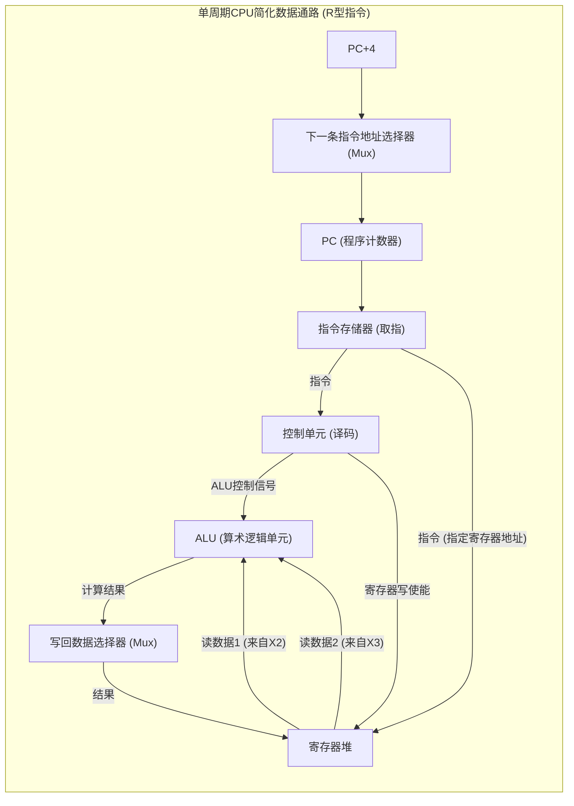

![[Pasted image 20250509150408.png]]
**题目一:**

> 考虑使用一个字节（8位）来表示有符号整数（例如，补码表示，其范围为 -128 到 127，或者题目中暗示的范围 -127 到 127）。
> 
> 1. 将十进制数 `85` 和 `122` 分别转换为二进制数。
> 2. 计算这两个二进制数的和。
> 3. 判断其十进制和 `85 + 122` 是否超出了该8位有符号整数的表示范围，即是否发生溢出。

**题目二:**

> 1. 将十进制数 `63.25` 转换为二进制数。
> 2. 将转换后的二进制数进行规格化处理。
> 3. 请将该规格化的二进制浮点数按照 **IEEE 754 单精度浮点数格式** 表示。具体要求如下：
>     - **符号位：** 确定并表示该1位符号位。
>     - **阶码：** 计算实际阶码，并将其转换为8位的偏移阶码（偏移量为127）进行存储。
>     - **尾数：** 提取规格化后的23位尾数部分（注意隐含的前导1）。
> 4. 最终以32位的二进制序列形式给出 `63.25` 的IEEE 754单精度浮点表示。

![[Pasted image 20250509150035.png]]
![[Pasted image 20250509150046.png]]
![[Pasted image 20250509150101.png]]
![[Pasted image 20250509150342.png]]

![[ab5329e3d99653f9935f8f315169494d.jpg]]
*   **命中 (Hit)：CPU要的数据在Cache中找到了。
*   **缺失 (Miss) / 未命中：** CPU要的数据不在Cache中，需要去下一级存储（如主存）中查找。
*   **命中率 (Hit Rate, H)：** 命中次数 / 总访问次数。
*   **缺失率 (Miss Rate, M)：** 缺失次数 / 总访问次数。显然 $M = 1 - H$。
*   **命中时间 (Hit Time, $T_{hit}$ )：** 访问Cache并取到数据所需的时间。
*   **缺失代价 (Miss Penalty, $T_{miss\_penalty}$ )：** 从下一级存储中调入数据块到Cache并送给CPU所需的时间。
*   **平均访存时间 (Average Memory Access Time, AMAT)：**    $AMAT = T_{hit} + M \times T_{miss\_penalty}$
*   **CPU时间 (CPU Time)：**    $CPU_{time} = (\text{CPU执行周期数} + \text{存储器停顿周期数}) \times \text{时钟周期时间}$    其中，存储器停顿周期数 = 访存次数 $\times$ 缺失率 $\times$ 缺失代价 (以周期为单位)
*   **CPI (Cycles Per Instruction, 每指令周期数)：**    $CPI_{actual} = CPI_{ideal} + \text{平均每条指令的存储器停顿周期数}$    
* 平均每条指令的存储器停顿周期数 = 指令平均访存次数 $\times$ 缺失率 $\times$ 缺失代价 (周期)

* **老师举的CPI计算例子 (非常重要，很可能考！)：

**题目：Cache性能分析与CPI计算**

> 假设一个CPU系统具有以下参数：
> 
> - CPU 基准时钟频率 = 4 GHz
> - 理想CPI (假设所有访存都命中Cache) = 1.0
> - 主存访问时间 (Memory Access Time) = 100 ns
> - 指令的L1缺失率 (Instruction Miss Rate for L1) = 2%
> 
> (假设每条指令平均有1次内存访问，主要来自取指令)
> 
> **问题：**
> 
> 1. 情况一：只有一级缓存 (L1 Cache)
>     
>     a. 计算CPU的时钟周期（单位：ns/cycle）。
>     
>     b. 计算主存访问时间对应的时钟周期数（即L1的缺失代价，单位：cycles）。
>     
>     c. 计算在此情况下，系统的实际CPI。
>     
> 2. 情况二：加入二级缓存 (L2 Cache)
>     
>     在情况一的基础上，系统中增加了一个L2 Cache，其特性如下：
>     
>     - L2 Cache 访问时间 (从CPU发出请求，L1缺失，到L2命中并返回数据给CPU的时间) = 5 ns
>     - L2 的全局缺失率 (Global Miss Rate for L2, 指CPU发出的访存请求中，L1和L2都缺失的概率) = 0.5%
>     
>     a. 计算L2 Cache访问时间对应的时钟周期数（单位：cycles）。
>     
>     b. 计算当L1发生缺失时，访问L2并命中的概率。
>     
>     c. 计算在此两级缓存结构下，系统的实际CPI (CPI&lt;sub>L1+L2&lt;/sub>)。
>     
> 3. 对比分析：
>     
>     比较情况一和情况二得到的CPI值，并简要说明加入L2 Cache对系统性能的影响。
>     

_(可选的思考题，源自文本末尾的讨论点):_

> 4. **讨论：** 在设计Cache系统时，除了缺失率和访问时间，还需要考虑哪些因素来优化性能？例如，关联度 (associativity) 的选择对Cache性能有何影响？

**题目一：直接映射缓存工作过程模拟**

> 假设一个计算机系统具有以下配置：
> 
> - 主存容量：32个字 (Word)
> - 高速缓存容量：8行 (Cache Lines / Blocks)
> - 每块/每行大小：1个字 (Word)
> - 映射策略：直接映射
> - 初始状态：缓存为空（所有有效位为0）
> 
> 1. 分析并确定该系统的主存地址位数、缓存行地址（索引）位数、块内地址（字偏移）位数以及标签（Tag）位数。请说明主存地址的划分方式。
> 2. CPU按顺序访问以下主存地址序列（字地址，十进制表示）：22, 26, 22, 26, 16, 3, 18, 16。 请模拟直接映射缓存的工作过程，对于每一次内存访问：
>     - 将访问的十进制地址转换为二进制地址。
>     - 根据地址划分，确定其Tag和Index。
>     - 判断是缓存命中 (Hit) 还是未命中 (Miss)。
>     - 如果是Miss，说明如何更新缓存行（包括有效位、Tag和数据）。如果发生替换，请指出。
>     - 如果是Hit，说明操作。
> 3. 在访问序列结束后，给出最终的缓存状态（列出所有非空缓存行的Index、Valid Bit、Tag和存储的数据来源，例如Mem[X]）。
> 4. 统计整个访问序列中的总访问次数、Miss次数、Hit次数，并计算缓存的命中率。

**题目二：地址划分计算**

> 考虑一个高速缓存系统，其配置如下：
> 
> - 高速缓存共有 64个块 (行)。
> - 每块有 16个字节。
> - 内存地址为 64位。
> 
> 1. 确定该系统中的块内偏移位数、索引位数和标记位数。
> 2. 对于内存地址 1200 (十进制，字节编址)，请计算：
>     - 该地址对应的内存块号。
>     - 该内存块应映射到高速缓存的哪一行（缓存行号/索引）。
>     - 存入该缓存行的Tag值是什么（可以用十进制或二进制表示）。 请详细说明你的计算步骤或地址划分方法。

**题目三：缓存块大小的影响分析 (论述题)**

> 1. 解释为什么增大缓存块大小可能会提高缓存的命中率，并说明这利用了程序的什么局部性原理。
> 2. 论述过大的缓存块可能带来的三个主要坏处，并简要解释其原因。

**题目四：服务器I/O性能瓶颈分析**

> 考虑一台服务器，其硬件规格和工作负载定义如下：
> 
> **工作负载:**
> 
> - 每次I/O操作的数据大小: 64KB。
> - 处理每次I/O操作所需的CPU指令数: 20万条应用程序指令 + 10万条操作系统指令 = 30万条指令。
> 
> **服务器硬件规格:**
> 
> - **CPU:** 8核心，每核心处理能力为 1×109 IPS (每秒十亿条指令)，总CPU处理能力为 8×109 IPS。
> - **前端总线 (FSB):** 带宽为 10.6 GB/s。
> - **内存系统:** 最大带宽为 33.6 GB/s。
> - **PCIe x8总线:** 带宽为 8 GB/s。
> - **硬盘 (HDD)子系统:**
>     - 数量: 8个硬盘。
>     - 单盘转速: 15000 RPM。
>     - 单盘平均寻道时间: 12 ms。
>     - 单盘数据传输率: 120 MB/s。
> 
> **问题：**
> 
> 请分析该服务器系统的最大I/O速率 (IOPS - 每秒I/O操作数)，需分别考虑以下两种访问模式：
> 
> 1. **CPU处理能力上限：**
>     
>     - 计算CPU能支持的最大IOPS。
> 2. **硬盘IOPS上限 (随机访问):**
>     
>     - 计算单个硬盘进行一次随机I/O操作所需的平均时间，包括平均寻道时间、平均旋转延迟和数据传输时间。
>     - 计算单个硬盘所能支持的最大随机IOPS。
>     - 计算8个硬盘并行工作时，整个硬盘子系统能支持的最大随机IOPS。 _(请注意，根据文本，老师给出的单盘随机IOPS可能基于简化计算或特定条件得到约303 IOPS，使得8个硬盘总计约2424 IOPS。计算时可以展示标准计算过程，并与老师的结论对比或按老师结论进行后续分析，需注明)。_
> 3. **硬盘IOPS上限 (顺序访问):**
>     
>     - 计算8个硬盘并行工作时，整个硬盘子系统能支持的最大顺序IOPS（主要受限于总数据传输率）。 _(请注意，根据文本，老师给出的总顺序IOPS结论约为14000 IOPS。计算时可以与此对比)。_
> 4. **总线IOPS上限：**
>     
>     - 分别计算前端总线 (FSB)、PCIe x8总线以及内存总线各自能支持的最大IOPS，假设I/O数据均需通过这些总线。
> 5. **系统瓶颈分析与结论：**
>     
>     - **对于随机访问模式：** 综合以上各组件的IOPS上限，确定整个系统的瓶颈组件，并给出系统能达到的最大随机IOPS。
>     - **对于顺序访问模式：** 综合以上各组件的IOPS上限，确定整个系统的瓶颈组件，并给出系统能达到的最大顺序IOPS。

---

**题目六：直接映射Cache的地址映射与命中分析**

> 考虑一个初始为空的直接映射Cache。内存按字节编址，字长为4 Bytes。 现给定一个内存访问序列 (例如：0, 4, 8, 12, 16, 20, 0, 4，或其他具体序列)。
> 
> **问题：**
> 
> 1. **配置一：** Cache有16个块，每块大小为1个字 (即4 Bytes)。
>     
>     - 确定主存地址应如何划分为Tag、Index和块内偏移(字节偏移)。
>     - 对于给定的内存访问序列，逐个分析每次访问的Tag、Index，判断是Hit还是Miss，并展示每次访问后Cache的状态 (例如，每行的Valid位、Tag和数据块内容)。
>     - 计算该序列下的总命中率。
> 2. **配置二：** Cache总容量仍为16个字，但块大小变为2个字 (即8 Bytes)。因此，Cache共有8个块。
>     
>     - 确定主存地址应如何划分为Tag、Index和块内偏移 (包括块内字偏移和字内字节偏移)。
>     - 对于相同的内存访问序列，重复问题1中的分析过程 (判断Hit/Miss，展示Cache状态)。
>     - 计算该序列下的总命中率。
> 3. **配置三 (可选，如题目给定)：** Cache总容量仍为16个字，但块大小变为4个字 (即16 Bytes)。因此，Cache共有4个块。
>     
>     - 确定主存地址划分。
>     - 对于相同的内存访问序列，重复问题1中的分析过程。
>     - 计算该序列下的总命中率。
> 4. **比较分析：** 根据上述至少两种配置（例如配置一和配置二）对同一访问序列的分析结果，比较它们的命中率，并讨论块大小对直接映射Cache性能的可能影响。
>     
> 
> _(答题时，请务必画出Cache状态表来追踪变化。地址转换和拆分是关键步骤。)_

![[b7eb090819b8706dcf73d1e5930338d7.jpg]]
![[448333be83ea09429518bb523e4e9d8a.jpg]]

![[08559418ac09e6113a85260c0b00eae4.jpg]]

![[cdac4f20d1be5a56bc54c104b728f51b.jpg]]
![[cd6f1e4e7dd191a29342cedd404cd087.jpg]]
