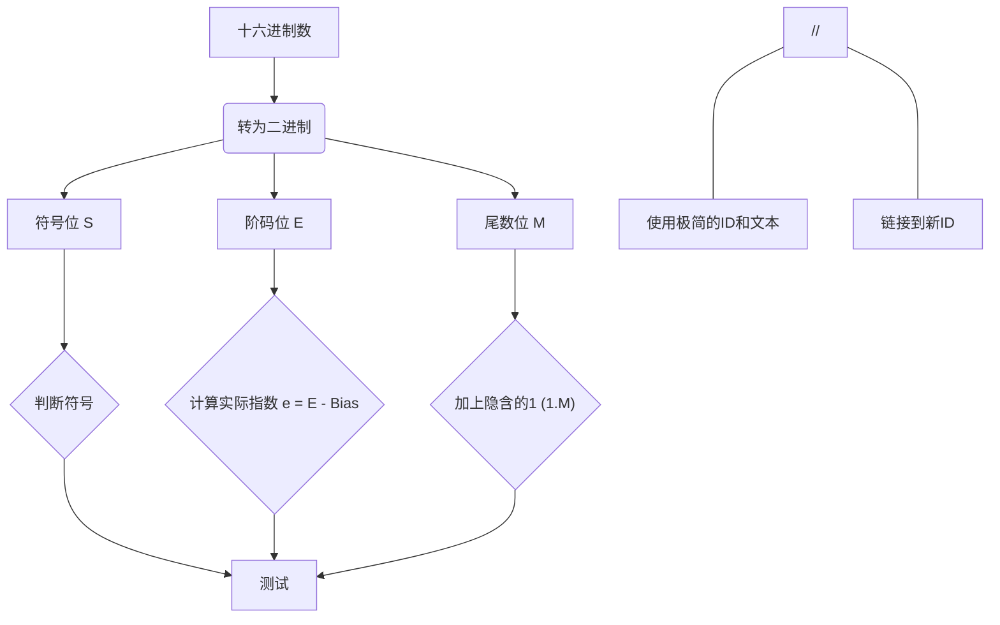

好的，我们结合你的笔记（这些PPT标题确实很重要，代表了老师讲解的结构）和之前的录音STT分析，来重新整理一份更完整、详细的复习纲要。

---

## 课程复习与考试安排总览 (与之前整理一致，此处概要)

*   **重要事宜：** 考勤、作业提交 (5月13日截止)、成绩构成 (平时40%, 期末60%-70%)。
*   **复习方法：** 理解概念而非死记硬背，重点掌握作业题、PPT例题。
*   **考试安排：**
    *   时间：5月12日。
    *   地点：多考场。
    *   要求：不能提前交卷，携带学生证/身份证。
    *   禁止：书籍、资料、字典、计算器、手机。
    *   题型：无选择判断，主要是简答、计算、分析题。
    *   答题：步骤清晰，保留两位小数，区分等号与约等号。

## 课程复习与考试安排总览

**老师首先强调了几个重要的事情：**

1.  **考勤 (Attendance):**
    *   大部分同学都按时参与了课程，签到情况良好。
    *   老师提到了签到记录（比如 5月10日，5月12日），如果因为特殊原因（如生病）缺勤，可以之后向老师说明情况并补签（但不要试图篡改记录）。
    *   考勤、平时表现和作业共同构成了平时成绩。

2.  **作业 (Homework):**
    *   **重要性：** 作业非常重要，是平时成绩（可能占40%）的主要部分。老师强调作业一定要搞懂。
    *   **提交：** 最终的作业提交时间是 **5月13日**（考完试的第二天）。需要将之前所有布置的作业整理好，连同最后一次作业一起提交。学委（学习委员）会统计提交情况。
    *   **内容：** 作业里的题目类型（特别是计算题和分析题）和考试紧密相关，是复习的重中之重。
    *   **批改/讲解：** 作业之前已经在课堂上讲解过，答案不会再单独发放，需要根据笔记整理。
    *   **未交情况：** 有少数同学（提到约10人，2位同学）的部分平时作业没有按时提交，需要在5月13日前补齐。

3.  **成绩构成 (Grading):**
    *   **平时成绩（~40%）：** 包括出勤、课堂表现、作业。老师提到如果这些都做好，拿到35分以上（满分40的话）应该没问题。
    *   **期末考试（~60%-70%）：** 主要考察课程的核心知识点和解题能力。老师的目标是让大部分同学能达到 70-80 分的水平。

4.  **复习方法 (Study Strategy):**
    *   **概念：** 对于概念，不需要死记硬背原文，但要理解其含义，能用自己的话解释清楚。
    *   **重点：** 作业题、老师课堂上讲解的例题、PPT里的计算和分析题是重点。
    *   **教材：** 老师强调内容基本都源于教材（“书本”），题目也大多来自通用题库或教材习题。建议多看书、多做题。遇到不懂的题目，可以尝试在网上搜索关键语句找到类似题目或讲解。


---

## 课程核心内容梳理 (结合你的笔记标题)

以下是你笔记中提到的PPT标题，我会结合之前STT的详细内容进行展开：

### Page 1 笔记内容：

1.  **Classes of Computers. (计算机分类)**
    *   **STT 提及：** PC机、服务器 (Server)、超级计算机 (Supercomputer)、嵌入式系统 (Embedded System)。老师强调这是基础的四类。
    *   **笔记提及：** "笑+PMD+WSC" - "笑"可能是"小型机"或口误，"PMD" 可能是 Personal Mobile Device (个人移动设备/PDA)，"WSC" 可能是 Workstation (工作站) 或 Server (服务器的另一种说法)。
    *   **考点/复习要点：**
        *   你需要掌握至少 **PC、服务器、超级计算机、嵌入式系统** 这四种分类的概念和主要特点。
        *   如果题目要求更多（如6种），可以加上 **PDA/移动设备、工作站**。
        *   题型：很可能是简答题，要求列出分类并简述特征。
        *   例如：
            *   **个人计算机(PC):** 面向个人用户，通用性强，性价比高。
            *   **服务器(Server):** 提供网络服务，高可靠性、高可用性、高吞吐量。
            *   **嵌入式系统(Embedded System):** 特定功能，资源受限，实时性要求高，如家电、车载系统。
            *   **超级计算机(Supercomputer):** 用于大规模科学计算，性能极高。

2.  **Eight Great Ideas. (计算机设计的八个伟大思想)**
    *   **STT 提及：** 虽然没有直接列出八个思想，但老师提到了冯诺依曼结构，并说去年考过相关难题，暗示要理解计算机设计的基本原则。
    *   **考点/复习要点：** 这通常指 Patterson & Hennessy 教材中总结的八个思想，对于理解计算机体系结构非常重要。即使不直接考名词解释，理解它们也有助于解答其他问题。
        1.  **Design for Moore's Law (为摩尔定律而设计)**
        2.  **Use Abstraction to Simplify Design (使用抽象简化设计)**
        3.  **Make the Common Case Fast (加速大概率事件)**
        4.  **Performance via Parallelism (通过并行提高性能)**
        5.  **Performance via Pipelining (通过流水线提高性能)**
        6.  **Performance via Prediction (通过预测提高性能)**
        7.  **Hierarchy of Memories (存储器层次结构)**
        8.  **Dependability via Redundancy (通过冗余提高可靠性)**
    *   了解每个思想的核心含义。

3.  **Brief History of Arm (ARM发展简史)** (你的笔记写了Arm(2)可能是指这部分有两个点或第二部分)
    *   **STT 提及：** 提到了MIPS, ARM 作为指令集架构的例子。
    *   **考点/复习要点：** 了解ARM是一家公司及其处理器的主要应用领域（嵌入式、移动设备等），以及其RISC（精简指令集）的特点。可能不会深究历史细节。

4.  **Design principles applied to the ARMv8. (应用于ARMv8的设计原则)**
    *   **STT 提及：** 重点讲了RISC的四个重要设计原则，并强调要理解。
    *   **考点/复习要点：**
        *   **精简指令集 (RISC) 的核心设计原则：**
            1.  **指令长度固定：** 便于译码和流水线。
            2.  **Load/Store 架构：** 只有加载 (Load) 和存储 (Store) 指令可以访问内存，运算指令的操作数来自寄存器。
            3.  **指令功能简单，数量较少：** 便于硬件实现。
            4.  **强调编译器优化：** 充分利用寄存器，优化指令序列。
            5.  (可能还包括：寻址方式简单，大量通用寄存器)
        *   题型：简答题，阐述RISC的设计原则。

5.  **LEGV8 Registers. x9-x15 x19-x27 X2R (应为XZR/R31, 零寄存器)**
    *   **STT 提及：** "x9它是一个临时的"，"像这个29 30 00 你就知道一下"。
    *   **考点/复习要点：** (LEGv8是ARMv8的一个教学简化版，寄存器命名和使用规则类似)
        *   **通用寄存器：** ARMv8 (及LEGv8) 有32个64位通用寄存器 `X0` - `X30`。
        *   **特殊用途寄存器（按惯例）：**
            *   `X0` - `X7`: 用于参数传递和返回值。
            *   `X8`: 间接结果寄存器 (Indirect result register)。
            *   `X9` - `X15`: 调用者保存的临时寄存器 (Caller-saved temporary registers)。 (与你的笔记 `x9-x15` 一致)
            *   `X16` (IP0), `X17` (IP1): 链接器使用的临时寄存器。
            *   `X18`: 平台寄存器 (Platform register)，不建议在普通代码中使用。
            *   `X19` - `X27`: 被调用者保存的寄存器 (Callee-saved registers)。 (与你的笔记 `x19-x27` 一致)
            *   `X28` (SP): 栈指针 (Stack Pointer) 的可选别名，通常指代栈顶。
            *   `X29` (FP): 帧指针 (Frame Pointer)。
            *   `X30` (LR): 链接寄存器 (Link Register)，保存返回地址。
            *   `XZR` (或 `X31`): 零寄存器，读取时总是0，写入时被忽略。(你笔记的 `X2R` 应该是 `XZR`)
        *   **程序状态寄存器 (PSTATE):** 包含条件码标志位 N (Negative), Z (Zero), C (Carry), V (Overflow)。
        *   理解哪些寄存器用于参数传递，哪些需要被调用者保存，哪些由调用者保存。

6.  **More conditional operations (更多条件操作)**
    *   **STT 提及：** "标志来移移衍生出来的很多的条件就是那么大的问题" (指条件码标志位)。
    *   **考点/复习要点：**
        *   基于PSTATE中的条件码标志位 (N, Z, C, V) 实现条件执行或条件跳转。
        *   常见的条件跳转指令：如 `CBZ` (Compare and Branch if Zero), `CBNZ` (Compare and Branch if Non-Zero), `B.cond` (Branch on condition, e.g., `B.EQ` Branch if Equal, `B.NE` Branch if Not Equal, `B.LT` Branch if Less Than等)。
        *   了解这些指令如何根据运算结果（影响标志位）来改变程序控制流。

7.  **Procedure Calling. (过程调用/子程序调用)**
    *   **STT 提及：** "调用子程序的一个简单的流程，这6其实不难...第一步，把这个参数存在的存在放在这个，然后呢，把这个控制权交给调度组织成功率..." (老师说的6步)。
    *   **考点/复习要点：** 掌握子程序调用的标准流程（调用约定）：
        1.  **参数传递 (Parameter Passing):** 调用者将参数放入约定的寄存器 (`X0-X7`) 或栈中。
        2.  **保存返回地址 (Save Return Address):** 调用指令 (如 `BL` - Branch with Link) 将下一条指令的地址存入链接寄存器 `LR (X30)`。
        3.  **跳转到子程序 (Transfer Control):** 程序计数器 `PC` 跳转到子程序的入口地址。
        4.  **分配栈帧 (Allocate Stack Frame):** 子程序在栈上为局部变量、需要保存的寄存器分配空间 (通过调整 `SP`)。
        5.  **保存寄存器 (Save Registers):** 如果子程序使用了被调用者保存的寄存器 (`X19-X29`, `LR`)，则需要先将它们的值压栈。
        6.  **执行子程序体 (Execute Procedure Body):**
        7.  **恢复寄存器 (Restore Registers):** 从栈中恢复之前保存的被调用者寄存器。
        8.  **返回值 (Return Value):** 将结果放入约定的寄存器 (`X0-X1`)。
        9.  **释放栈帧 (Deallocate Stack Frame):** 恢复 `SP`。
        10. **返回 (Return):** 将 `LR` 中的返回地址加载到 `PC` (如使用 `RET` 指令，它通常等价于 `BR LR`)。
        *   题型：简答题，描述过程调用的步骤。

### Page 2 笔记内容：

1.  **IEEE Floating-point Format (IEEE 浮点数格式)**
    *   **STT 提及：** "单精度和双这个指标...符号内，肯定是一个。你只需要记住它的整个指数27...双季度就是二的11次方减去24万那个时候..." (老师口误较多，但指明了单精度指数偏移127，双精度指数11位)。
    *   **考点/复习要点：**
        *   **单精度 (Single Precision, 32-bit):**
            *   1位符号 (S)
            *   8位阶码 (Exponent, E)，偏移量 (Bias) 为 127。实际指数 $e = E - 127$。
            *   23位尾数 (Mantissa/Fraction, M)。规格化时隐藏整数部分的1。
            *   值：$(-1)^S \times (1.M) \times 2^{E-127}$
        *   **双精度 (Double Precision, 64-bit):**
            *   1位符号 (S)
            *   11位阶码 (Exponent, E)，偏移量 (Bias) 为 1023。实际指数 $e = E - 1023$。
            *   52位尾数 (Mantissa/Fraction, M)。规格化时隐藏整数部分的1。
            *   值：$(-1)^S \times (1.M) \times 2^{E-1023}$
        *   **规格化 (Normalization):** 确保尾数的小数点前是1 (对于二进制)。
        *   **特殊值：** ±Infinity (阶码全1，尾数全0)，NaN (Not a Number, 阶码全1，尾数非0)，±0 (阶码全0，尾数全0)。
        *   **考点：** 重要的计算题。十六进制与浮点数的相互转换。例如，将 `0xC1200000` (十六进制) 转换为单精度浮点数。

2.  **Instruction Execution. (指令执行过程)**
    *   **STT 提及：** "你能看到这些指令，他们都用了某个硬件是用来干什么？比如说ALU他在加班预算的时候用来做什么？" (加班预算=加法运算)。
    *   **考点/复习要点：** 经典的指令周期通常包含：
        1.  **IF (Instruction Fetch - 取指令):** 从PC指向的内存地址读取指令到指令寄存器。PC自增。
        2.  **ID (Instruction Decode - 指令译码):** 分析指令操作码，确定操作类型和操作数地址。读取寄存器操作数。
        3.  **EX (Execute - 执行):** ALU执行算术逻辑运算，或计算地址。
        4.  **MEM (Memory Access - 访存):** Load指令从内存读取数据，Store指令向内存写入数据。
        5.  **WB (Write Back - 写回):** 将结果写回寄存器堆。
        *   理解不同类型指令（如算术、Load/Store、跳转）在这些阶段分别做什么。

3.  **Datapath with Control 图 (带控制的数据通路图)**
    *   **STT 提及：** "单周期的简单处理你知道吗？我们在哪里？我们都去我们的考试的。1到2个，但是这只是为了帮助整个总体解读的时候，需要回答的问题并不代表着哪道题。具体就是用到就是一个参考资料。这里你们要先学会看懂..."
    *   **考点/复习要点：**
        *   理解单周期处理器的数据通路图，识别主要部件（PC, 指令存储器, 寄存器堆, ALU, 数据存储器, 控制器, 各种多路选择器MUX）。
        *   能够追踪一条简单指令（如ADD, LDUR, STUR, B）在数据通路上的执行流程，哪些部件被使用，哪些控制信号有效。
        *   考试时 **可能会提供数据通路图** 作为参考。
        *   Mermaid示例 (简化)：
            ```mermaid
            graph TD
                PC --> IMEM[指令存储器]
                IMEM --> IDecode[译码/寄存器堆]
                IDecode --> ALU
                IDecode --> DMem[数据存储器]
                ALU --> DMem
                ALU --> IDecode_WB(写回)
                DMem --> IDecode_WB
                Controller[控制器] -.-> PC
                Controller -.-> IMEM
                Controller -.-> IDecode
                Controller -.-> ALU
                Controller -.-> DMem
            ```

4.  **Five stages (五级流水线)**
    *   **STT 提及：** "这个五级流水线的划分。这个大家要看一下...IF (取指), ID (译码/读寄存器), EX (执行), MEM (访存), WB (写回)。"
    *   **考点/复习要点：**
        *   熟记五级流水线的名称和每个阶段的主要功能。
        *   **IF:** 取指令。
        *   **ID:** 指令译码，读寄存器。
        *   **EX:** 执行运算或计算地址。
        *   **MEM:** 访问数据存储器。
        *   **WB:** 将结果写回寄存器。
        *   理解流水线如何通过并行执行不同指令的不同阶段来提高吞吐率。

5.  **Pipeline performance. (流水线性能)**
    *   **STT 提及：** 详细讲解了基于流水线的性能计算例题 (你的笔记Page 4左侧的题目)。
    *   **考点/复习要点：**
        *   **加速比 (Speedup):** $S = T_{\text{non-pipeline}} / T_{\text{pipeline}}$
        *   **理想流水线：** 如果有 $k$ 个阶段，指令数为 $n$，理想情况下完成时间 $T_k = (k + n - 1) \tau$，其中 $\tau$ 是最长阶段的延迟。当 $n \gg k$ 时，$S \approx k$。
        *   **流水线时钟周期：** 由最慢的流水线段决定 (加上锁存器开销)。
        *   **吞吐率 (Throughput):** 单位时间内完成的指令数。
        *   **关键路径（针对单周期）：** 执行时间最长的指令决定了单周期处理器的时钟周期。
        *   **流水线最高频率：** $f = 1 / (\text{最长阶段延迟} + \text{锁存器延迟})$
        *   参考下面详细例题分析。

6.  **Hazards (冒险)**
    *   **STT 提及：** 未深入，但这是流水线的核心问题。
    *   **考点/复习要点：**
        *   **结构冒险 (Structural Hazard):** 硬件资源不足导致冲突。解决方法：增加资源，流水线停顿。
        *   **数据冒险 (Data Hazard):** 指令依赖于前一条指令的结果，但结果尚未写回。
            *   **RAW (Read After Write):** 写后读。解决方法：转发/旁路 (Forwarding/Bypassing)，流水线停顿/气泡 (Stall/Bubble)。
            *   WAW (Write After Write), WAR (Write After Read): 在简单五级流水线中不常见，但在乱序执行中需要处理。
        *   **控制冒险 (Control Hazard):** 分支指令导致下一条指令不确定。解决方法：分支预测，延迟槽 (Delayed Branch)，流水线冲刷 (Flush)。
        *   能识别不同类型的冒险，并知道主要的解决方法。

7.  **Pipelined Control (Simplified) (流水线控制-简化)**
    *   **STT 提及：** "控制器会把这个指定的所有控制信号，然后把它分子，然后再把这些话就发入相应的阶段。然后紧紧接着是这个呃ALU的控制的型号是在今天晚上（EX阶段）。"
    *   **考点/复习要点：**
        *   控制信号需要在正确的流水线阶段生效。
        *   通过在流水线寄存器中传递控制信号，确保每个阶段的部件获得正确的控制。例如，ALU操作的控制信号在ID阶段产生，但通过ID/EX寄存器传递到EX阶段才作用于ALU。
        *   理解哪些控制信号在哪个阶段使用。

### Page 3 笔记内容：

1.  **Principle of Locality (局部性原理)**
    *   **STT 提及：** "第一个重要的概念就是这局部性原。那么同学们要知道什么是局部性原理，然后为什么计算机不具有能源，而它的时间局部性和空间局部性..."
    *   **考点/复习要点：**
        *   **时间局部性 (Temporal Locality):** 如果一个数据项或指令被访问，那么在不久的将来它很可能再次被访问 (如循环中的指令和变量)。
        *   **空间局部性 (Spatial Locality):** 如果一个数据项被访问，那么与它地址相近的数据项很可能在不久的将来被访问 (如数组元素顺序访问，顺序执行的指令)。
        *   **应用：** 局部性原理是高速缓存 (Cache)、虚拟内存等技术有效性的基础。
        *   题型：简答题，解释概念及其应用。

2.  **Associative caches 映射 (相联高速缓存映射)** (应指Cache的映射方式)
    *   **STT 提及：** "直接映射，还有这个二路主线的映射，四路主线的映射..."
    *   **考点/复习要点：** Cache 的三种主要映射方式：
        1.  **直接映射 (Direct Mapped):** 每个主存块只能映射到Cache中的一个特定行。
            *   地址划分：Tag | Index | Offset
            *   冲突率高，但实现简单。
        2.  **全相联映射 (Fully Associative):** 主存块可以映射到Cache中的任何行。
            *   地址划分：Tag | Offset
            *   冲突率最低，但硬件复杂 (需要比较所有Tag)。
        3.  **组相联映射 (Set-Associative):** Cache行被分成若干组，每个主存块可以映射到特定组中的任何一行。是前两者的折中。
            *   地址划分：Tag | Set Index | Offset
            *   例如，2路组相联 (2-way set associative) 指每组有2行。
        *   能够根据给定的Cache参数（Cache大小，块大小，相联度）和内存地址，计算Tag, Index/Set Index, Offset的位数，并确定数据映射到Cache的哪个位置。
        *   参考下面详细例题分析。

3.  **Disk sectors and Access 时间 (磁盘扇区与访问时间)**
    *   **STT 提及：** "...问大家硬盘的访问时间或者动作，包括哪几个步骤或者哪几个时间。那就在这包含了五个小。" (通常是4个主要时间)
    *   **考点/复习要点：** 磁盘访问时间主要由以下几部分组成：
        1.  **寻道时间 (Seek Time):** 磁头移动到目标磁道所需时间。
        2.  **旋转延迟 (Rotational Latency):** 等待目标扇区旋转到磁头下方所需时间 (平均为磁盘旋转半周的时间)。
        3.  **传输时间 (Transfer Time):** 数据从磁盘读出或写入磁盘所需时间 (取决于数据量和磁盘转速/密度)。
        4.  **控制器时间 (Controller Time):** 控制器处理命令所需时间。
        5.  (有时还包括排队时间 Queuing Time，如果多个请求等待)
        *   题型：简答题，列出组成部分。

4.  **Buses used to connect CPU memory. (用于连接CPU和内存的总线)**
    *   **STT 提及：** 未详细展开，但总线是计算机组件互连的基础。
    *   **考点/复习要点：**
        *   **总线类型：**
            *   **数据总线 (Data Bus):** 传输数据。宽度决定了每次能传输的数据位数。
            *   **地址总线 (Address Bus):** 传输内存地址或I/O端口地址。宽度决定了可寻址空间大小。
            *   **控制总线 (Control Bus):** 传输控制信号和时序信号 (如读/写信号、中断请求、总线请求/允许等)。
        *   了解总线的概念和基本分类。

5.  **Polling interrupts DMA (程序查询(轮询)、中断、DMA)**
    *   **STT 提及：** "这里我们说了三种，对吧？实际上是四种铺了一轮训法终端。你在哪一个size，直接内存访问这个管理法。然后还有一种是什么通道处理器这小5处理器。"
    *   **考点/复习要点：** 这是I/O控制的几种主要方式：
        1.  **程序查询/轮询 (Programmed I/O - Polling):** CPU主动、反复查询I/O设备状态。CPU效率低。
        2.  **中断驱动 (Interrupt-driven I/O):** I/O设备完成操作后向CPU发出中断请求，CPU响应中断并处理。CPU效率较轮询高。
        3.  **直接内存访问 (DMA - Direct Memory Access):** DMA控制器在外设和主存之间直接传输数据，只需CPU在开始和结束时介入。大大减轻CPU负担，适用于高速I/O。
        4.  **通道方式 (Channel / I/O Processor - IOP):** 使用专门的I/O处理器管理I/O操作，进一步解放CPU。
        *   题型：简答题，比较这几种方式的原理、优缺点。

---

## 例题详细分析 (基于你的笔记Page 4, 5 和 STT讲解)

### 题型一：流水线性能分析 (笔记Page 4 左图 & STT)

*   **题目描述 (还原自PPT截图):**
    *   电路元件延迟: IF=200ps, ID=100ps, EX=200ps, MEM=200ps, WB=100ps.
    *   给定指令: ADD, LDUR, STUR, AND, CBZ (CBZ应为条件分支，通常不进行WB，但题目表格包含WB，按表格算)。
    *   任务1: 标记指令使用的阶段，计算执行时间。
    *   任务2: 哪条指令是关键路径？
    *   任务3: 单周期数据通路最快时钟频率？

*   **解答思路 (结合STT)：**
    1.  **标记阶段与计算时间 (假设所有指令都经过这5个阶段，除非特定指令跳过某些阶段，例如跳转指令可能不进行MEM或WB，但题目表格中都列出了，按表格假设)：**
        *   你需要为每条指令，在表格中标记它实际会用到的阶段（通常ALU类指令如ADD/AND用IF,ID,EX,WB；Load用IF,ID,EX,MEM,WB；Store用IF,ID,EX,MEM；Branch用IF,ID,EX）。 **但此题中，所有指令都给出了5个阶段的时间，可能简化为每条指令都要经历这5个阶段，或者说这是每个阶段的最大可能延迟。** 老师说“在下面打个勾，也可以写个下面是200”。
        *   **STT的重点是：** 给定的指令，如 `ADD`, `LDUR` 等，它们在 IF, ID, EX, MEM, WB 各阶段的耗时是多少。PPT的表格是 *元件* 的延迟，你需要根据指令类型判断它会激活哪些元件路径，以及每个阶段的 *实际* 耗时。**但此题简化了，似乎直接用了元件延迟作为该阶段的指令耗时。**
        *   **以 LDUR 为例 (假设它用满所有阶段，且各阶段耗时如PPT表格):**
            *   IF: 200ps
            *   ID: 100ps
            *   EX: 200ps (地址计算)
            *   MEM: 200ps (读内存)
            *   WB: 100ps (写回寄存器)
            *   **LDUR 单独执行总时间 (非流水线或单周期下):** 200+100+200+200+100 = 800ps.
        *   你需要对所有给出的指令类型（ADD, LDUR, STUR, AND, CBZ）都做这个计算。
            *   ADD, AND (R型指令): 通常不用MEM阶段，但如果按表格都算：200(IF)+100(ID)+200(EX)+200(MEM,可能空操作)+100(WB) = 800ps. 如果MEM不用，则是 200+100+200+100 = 600ps. **需明确题目对R型指令是否经过MEM。从表格看，似乎假设所有指令都按这5个阶段评估。**
            *   STUR (S型指令): 200(IF)+100(ID)+200(EX,地址计算)+200(MEM,写内存) = 700ps (WB阶段通常不写通用寄存器). 如果算WB则是800ps.
            *   CBZ (条件跳转): 200(IF)+100(ID)+200(EX,比较和地址计算). 通常后续MEM, WB不做。则是500ps. 如果都算则是800ps.
            *   **关键是看题目如何定义 "Total Time"，是指令的实际路径，还是简单地把对应列加起来。从STT描述看，老师强调 "这个指令打勾，下面打这样就不行。你要证明这种情况没有歧义的方式去表达。你是选这个阶段做预算，然后最后你这里要把它这些数量加起来了，得到一个值。" 这表明要累加所选阶段的时间。**
            *   **假设所有指令都使用表格中给出的5个阶段的延迟：** 那么每条指令的总时间都是 200+100+200+200+100 = 800ps。

    2.  **关键路径 (Critical Path - 针对单周期处理器):**
        *   单周期处理器中，时钟周期必须满足最慢（执行时间最长）的那条指令。
        *   从上面的计算中找出最大的那个“Total Time”。如果都按800ps算，则关键路径是800ps。
        *   STT: "你就找不出上面的这里哪一个数最大，大多数是在上面的。"

    3.  **单周期最快时钟频率 (Fastest single-cycle datapath clock):**
        *   $T_{\text{single-cycle}} = \text{Critical Path Time}$
        *   $f_{\text{single-cycle}} = 1 / T_{\text{single-cycle}}$
        *   如果 Critical Path = 800ps = $800 \times 10^{-12}$ s
        *   $f = 1 / (800 \times 10^{-12}) = 1.25 \times 10^9$ Hz = 1.25 GHz.
        *   STT: "如果说这一部分是拍不来的话，那你就要找里面。比如说这里面200就是最深的那个情歌（阶段），所以应该他就是200平的（皮秒），他始终比较慢，哪怕就是气候治理（其他指令），如果是开展（流水线）的话，你以后都算出来加起来的东西。你只要算它这里面最长的99（最长指令时间），但是这个问题不是单周期，那就要把这个关键路径。" **这里老师的STT有点混淆了单周期和流水线。对于单周期，是看最长指令总时间。对于流水线，是看最长阶段时间。题目问的是单周期！**

    *   **补充：如果问流水线最高时钟频率：**
        *   $T_{\text{pipeline-stage}} = \text{Max(IF, ID, EX, MEM, WB) delay} = \text{Max(200, 100, 200, 200, 100)} = 200\text{ps}$
        *   $f_{\text{pipeline}} = 1 / (200 \times 10^{-12}) = 5 \text{ GHz}$ (忽略锁存器延迟)

### 题型二：处理器性能比较 (笔记Page 4 右图 & STT & 手写计算)

*   **题目描述 (还原自PPT截图):**
    *   P1: $f_1=3$ GHz, $CPI_1=1.5$
    *   P2: $f_2=2.5$ GHz, $CPI_2=1.0$
    *   P3: $f_3=4.0$ GHz, $CPI_3=2.2$
    *   a. 哪个处理器IPS最高？
    *   b. 若程序运行10秒，各处理器执行的周期数和指令数？
    *   c. 执行时间减少30% ($T_{new}=0.7T_{old}$)，导致CPI增加20% ($CPI_{new}=1.2CPI_{old}$)。新的时钟频率 $f_{new}$ 应为多少？(针对P1计算)

*   **解答思路 (结合STT和你笔记中的计算):**
    *   **a. 计算IPS (Instructions Per Second):** $IPS = f / CPI$
        *   $IPS_1 = (3 \times 10^9) / 1.5 = 2 \times 10^9$ IPS
        *   $IPS_2 = (2.5 \times 10^9) / 1.0 = 2.5 \times 10^9$ IPS
        *   $IPS_3 = (4 \times 10^9) / 2.2 \approx 1.818 \times 10^9$ IPS
        *   **结论：P2 的 IPS 最高。** (你的笔记第1点 "P2 IPS" 指向正确)
    *   **b. 10秒内的周期数和指令数：**
        *   **周期数 (Cycles):** $Cycles = f \times Time$
            *   $Cycles_1 = (3 \times 10^9) \times 10 = 30 \times 10^9$ cycles (与你笔记第2点 $3\times10^9\times10=30\times10^9$ 一致)
            *   $Cycles_2 = (2.5 \times 10^9) \times 10 = 25 \times 10^9$ cycles
            *   $Cycles_3 = (4 \times 10^9) \times 10 = 40 \times 10^9$ cycles
        *   **指令数 (Instructions, IC):** $IC = IPS \times Time$ 或 $IC = Cycles / CPI$
            *   $IC_1 = (2 \times 10^9) \times 10 = 20 \times 10^9$ instructions (与你笔记第2点 $\frac{30\times10^9}{1.5}=20\times10^9$ 一致)
            *   $IC_2 = (2.5 \times 10^9) \times 10 = 25 \times 10^9$ instructions
            *   $IC_3 = (1.818 \times 10^9) \times 10 \approx 18.18 \times 10^9$ instructions
    *   **c. 性能优化分析 (假设针对P1):**
        *   原始P1: $T_{old}$, $f_{old}=3$ GHz, $CPI_{old}=1.5$.
        *   程序相同，所以指令数 $IC$ 不变。$IC = IPS_1 \times T_{old} = (2 \times 10^9) \times T_{old}$.
        *   新的条件: $T_{new} = 0.7 \times T_{old}$, $CPI_{new} = 1.2 \times CPI_{old} = 1.2 \times 1.5 = 1.8$.
        *   我们知道 $T_{cpu} = IC \times CPI / f$.
        *   所以 $f_{new} = (IC \times CPI_{new}) / T_{new}$
        *   $f_{new} = (IC \times 1.8) / (0.7 \times T_{old})$
        *   因为 $IC/T_{old} = f_{old}/CPI_{old} = (3 \times 10^9) / 1.5 = 2 \times 10^9$.
        *   $f_{new} = ( (2 \times 10^9) \times T_{old} \times 1.8) / (0.7 \times T_{old})$
        *   $f_{new} = (2 \times 10^9 \times 1.8) / 0.7 = (3.6 \times 10^9) / 0.7 \approx 5.14 \times 10^9$ Hz = 5.14 GHz.
        *   你的笔记第3点: $10 \times 0.7 = 7s$ (假设 $T_{old}=10s$, 则 $T_{new}=7s$). $IC_1 = 20 \times 10^9$.
            $CPI_{new} = 1.5 \times 1.2 = 1.8$.
            $f_{new} = (IC_1 \times CPI_{new}) / T_{new} = (20 \times 10^9 \times 1.8) / 7 = (36 \times 10^9) / 7 \approx 5.14 \times 10^9$ Hz.
            **你的手写计算 $\frac{20\times10^9\times1.8}{7} = 5.1PXVGHZ$ (应为 $5.14$ GHz) 是正确的。**

### 题型三：高速缓存映射分析 (笔记Page 5 图 & STT)

*   **题目描述 (还原自PPT截图):**
    *   1G 主存 (byte-addressing), 128KB Cache.
    *   数据地址: `0x123456` (byte-addressing).
    *   任务: 对于不同的Cache配置（直接映射/组相联，不同块大小），确定数据映射到的Cache块，Tag内容(Hex)，Tag位数，总Cache大小。

*   **解答思路 (结合STT和你笔记中的二进制划分):**
    *   **通用步骤：**
        1.  **地址位数：** 1G主存 = $2^{30}$ Bytes，所以内存地址是30位。
            `0x123456` = `0001 0010 0011 0100 0101 0110` (二进制，24位，前面补0到30位)
            `000000 0001 0010 0011 0100 0101 0110` (30位二进制)
        2.  **Cache 总大小：** 128KB = $2^7 \times 2^{10}$ Bytes = $2^{17}$ Bytes.
        3.  **你笔记的划分: `0x 0001 0010 0011 0100 0101 0110`**
            **`8K Block | index | offset` 这是错误的，应该是 `Tag | Index | Offset`**
            8K Blocks 是指 Cache 中块的数量，不是地址的一部分。

    *   **情况1: Direct-mapped, 16 bytes/block**
        *   **Block Size:** 16 Bytes = $2^4$ Bytes.
        *   **Offset bits:** $\log_2(16) = 4$ bits.
            地址 `...0110` (最后4位是Offset)
        *   **Number of blocks in Cache:** Total Cache Size / Block Size = $(128 \times 1024) / 16 = (2^{17}) / (2^4) = 2^{13}$ blocks = 8192 blocks (8K blocks).
        *   **Index bits:** $\log_2(2^{13}) = 13$ bits.
            地址 `...0100 0101 0` (Offset前的13位是Index: `010 0011 0100 0`)
            Index value: `0010 0011 0100 0` (二进制) = `0x468`
            所以数据映射到第 `0x468` (十进制1128) 号 Cache 块。
        *   **Tag bits:** Total address bits - Index bits - Offset bits = $30 - 13 - 4 = 13$ bits.
            地址 `000000 0001 001` (最前面的13位是Tag)
            Tag value: `0000000001001` (二进制) = `0x009` (十六进制)
        *   **Tag for the data (Hex):** `0x9` (老师的PPT里通常会写成两位或更多，补零如 `09` 或 `009`，位数取决于tag总位数)
        *   **Total Cache Size (bits, including Tag and Valid):**
            每个块: Tag bits + Valid bit (1) + Data bits
            Data bits = $16 \text{ Bytes} \times 8 = 128$ bits.
            Total = Number of blocks $\times (13 + 1 + 128)$ bits
            Total = $2^{13} \times (142)$ bits = $8192 \times 142 = 1,163,264$ bits.
            In Bytes = $1,163,264 / 8 = 145,408$ Bytes = $145408 / 1024 = 142$ KB.
            (STT中老师算的是 $15+1$ 可能是另一个例子，这里是 $13+1$ )

    *   **你需要对表格中的其他情况进行类似的计算：**
        *   **Direct-mapped, 64 bytes/block:**
            Offset bits = $\log_2(64) = 6$.
            Number of blocks = $2^{17} / 2^6 = 2^{11}$.
            Index bits = $11$.
            Tag bits = $30 - 11 - 6 = 13$.
        *   **2-Way set associative, 16 bytes/block:**
            Offset bits = $\log_2(16) = 4$.
            Number of sets = (Number of blocks) / (Associativity) = $(2^{17} / 2^4) / 2 = 2^{13} / 2 = 2^{12}$ sets.
            Set Index bits = $12$.
            Tag bits = $30 - 12 - 4 = 14$.
        *   **4-Way set associative, 32 bytes/block:**
            Offset bits = $\log_2(32) = 5$.
            Number of sets = $(2^{17} / 2^5) / 4 = 2^{12} / 2^2 = 2^{10}$ sets.
            Set Index bits = $10$.
            Tag bits = $30 - 10 - 5 = 15$.

    *   **STT强调的：** "关键要先算出offset的，然后再去算出这个index，每一个都要这样算，所以这道题时间至少要十几分钟到20分钟左右。" "这个是我们比较难的题的。"

---

这份结合你笔记的整理应该更加贴合老师的讲课思路和重点了。请务必把这些核心概念和例题的解法彻底搞懂！祝你复习顺利！


你说得对！非常抱歉，我在上一轮结合你的笔记进行详细梳理时，重点放在了与你笔记图片直接对应的三个大题型上，确实遗漏了明确地再次强调并展开我最初总结的 **第四个核心题型**。

我最初总结的四个核心题型是：

1.  **流水线性能分析**
2.  **处理器性能比较**
3.  **高速缓存映射分析**
4.  **数值表示与转换 (Number Representation & Conversion)**

现在我来补充和详细说明这个 **第四种核心题型**：

---

### 题型四：数值表示与转换 (Number Representation & Conversion)

这种题型主要考察你对计算机内部如何表示不同类型数据（特别是整数和浮点数）的理解，以及在不同进制（主要是十六进制和二进制）和不同表示法之间进行转换的能力。

*   **输入 (Input):**
    *   通常会给出一个或多个 **十六进制数**。
    *   有时也可能给出二进制数或十进制数要求转换。
    *   老师在STT中提到过一个例子：“0XFF0000421754的single支持”，这暗示了可能会给出一些看似复杂的十六进制串，要求你按特定格式（如单精度浮点数）去解析。

*   **任务 (Tasks):**
    1.  **进制转换 (Radix Conversion):**
        *   十六进制 <-> 二进制 (非常基础且关键，因为计算机内部是二进制)
        *   十六进制/二进制 <-> 十进制
    2.  **整数表示转换 (Integer Representation):**
        *   **无符号整数 (Unsigned Integer):** 将给定的二进制/十六进制数直接转换为十进制。
        *   **有符号整数 (Signed Integer - 通常是补码 Two's Complement):**
            *   将给定的二进制/十六进制数（假设是补码形式）转换为十进制。需要注意符号位，负数求补码的逆运算。
            *   将十进制数转换为补码形式的二进制/十六进制。
    3.  **浮点数表示转换 (Floating-Point Representation - IEEE 754 标准):**
        *   **十六进制/二进制 -> 浮点数 (单精度/双精度):**
            1.  将十六进制转换为二进制。
            2.  按照IEEE 754格式划分出符号位 (S)、阶码位 (E)、尾数位 (M)。
            3.  根据S、E、M的值计算出实际的十进制浮点数值。注意阶码的偏移量 (Bias) 和尾数的规格化 (隐含的1)。
            4.  处理特殊值：0, ±Infinity, NaN。
        *   **十进制浮点数 -> 十六进制/二进制 (单精度/双精度):**
            1.  确定符号位S。
            2.  将十进制数的绝对值转换为二进制科学计数法形式：$1.fraction \times 2^{exponent}$。
            3.  计算阶码E：$E = exponent + Bias$。将E转换为二进制。
            4.  取科学计数法的小数部分作为尾数M。
            5.  组合S、E、M形成完整的IEEE 754二进制表示，然后转换为十六进制。
    4.  **比较大小 (Comparison):**
        *   老师特别提到：“它让你把这六个都求出来，然后让他们以小从小到大进行一个排列。”
        *   这意味着题目可能会给出多个十六进制数，要求你将它们分别解释为某种数值类型（例如，都解释为单精度浮点数，或者有的解释为整数，有的解释为浮点数，题目会指明），然后比较这些转换后的十进制值的大小并排序。

*   **考点/复习要点：**
    *   熟练掌握二进制、十进制、十六进制之间的相互转换。
    *   深刻理解补码表示法，包括其表示范围和正负数的转换规则。
    *   **极其重要：** 精通 IEEE 754 单精度和双精度浮点数的格式（符号位、阶码、尾数位数，偏移量 Bias）。能够进行双向转换。
    *   注意细节，如规格化浮点数的隐含位、阶码的全0和全1代表的特殊情况。
    *   在比较大小时，务必先将所有数字转换到同一可比较的基准上（通常是十进制）。

*   **难度与耗时：**
    *   这类题目本身概念不一定非常难，但计算过程 **非常繁琐，容易出错**。
    *   如果涉及到多个数的转换和排序，会比较 **耗时**。
    *   老师说“这些都是基本功”，但也提到“六分钟的话...这种题我们吃过饮食，用过的时候（指之前遇到过，但比较耗时）”。

*   **Mermaid 示例 (浮点数解析过程 - 简化)：**

*   **老师STT相关原话回顾：**
    *   “六分钟的话，0XFF0000421754的single支持大家一看，我们的作业里面不就有这种情况是吧？我们就要拆解开，然后把它转换成浮点数。然后它关键不是说让你求出来就行了，它让你把这六个都求出来，然后让他们以小从小到大进行一个排列。这是书本上题，好书本上题。”
    *   “还有另外一种形态，就是这种就是把一个这样子的实际这个16进制数，转换成什么呢？下面类型，这些都是基本功，我们就不说了。”

感谢你的提醒，确保所有核心题型都被充分覆盖对于全面复习非常重要！希望这次补充说明让你对第四种题型有了更清晰的认识。