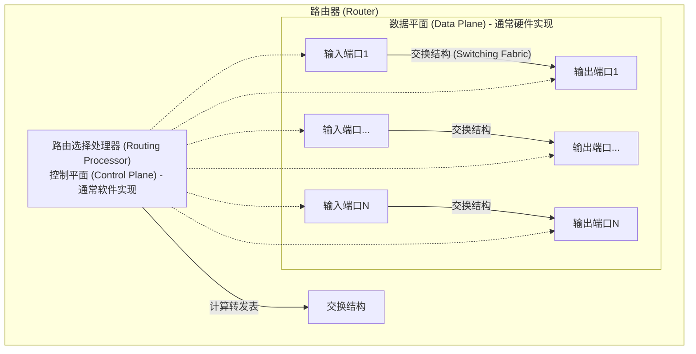

同学你好！很高兴能为你辅导。你给自己设定了很高的目标，这非常好！有目标才有动力。眼高手低是学习过程中常见的现象，别担心，这说明你对知识有渴求，只是暂时缺乏一些将高层概念与具体实践联系起来的桥梁。我会尽我所能，帮助你打通这些环节，夯实基础，最终让你能够游刃有余地解决这些问题。

我们不要急于一道题一道题地看，而是先把这些题目背后涉及的知识点梳理清楚。我会把相关的知识点串联起来，形成一个体系，这样你理解起来会更轻松，记忆也会更深刻。

根据你提供的题目，它们主要涵盖了计算机网络的几个核心领域：
1.  **网络基础概念与分层体系结构**：包括网络接入技术、分组交换、各种延迟、吞吐量、以及TCP/IP五层模型及其功能。
2.  **应用层**：重点是HTTP协议（持续/非持续连接、并行连接）、DNS解析过程、Web缓存。
3.  **运输层**：TCP与UDP的对比、端口号与套接字、TCP的序号和确认号、可靠数据传输（如GBN）、MSS。
4.  **网络层**：路由与转发、路由器组成、IP地址（CIDR、子网划分、私有地址、NAT）、IP数据报开销与分片（间接涉及）。

内容会比较多，我会尽量讲得细致一些，并且会穿插一些小问题来帮助你思考。准备好了吗？我们开始吧！

### 第一部分：计算机网络基础与分层体系结构

#### 1. 网络的构成与接入

*   **什么是计算机网络 (Computer Network)？**
    简单来说，就是将地理位置不同的、具有独立功能的“计算机系统”通过“通信线路”连接起来，在“网络软件”的管理和协调下，实现“资源共享”和“信息传递”的系统。
    *   **主机 (Host)**：网络边缘的设备，如PC、服务器、手机等，它们运行网络应用程序。
    *   **通信链路 (Communication Link)**：连接主机的物理介质，如光纤 (fiber optics)、铜缆 (copper wire)、无线电频谱 (radio spectrum)。
    *   **分组交换机 (Packet Switch)**：将数据分组 (packet) 从一条入链路转发到另一条出链路的设备，最常见的有路由器 (router) 和链路层交换机 (link-layer switch)。

*   **网络接入技术 (Access Network Technologies)**
    这是指将端系统（主机）连接到边缘路由器 (edge router)——也就是连接到互联网服务提供商 (ISP, Internet Service Provider) 的第一跳路由器的网络。
    *   **住宅接入 (Residential Access)**：
        *   **DSL (Digital Subscriber Line 数字用户线路)**：利用已有的电话线。
        *   **HFC (Hybrid Fiber Coax 混合光纤同轴电缆)**：利用有线电视公司的同轴电缆。**（对应 R4）** HFC 将光纤铺设到居民区的接线盒，然后通过同轴电缆连接到各个家庭。它使用频分复用 (Frequency Division Multiplexing) 将不同信道（如下行数据、上行数据、电视信号）分配到不同频段。
        *   **FTTH (Fiber To The Home 光纤到户)**：直接将光纤铺设到用户家中，速率最高。
    *   **公司接入 (Company Access / Enterprise Access)**：
        *   通常使用**局域网 (LAN, Local Area Network)**，如以太网 (Ethernet)，连接企业内部的计算机和服务器，然后再通过高速链路连接到ISP。
    *   **广域无线接入 (Wide-Area Wireless Access)**：
        *   **3G, 4G LTE, 5G**：通过蜂窝移动网络接入，覆盖范围广。
        *   **WiMAX** (Worldwide Interoperability for Microwave Access)：也是一种广域无线技术，但普及程度不如蜂窝网络。

    > **思考一下：** 你家里上网用的是哪种接入技术？它属于我们上面提到的哪一类？

#### 2. 网络核心 (Network Core)

网络核心是互联了路由器和链路的网状结构。其主要功能是将数据从源主机路由到目的主机。实现这一目标主要有两种方式：

*   **电路交换 (Circuit Switching)**：
    *   在数据传输前，必须在源和目的之间建立一条专用的端到端连接（电路）。这条电路在整个通信会话期间被预留，即使没有数据传输，资源也不会被释放。
    *   优点：有保障的恒定速率，无拥塞（一旦建立连接）。
    *   缺点：资源利用率低（预留的带宽可能闲置），建立连接有延迟。
    *   典型例子：传统的电话网络。

*   **分组交换 (Packet Switching)**：
    *   数据被分割成一个个较小的单元，称为**分组 (Packet)**。每个分组包含一部分用户数据和控制信息（如源地址、目的地址）。
    *   分组在网络中独立传输，从一个路由器到下一个路由器，直到到达目的地。路由器使用**存储转发 (Store-and-Forward)** 机制：路由器必须接收到整个分组，检查其目的地址，然后才能将其转发到下一条链路。
    *   优点：资源共享，效率高，更灵活。
    *   缺点：可能发生拥塞 (congestion)，导致排队延迟和分组丢失。
    *   **因特网 (Internet) 主要采用分组交换。**

*   **为什么网络核心有两种不同的主要功能？(对应 R18)**
    这里的“两种不同的主要功能”可能指的是：
    1.  **路由 (Routing)**：确定分组从源到目的所经过的路径。这是由路由选择算法 (routing algorithm) 决定的，通常在控制平面 (control plane) 实现。
    2.  **转发 (Forwarding)**：当一个分组到达路由器时，将其从输入链路转移到合适的输出链路。这是根据转发表 (forwarding table) 进行的，通常在数据平面 (data plane) 实现。
    另一种理解可能是对比电路交换和分组交换这两种根本不同的数据交换方式，它们各自有不同的工作原理和适用场景，为网络核心提供了不同的服务模型。考虑到上下文，前一种解释（路由与转发）更贴近网络核心内部的工作。

    > **小提示：** R18 这个问题问得比较开放，也可能是指网络提供的服务类型，比如尽力而为服务 (best-effort service) vs. 有服务质量保证 (QoS, Quality of Service) 的服务。但结合后续网络层题目，路由与转发是更核心的功能。

#### 3. 网络中的延迟 (Delay) 与损耗 (Loss)

一个分组从源主机到目的主机通常会经历以下几种类型的延迟：

1.  **处理延迟 (Processing Delay, $d_{proc}$)**：
    *   检查分组首部、确定输出链路、检查比特差错等所需的时间。
    *   通常是微秒 (µs) 级别或更低。

2.  **排队延迟 (Queuing Delay, $d_{queue}$)**：
    *   分组在输出链路的队列中等待传输的时间。
    *   取决于网络的拥塞程度。如果链路繁忙，队列长，延迟就大；如果链路空闲，队列空，延迟可能为0。
    *   这是唯一一种可能变化很大的延迟。

3.  **传输延迟 (Transmission Delay, $d_{trans}$)**：
    *   将分组的所有比特推向链路所需的时间。
    *   计算公式：$d_{trans} = L / R$
        *   $L$：分组长度 (bits)
        *   $R$：链路带宽 (bps, bits per second)
    *   这可以类比为：把一列火车（分组）的所有车厢（比特）都开到铁轨（链路）上所花的时间。

4.  **传播延迟 (Propagation Delay, $d_{prop}$)**：
    *   一个比特从链路的一端传播到另一端所需的时间。
    *   计算公式：$d_{prop} = m / s$
        *   $m$：链路长度 (meters)
        *   $s$：信号在介质中的传播速率 (m/s)，通常接近光速 ($ \approx 2 \times 10^8 \text{ m/s} $ 到 $3 \times 10^8 \text{ m/s}$)
    *   这可以类比为：火车头（第一个比特）从铁轨的一端行驶到另一端所花的时间。

*   **端到端延迟 (End-to-End Delay)**：
    对于一个经过 $N-1$ 个路由器的路径（即 $N$ 条链路），忽略其他复杂因素，总延迟为：
    $d_{end-to-end} = N \times (d_{proc} + d_{trans} + d_{prop}) + \sum_{i=1}^{N-1} d_{queue,i}$ (假设每段链路的 $d_{proc}, d_{trans}, d_{prop}$ 相同，排队延迟在每个路由器处不同)
    如果题目中忽略了某些延迟（如 R11, P6, P10），则公式会简化。

    **针对 R11：**
    发送主机 -> 交换机 -> 接收主机。
    传输速率：$R_s$ (主机到交换机)，$R_r$ (交换机到接收主机)。
    分组长度：$L$。
    交换机使用存储转发。忽略排队、传播、处理延迟。

    *   第一个传输延迟（主机到交换机）：$d_{trans1} = L / R_s$
    *   由于是存储转发，交换机必须完整接收分组后才能开始向接收主机发送。
    *   第二个传输延迟（交换机到接收主机）：$d_{trans2} = L / R_r$
    *   端到端延迟 = $d_{trans1} + d_{trans2} = L/R_s + L/R_r$

    **针对 P6：**
    a.  $d_{prop} = m / s$
    b.  $d_{trans} = L / R$
    c.  端到端延迟 = $d_{prop} + d_{trans} = m/s + L/R$ (忽略处理和排队)
    d.  时刻 $t = d_{trans}$：分组的最后一个比特刚刚离开主机A，正要进入链路。因为要花 $d_{trans}$ 时间才能把所有比特推出去。
    e.  $d_{prop} > d_{trans}$：这意味着第一个比特到达B所需的时间比整个分组被推上链路的时间还要长。在 $t=d_{trans}$ 时，最后一个比特刚离开A，而第一个比特还在链路上向B传播，但尚未到达B。它已经传播了 $d_{trans}$ 时间的距离，位置在距离A $s \times d_{trans}$ 米处。
    f.  $d_{prop} < d_{trans}$：这意味着第一个比特在整个分组被完全推上链路之前就已经到达了B。在 $t=d_{trans}$ 时，最后一个比特刚离开A，而第一个比特早已到达B（在 $t=d_{prop}$ 时刻就到达了）。
    g.  直接代入公式计算。注意单位换算：kbps = $10^3$ bps。

    **针对 P5 (旅行队类比)：**
    这个问题用旅行队类比分组传输，非常形象。
    *   每辆汽车 ≈ 一个比特或一小组比特。
    *   整个车队 ≈ 一个分组。
    *   车队长度 (10 辆 * 5 米/辆 = 50 米) ≈ 分组大小 $L$ 的一种体现。
    *   收费站 ≈ 路由器/交换机（进行某种处理或检查）。
    *   公路长度 ≈ 链路长度 $m$。
    *   车队速率 (100 km/h) ≈ 传播速率 $s$ (如果把车队看成一个整体，第一个车头到达的时间)。
    *   “车队中的汽车首尾相接，排成一列” 这个描述有点像比特串行发送。

    关键点：这里的“端到端延迟”是指从第一个车头离开起点收费站A，到最后一个车尾通过终点收费站B的时间。
    *   我们可以把整个车队看作一个长度为 "车队长度" 的“宏观物体”。
    *   **传播时间**：第一个车头从A到达B所需时间。
    *   **传输时间**（在这个类比中）：可以理解为整个车队通过一个特定点（例如收费站出口）所需的时间。如果收费站处理速度无限快，只考虑车队通过某个点，时间 = 车队长度 / 车队速度。

    P5a: 总路程150km。
    1.  第一个车头行驶150km所需时间 (传播延迟)：$d_{prop} = 150 \text{ km} / (100 \text{ km/h}) = 1.5 \text{ 小时}$。
    2.  当第一个车头到达第三个收费站（终点）时，车队尾部在哪里？它还在第一个车头后面 "车队长度" 的位置。
    3.  车队长度 = 10 辆 * 5 米/辆 = 50 米 = 0.05 km。
    4.  最后一个车尾通过第三个收费站还需要的时间（相当于传输延迟，即整个车队通过终点线）：$d_{trans\_like} = \text{车队长度} / \text{车队速率} = 0.05 \text{ km} / (100 \text{ km/h}) = 0.0005 \text{ 小时}$。
    5.  总端到端延迟 = $d_{prop} + d_{trans\_like} = 1.5 \text{ h} + 0.0005 \text{ h} = 1.5005 \text{ 小时}$。

    P5b: 车队8辆车，车队长度 = 8 * 5m = 40m = 0.04km。
    6.  $d_{prop}$ 不变，仍为 1.5 小时。
    7.  $d_{trans\_like} = 0.04 \text{ km} / (100 \text{ km/h}) = 0.0004 \text{ 小时}$。
    8.  总端到端延迟 = $1.5 \text{ h} + 0.0004 \text{ h} = 1.5004 \text{ 小时}$。

    > **注意：** 这个旅行队的类比与网络传输延迟的经典定义略有不同。经典定义中，传输延迟是把分组推上链路的时间，传播延迟是比特在链路上传播的时间。这里把车队看作一个整体，"车队长度/车队速率" 更像是整个分组通过某个点的时间。这个题目主要是帮助理解“头部先到，尾部后到”以及“整体通过需要额外时间”的概念。

    **针对 P10 (多跳存储转发)：**
    源 A -> 链路1 -> 交换机1 -> 链路2 -> 交换机2 -> 链路3 -> 目的 B
    $d_{proc,i}, d_{q,i}, d_{trans,i}, d_{prop,i}$
    假定 $d_{proc,i}=0, d_{prop,i}=0$ (对所有 $i$)。第一个比特在 $t=0$ 从源发出。

    a. 第二个交换机什么时刻能收到第一个比特？
    *   第一个比特从源A发出，经过链路1到达交换机1。由于 $d_{prop,1}=0$，它瞬间到达交换机1。
    *   交换机1处理第一个比特。由于是存储转发，交换机1必须收到**整个分组**才能开始转发。
    *   交换机1接收整个分组所需时间：$d_{trans,1}$ (因为 $d_{prop,1}=0$)。
    *   交换机1上的排队延迟：$d_{q,1}$。
    *   交换机1开始向交换机2发送第一个比特的时刻：$0 + d_{trans,1} + d_{q,1}$。 (因为 $d_{proc,1}=0$)
    *   第一个比特从交换机1发出，经过链路2到达交换机2。由于 $d_{prop,2}=0$，它瞬间到达交换机2。
    *   所以，第二个交换机收到第一个比特的时刻是：$d_{trans,1} + d_{q,1}$。

    b. 假定对后续分组，$d_q=0$ (应为 $d_{q,i}=0$ 对所有 $i$ 和所有分组，这里指第一个分组的 $d_q$ 也为0)。第一个分组的端到端延迟是多少？
    *   源A发送完整个分组：$d_{trans,1}$ (因为 $d_{prop,1}=0, d_{proc,1}=0, d_{q,1}=0$)
    *   交换机1收到整个分组的时刻是 $d_{trans,1}$。它立即开始转发。
    *   交换机1发送完整个分组到链路2，并到达交换机2的时刻：$d_{trans,1} (\text{接收}) + d_{trans,2} (\text{发送})$。
    *   交换机2收到整个分组的时刻是 $d_{trans,1} + d_{trans,2}$。它立即开始转发。
    *   交换机2发送完整个分组到链路3，并到达目的B的时刻：$d_{trans,1} + d_{trans,2} + d_{trans,3}$。
    *   这就是第一个分组的端到端延迟。

    c. 假定对后续分组来说，$d_{q,1} = 10\text{ms}$。第二个分组的端到端延迟是多少？
    这里题目描述“对后续分组来说”，但又问“第二个分组的端到端延迟”，且只给 $d_{q,1}$。我们假设这是指第二个分组在交换机1的排队延迟是10ms，其他排队延迟为0。
    *   考虑第二个分组：
        *   它不能在第一个分组传输完成前开始传输。假设源是流水线发送，第二个分组在源端的发送紧随第一个分组。
        *   源A发送完第二个分组的时刻是 $2 \times d_{trans,1}$。 (如果源可以连续发送)
        *   第二个分组到达交换机1的时刻也是 $2 \times d_{trans,1}$ (因为 $d_{prop,1}=0, d_{proc,1}=0$)。
        *   关键点：交换机1何时能开始发送第二个分组？它必须先发送完第一个分组。第一个分组离开交换机1的时间是 $d_{trans,1} + d_{trans,2}$ (从0时刻算，第一个分组在 $d_{trans,1}$ 到达，然后花 $d_{trans,2}$ 发送出去)。
        *   第二个分组到达交换机1后，面临排队延迟 $d_{q,1} = 10\text{ms}$。
        *   所以，第二个分组从交换机1开始发送的时刻是 $\max(\text{第二个分组到达时刻}, \text{第一个分组发送完毕时刻}) + d_{q,1}$。
            *   第二个分组到达时刻 (进入交换机1队列尾部): $d_{trans,1}$ (假设第一个分组在时刻0开始发，第二个分组在源端可以认为是和第一个分组背靠背发出，所以它到达交换机1的时刻是源发送完它，即 $d_{trans,1}$ 之后)。
            *   更准确地说，第二个分组的第一个比特在 $d_{trans,1}$ 时刻从源发出 (如果源连续发，第一个分组在0到 $d_{trans,1}$ 发送)。那么第二个分组的最后一个比特在 $2 \times d_{trans,1}$ 到达交换机1。
            *   交换机1发送完第一个分组的时刻: $d_{trans,1}(\text{接收完P1}) + d_{q,1}(\text{P1在Sw1的排队，题目(b)假设为0}) + d_{trans,2}(\text{发送完P1})$。
            *   这里题目c说的是“对后续分组来说 $d_{q,1}=10\text{ms}$”，那么我们假设第一个分组的 $d_{q,1}=0$ (如b)，第二个分组的 $d_{q,1}=10\text{ms}$。
            *   第一个分组离开交换机1的时间点 (即链路2空闲的时间点): $d_{trans,1} + d_{trans,2}$。
            *   第二个分组的最后一个比特到达交换机1的时间点: $2 \times d_{trans,1}$。
            *   第二个分组开始在交换机1传输的时刻: $\max(2 \times d_{trans,1}, d_{trans,1} + d_{trans,2}) + 10\text{ms}$ (这是它离开队列头部的时刻)
            *   第二个分组的端到端延迟 (从它在源端开始发送算起):
                (第二个分组在交换机1开始发送的时刻 - 第二个分组开始从源发送的时刻) + $d_{trans,2} + d_{trans,3}$
                $= (\max(2 \times d_{trans,1}, d_{trans,1} + d_{trans,2}) + 10\text{ms} - d_{trans,1}) + d_{trans,2} + d_{trans,3}$

    **P11 (非存储转发/直通交换 Cut-through Switching):**
    如果交换机不等待整个分组到达，而是一收到比特就立即转发 (假设处理和检查地址的时间极短)，这就是所谓的**直通交换 (Cut-through Switching)**。
    *   第一个比特从源发出，经过 $N$ 段链路。由于 $d_{prop,i}=0, d_{proc,i}=0$，第一个比特几乎是瞬间穿过所有交换机和链路到达目的地的。
    *   整个分组的传输时间由瓶颈链路决定吗？不完全是。
    *   当第一个比特在 $t=0$ 从源主机发出时，它几乎立即到达目的主机（因为所有 $d_{prop}$ 和 $d_{proc}$ 都为0）。
    *   整个分组的最后一个比特何时到达目的主机呢？
        *   源A将整个分组推向链路1需要 $d_{trans,1} = L/R_1$。
        *   在直通模式下，一旦第一个比特到达交换机1，它就被转发。当源A还在发送分组的后续比特时，交换机1可能已经在转发已收到的比特了。
        *   如果所有链路速率相同 ($R_1=R_2=R_3=R$)：
            *   源A发送完整个分组需要 $L/R$。在时刻 $L/R$，最后一个比特离开源A。
            *   由于 $d_{prop}=0, d_{proc}=0$，这个最后一个比特也几乎是瞬间通过所有交换机和链路到达目的地。
            *   所以端到端延迟就是 $L/R$。

        *   如果链路速率不同 ($R_1, R_2, R_3$)：
            *   源A花 $L/R_1$ 将分组注入链路1。
            *   交换机1以 $R_2$ 的速率转发，交换机2以 $R_3$ 的速率转发。
            *   这种情况下，整个分组的传输就像一个水流过不同管径的管道。
            *   第一个比特到达目的地的时间仍然是0 (因为 $d_{prop}=0, d_{proc}=0$)。
            *   最后一个比特离开源的时刻是 $L/R_1$。
            *   最后一个比特离开交换机1的时刻是 $L/R_1 + L/R_2 - L/\min(R_1,R_2)$ (这是一个简化的思考，实际更复杂，因为比特是连续的)。
            *   更简单地想：整个分组通过这条串联链路所需的时间，取决于将 $L$ 比特数据依次通过速率为 $R_1, R_2, R_3$ 的链路。
            *   当一个分组的第一个比特开始传输，直到最后一个比特到达目的地。
            *   源头发射完耗时 $L/R_1$。
            *   第一个交换机开始收到数据，并以 $R_2$ 转发。如果 $R_2 < R_1$，交换机1会成为瓶颈，数据会在其输入端“堆积”（虽然这里假设它能立即转发，但速率限制是物理的）。
            *   当采用直通交换时，总延迟近似为：第一个比特的传播延迟 (这里是0) + 最后一个比特的传输延迟。
                最后一个比特的“旅程”是：它在时刻 $L/R_1$ 离开源，然后（由于直通）它不需要等待，直接以 $R_2$ 速率通过交换机1的“逻辑”，再以 $R_3$ 速率通过交换机2的“逻辑”。
                实际上，在这种理想的直通（且 $d_{prop}=0, d_{proc}=0$）情况下，整个分组像一个固定长度的“数据条块”流过网络。
                *   第一个比特到达目的地：$t_0 = 0$ (因为 $d_{prop}$ 和 $d_{proc}$ 都是0)
                *   最后一个比特离开源：$t_1 = L/R_1$
                *   最后一个比特离开交换机1 (逻辑上的，因为它是一边收一边发): $t_2 = L/R_1 + L/R_2 - L/\text{some_overlap_term}$。这不对。
                *   **正确的思考方式 (Pipelining的理想情况)：**
                    源发送第一个比特在时刻0，最后一个比特在时刻 $L/R_1$。
                    交换机1在时刻0收到第一个比特，开始以 $R_2$转发；交换机1在时刻 $L/R_1$ 收到最后一个比特 (假设 $R_1$ 是瓶颈或一样快)，并以 $R_2$ 转发。
                    如果 $R_1=R_2=R_3=R$，那么最后一个比特在时刻 $L/R$ 离开源，并（由于直通和0传播处理）立即到达目的地。所以延迟是 $L/R$。
                    如果速率不同，情况会复杂。对于 $N$ 段链路，速率 $R_i$，长度 $L$ 的分组，直通交换的延迟（忽略传播和处理）可以近似为 $\sum_{i=1}^{N} (L/R_i)$ 吗？不对，这是串行存储转发的情况。
                    **对于P11的理想直通，且 $d_{prop}=0, d_{proc}=0$：**
                    第一个比特在时刻 $t=0$ 从源发出，立即到达目的地。
                    最后一个比特在时刻 $t=L/R_1$ 离开源。
                    最后一个比特在时刻 $t=L/R_1$ 也到达交换机1的输入。
                    最后一个比特在时刻 $t=L/R_1$ 也到达交换机2的输入。
                    最后一个比特在时刻 $t=L/R_1$ 也到达目的地的输入。
                    所以，端到端延迟是 $L/R_1$。 这是因为一旦第一个比特开辟了道路，后续比特就以进入第一段链路的速率 $R_1$ 持续流动，直到最后一个比特进入第一段链路。由于没有存储、没有传播延迟，最后一个比特进入链路1的同时，也就意味着它到达了目的地。
                    **然而，通常教材对于直通交换的延迟计算是： $(N-1) \times (\text{header_read_time}) + L/R_{\text{bottleneck}}$，或者更精细的，第一个比特的端到端传播时间 + 最后一个比特在源的发送时间，即 $N \times d_{prop} + L/R_S$ (假设所有链路传播时间 $d_{prop}$ 相同，源发送速率 $R_S$)。**
                    对于 P11， $d_{prop}=0, d_{proc}=0$, $R_1=R_2=R_3=R$。
                    最后一个比特离开源的时刻是 $L/R$。由于直通和零传播/处理，这个比特也同时到达了目的地。
                    所以端到端延迟是 $L/R$。
                    如果题目改为 $R_1, R_2, R_3$ 可能不同，并且 $d_{proc}=0, d_{prop}=0$。
                    总延迟 = $L/R_1 + (\text{switching_time}_1) + L/R_2 + (\text{switching_time}_2) + L/R_3$ ...
                    不，直通交换的延迟，当$d_{prop}=0, d_{proc}=0$时，是 $L/R_1$ (将分组推入第一段链路的时间) + $\sum_{i=2}^{N} \max(0, L/R_i - L/R_{i-1})$。
                    **对于P11的特定条件 ($R_1=R_2=R_3=R$, $d_{proc}=0, d_{prop}=0$)，端到端延迟就是 $L/R$。**
                    可以这样理解：第一个比特在 $t=0$ 到达目的地。最后一个比特在 $t=L/R$ 离开源主机，由于没有存储，没有传播，没有处理延迟，它也相当于在 $t=L/R$ 到达目的地。所以总时间是 $L/R$。

#### 4. 吞吐量 (Throughput)

*   **吞吐量 (Throughput)**：在源主机和目的主机之间的路径上，数据传输的实际速率 (bps)。
*   **瓶颈链路 (Bottleneck Link)**：端到端路径上，限制吞吐量的链路。即路径上所有链路中传输速率最小的那条。
    *   对于单条路径，吞吐量 = $\min(R_1, R_2, ..., R_N)$，其中 $R_i$ 是第 $i$ 段链路的速率。

    **针对 P20 (M对客户-服务器，图1-20b 未提供，但通常是共享链路瓶颈)：**
    假定场景：M个服务器，M个客户。所有服务器通过各自的链路 $R_s$ 连接到一个共享的网络链路 $R$，然后这个共享链路 $R$ 再连接到另一个路由器，该路由器再通过各自的链路 $R_c$ 连接到各个客户。
    ```mermaid
    graph TD
        subgraph "服务器侧"
            S1 -- "$R_s$" --> R1
            S2 -- "$R_s$" --> R1
             डॉटेड_S["... (M 个)"] -- "$R_s$" --> R1
            SM -- "$R_s$" --> R1
        end
        subgraph "客户侧"
            R2 -- "$R_c$" --> C1
            R2 -- "$R_c$" --> C2
            R2 -- "$R_c$" --> डॉटेड_C["... (M 个)"]
            R2 -- "$R_c$" --> CM
        end
        R1 -- "共享链路 $R$" --> R2
    ```
    *   服务器总共能发出的最大速率是 $M \times R_s$。
    *   客户总共能接收的最大速率是 $M \times R_c$。
    *   共享网络链路的最大容量是 $R$。
    *   **总的端到端吞吐量 (aggregate throughput)** 受这三者中最薄弱环节的限制：
        $\text{Throughput}_{\text{aggregate}} = \min(M \times R_s, M \times R_c, R)$
    *   如果问的是**平均每个客户-服务器对的吞吐量**，那么就是 $\text{Throughput}_{\text{aggregate}} / M = \min(R_s, R_c, R/M)$。题目通常问的是总吞吐量，除非特别指明。这里题目说“通用吞吐量表达式”，一般指总吞吐量。

    **针对 P21 (M条并行路径，图1-19b 未提供)：**
    假定场景：服务器和客户之间有 $M$ 条完全独立的路径。路径 $k$ 由 $N_k$ 条链路组成，速率为 $R_{k,1}, R_{k,2}, ..., R_{k,N_k}$。
    *   对于单条路径 $k$，其最大吞吐量是该路径上的瓶颈链路速率：
        $\text{Throughput}_k = \min(R_{k,1}, R_{k,2}, ..., R_{k,N_k})$
    *   如果服务器仅仅使用一条路径向客户发送数据，能取得的最大吞吐量是所有 $M$ 条路径中，吞吐量最大的那一条：
        $\text{Max Single Path Throughput} = \max_{k=1...M} (\text{Throughput}_k) = \max_{k=1...M} (\min(R_{k,1}, ..., R_{k,N_k}))$
    *   如果服务器使用所有 $M$ 条路径发送数据（例如，将数据分成多份，分别在不同路径上传输），则总的最大吞吐量是所有路径吞吐量之和：
        $\text{Max Total Throughput} = \sum_{k=1}^{M} \text{Throughput}_k = \sum_{k=1}^{M} (\min(R_{k,1}, ..., R_{k,N_k}))$

#### 5. 协议层次与服务模型

*   **分层思想 (Layering)**：将复杂的网络功能分解为一系列更小、更易于管理和设计的层次。每一层为其上一层提供特定的服务，并使用其下一层提供的服务。
*   **TCP/IP 五层模型 (对应 R23)**：这是实践中广泛使用的模型。
    1.  **应用层 (Application Layer)**：
        *   **任务**：为网络应用程序提供服务。定义了应用程序如何交换报文 (message)。
        *   **协议**：HTTP (Web), SMTP (电子邮件), FTP (文件传输), DNS (域名解析), POP3 (邮件读取) 等。
        *   **数据单元**：报文 (Message)。
    2.  **运输层 (Transport Layer)**：
        *   **任务**：在应用程序的端点之间提供进程到进程 (process-to-process) 的数据传输服务。主要有两种协议：TCP 和 UDP。
        *   **TCP (Transmission Control Protocol)**：提供面向连接的、可靠的数据传输服务。有流量控制、拥塞控制。
        *   **UDP (User Datagram Protocol)**：提供无连接的、不可靠的“尽力而为”数据传输服务。开销小，速度快。
        *   **数据单元**：报文段 (Segment) (TCP中) 或 用户数据报 (User Datagram) (UDP中)。
    3.  **网络层 (Network Layer) (也叫网际层 Internet Layer)**：
        *   **任务**：负责将数据报 (datagram) 从一台主机路由到另一台主机。实现主机到主机 (host-to-host) 的通信。
        *   **协议**：IP (Internet Protocol 网际协议)，路由协议 (如RIP, OSPF, BGP)。
        *   **数据单元**：数据报 (Datagram) 或 分组 (Packet)。
    4.  **链路层 (Link Layer) (也叫数据链路层 Data Link Layer 或 网络接口层 Network Interface Layer)**：
        *   **任务**：在相邻网络节点（主机-路由器，路由器-路由器）之间的链路上移动数据。处理帧 (frame) 的物理传输，进行差错检测等。
        *   **协议**：以太网 (Ethernet), Wi-Fi (802.11), PPP等。
        *   **数据单元**：帧 (Frame)。
    5.  **物理层 (Physical Layer)**：
        *   **任务**：在链路上传输原始比特流 (raw bit stream)。定义电压、接口、线缆标准等。
        *   **数据单元**：比特 (Bit)。

    ```mermaid
    graph TD
        A["应用层 (Application)"] -- "报文 (Message)" --> T["运输层 (Transport)"]
        T -- "报文段 (Segment) / 用户数据报 (User Datagram)" --> N["网络层 (Network)"]
        N -- "数据报 (Datagram) / 分组 (Packet)" --> L["链路层 (Link)"]
        L -- "帧 (Frame)" --> P["物理层 (Physical)"]
        P -- "比特 (Bit)" --> M["物理介质 (Physical Medium)"]

        style A fill:#f9f,stroke:#333,stroke-width:2px
        style T fill:#ccf,stroke:#333,stroke-width:2px
        style N fill:#9cf,stroke:#333,stroke-width:2px
        style L fill:#9fc,stroke:#333,stroke-width:2px
        style P fill:#fc9,stroke:#333,stroke-width:2px
    ```

*   **封装 (Encapsulation)**：发送端数据从上层向下层传递时，每层都会给上层的数据添加自己的控制信息（头部 Header，有时也有尾部 Trailer），这个过程称为封装。
    *   应用层报文 -> [运输层头部 + 应用层报文] (形成报文段)
    *   运输层报文段 -> [网络层头部 + 运输层报文段] (形成数据报)
    *   网络层数据报 -> [链路层头部 + 网络层数据报 + 链路层尾部] (形成帧)

*   **设备与层次 (对应 R25)**：
    *   **主机 (Host)**：处理所有五个层次。因为应用程序运行在主机上，主机需要完整的协议栈来与网络通信。
    *   **路由器 (Router)**：主要处理物理层、链路层和网络层（底下三层）。路由器根据网络层地址（IP地址）进行转发决策。它不关心运输层和应用层的内容（除非是特殊的防火墙路由器或NAT设备）。
    *   **链路层交换机 (Link-Layer Switch)**：主要处理物理层和链路层（底下两层）。它根据链路层地址（MAC地址）进行转发决策。

    > **思考一下：** 当你用浏览器访问一个网页时，数据是如何从服务器封装并发送到你的电脑，然后在你的电脑上又是如何解封装的？

#### 6. 报文分段 (Message Segmentation) (对应 P31)

*   **背景**：应用层报文（如一个大文件、一张大图片）通常很大。如果直接将整个大报文作为一个单元在网络中传输，会有以下问题：
    1.  **高延迟**：发送方需要很长时间才能将整个报文推到链路上。如果中间有错误，整个大报文都需要重传。
    2.  **低链路利用率**：如果一个大报文占据链路，其他小分组必须等待，增加了其他用户的延迟。
    3.  **出错重传代价大**：如果大报文在传输中发生错误，整个报文都要重传。

*   **报文分段 (Message Segmentation)**：将大的应用层报文分割成许多较小的数据块，然后给每个数据块添加运输层头部（如TCP头部），形成多个报文段 (segment) 或分组 (packet)。这些较小的分组可以独立地在网络中传输。
    *   **优点**：
        1.  **减小延迟 (Pipelining 效应)**：发送方可以发送第一个分组，然后在发送后续分组的同时，第一个分组已经在网络中传播和被后续交换机处理了。这就像流水线作业，提高了效率。
        2.  **提高可靠性**：如果某个小分组出错，只需要重传那个小分组，而不是整个大报文。
        3.  **更公平地共享网络资源**：小分组可以与其他用户的小分组交错传输。
    *   **缺点**：
        1.  **增加总开销**：每个分组都需要有自己的头部信息，所以总的头部开销比不分段要大。
        2.  **接收端需要重组**：接收方需要将收到的分组按正确顺序重新组装成原始报文。
        3.  **管理更复杂**：需要序号来保证顺序，需要控制分组的数量等。

    **针对 P31：**
    报文长度 $L_{total} = 8 \times 10^6$ 比特。
    每段链路速率 $R = 2 \text{ Mbps} = 2 \times 10^6 \text{ bps}$。
    忽略传播、排队、处理延迟。只有传输延迟。
    网络拓扑：源 -> 交换机1 -> 交换机2 -> 目的。 (共3段链路)
    交换机使用存储转发。

    a. **没有报文分段**：整个报文作为一个大分组。
    *   从源到交换机1移动报文时间 (即传输时间)：
        $d_{trans} = L_{total} / R = (8 \times 10^6 \text{ bits}) / (2 \times 10^6 \text{ bps}) = 4 \text{ 秒}$。
    *   从源到目的主机时间：由于是存储转发，每“跳”都需要完整的传输时间。
        源 -> Sw1: 4秒。 (Sw1在4秒时收到完整报文)
        Sw1 -> Sw2: 4秒。 (Sw2在 $4+4=8$ 秒时收到完整报文)
        Sw2 -> Dest: 4秒。 (Dest在 $8+4=12$ 秒时收到完整报文)
        总时间 = $3 \times d_{trans} = 3 \times 4 = 12 \text{ 秒}$。

    b. **报文分段**：分为800个分组，每个分组 $L_p = 10000$ 比特长。
    *   从源主机移动第一个分组到第一台交换机时间：
        $d_{p\_trans} = L_p / R = (10000 \text{ bits}) / (2 \times 10^6 \text{ bps}) = 0.005 \text{ 秒}$。
    *   从第一台交换机发送第一个分组到第二台交换机时间：也是 $0.005$ 秒。
    *   从源主机发送第二个分组到第一台交换机时间：也是 $0.005$ 秒。
    *   什么时候第二个分组能被第一台交换机全部收到？
        源发送第一个分组：时间 0 到 0.005 秒。
        源发送第二个分组：时间 0.005 秒到 0.010 秒。
        所以，第二个分组在 $t = 0.010$ 秒时被交换机1全部收到。

    c. **有报文分段时，移动整个文件时间**：
    这是一个经典的流水线 (pipelining) 问题。
    *   第一个分组到达目的地所需时间：
        源 -> Sw1: 0.005s (在0.005s时刻，Sw1收到P1)
        Sw1 -> Sw2: 0.005s (在 $0.005+0.005=0.01$s时刻，Sw2收到P1)
        Sw2 -> Dest: 0.005s (在 $0.01+0.005=0.015$s时刻，Dest收到P1)
        所以第一个分组在 $0.015$ 秒到达目的地。
    *   当第一个分组离开源后，源立刻开始发送第二个分组。总共有 $K=800$ 个分组。
    *   最后一个分组 (第800个) 何时离开源？
        源发送完所有 $K$ 个分组需要 $K \times d_{p\_trans} = 800 \times 0.005 = 4 \text{ 秒}$。
        在 $t=4$ 秒时，最后一个分组刚刚离开源。
    *   最后一个分组还需要经过两跳转发才能到达目的地。每跳转发耗时 $d_{p\_trans}$。
        所以，最后一个分组还需要 $2 \times d_{p\_trans} = 2 \times 0.005 = 0.01 \text{ 秒}$ 到达目的地。
    *   总时间 = (源发送所有分组的时间) + (最后一个分组通过剩余网络的时间)
        总时间 = $(K \times d_{p\_trans}) + (N-1) \times d_{p\_trans}$，其中 $N=3$ 是链路段数。
        总时间 = $K \times d_{p\_trans} + (M) \times d_{p\_trans}$，其中 $M=2$ 是交换机数量 (中间节点数量)。
        总时间 = $800 \times 0.005 \text{ 秒} + 2 \times 0.005 \text{ 秒} = 4 \text{ 秒} + 0.01 \text{ 秒} = 4.01 \text{ 秒}$。
    *   **比较与解释**：
        不分段：12秒。
        分段后：4.01秒。
        分段后大大减少了总传输时间。这是因为**流水线效应**：当源还在发送后续分组时，前面的分组已经在网络中向前传播和被处理了，而不是像不分段那样必须等待整个大报文在一个节点完全接收后再转发到下一个节点。

    d. **除了减小时延外，使用报文分段还有什么原因？**
        *   **错误控制更高效**：如果一个小分组在传输中出错，只需要重传那个小分组，而不是整个大报文。
        *   **资源共享更公平**：允许不同用户的分组交错共享网络链路，避免一个大报文长时间独占链路。
        *   **适应不同网络的MTU (Maximum Transmission Unit)**：链路层通常对帧的最大长度有限制 (MTU)。如果IP数据报超过MTU，就需要分片。报文分段（在更高层如运输层或应用层完成）可以产生适合网络MTU的分组，避免IP层分片或减少分片。

    e. **讨论报文分段的缺点。**
        *   **头部开销增加**：每个分段后的分组都需要自己的头部信息（如TCP/IP头部），导致总的头部数据比例增加，有效载荷比例下降。
        *   **处理开销增加**：路由器和主机需要处理更多的分组（尽管每个分组更小）。
        *   **接收端需要重组**：接收方需要缓存到达的分组，并按正确的顺序重新组装它们，这需要额外的处理和内存。如果分组失序或丢失，重组会更复杂。

---
同学，到这里我们回顾了网络的一些非常基础和重要的概念。你对延迟的计算、存储转发、流水线传输以及分层模型有没有更清晰的理解了呢？如果有任何不清楚的地方，或者想让我用其他方式再解释一下，请尽管告诉我。接下来，我们将进入应用层。

### 第二部分：应用层 (Application Layer)

应用层是网络体系结构的最顶层，直接为用户的应用程序提供服务。

#### 1. 应用层协议原理

*   **网络应用程序的体系结构**：
    *   **客户-服务器体系结构 (Client-Server Architecture)**：
        *   有一个总是打开的**服务器 (Server)**，它等待并服务于来自许多其他**客户 (Client)** 主机的请求。
        *   服务器有固定的、周知的IP地址。
        *   例如：Web服务器、邮件服务器。
    *   **P2P体系结构 (Peer-to-Peer Architecture)**：
        *   应用程序在间断连接的主机对（称为**对等方 (Peers)**）之间直接通信，而不需要经过专门的服务器。
        *   例如：BitTorrent, Skype (部分功能)。

*   **进程通信 (Process Communication)**：
    *   真正在网络上通信的是**进程 (Process)**，而不是主机。
    *   **标识进程**：为了让一台主机上的进程能够向另一台主机上的特定进程发送数据，需要一个标识符。这个标识符包括：
        1.  **IP地址 (IP Address)**：标识目标主机。
        2.  **端口号 (Port Number)**：标识目标主机上的特定进程（更准确地说是进程使用的套接字）。
        **（对应 R分组 R5: 运行在一台主机上的一个进程，使用什么信息来标识运行在另一台主机上的进程？答案是：目标主机的IP地址和目标进程的端口号。）**

*   **应用层协议定义了**：
    *   **交换的报文类型**：例如，请求报文、响应报文。
    *   **各种报文类型的语法**：报文中各个字段是什么以及如何划分。
    *   **字段的语义**：即字段中信息的含义。
    *   **进程何时以及如何发送报文和对报文进行响应的规则**。

#### 2. Web 和 HTTP (HyperText Transfer Protocol)

*   **HTTP**是Web的核心应用层协议，用于浏览器和Web服务器之间的通信。
*   HTTP使用**TCP**作为其运输层协议。这意味着在浏览器和服务器之间交换HTTP报文之前，必须先建立TCP连接。
*   HTTP是**无状态协议 (Stateless Protocol)**：服务器不保存关于过去客户请求的任何信息。

*   **HTTP连接类型**：
    1.  **非持续HTTP (Non-Persistent HTTP)**：
        *   每个请求/响应对都需要建立一个新的TCP连接。
        *   步骤：
            1.  客户发起TCP连接到服务器的80端口。
            2.  服务器接受连接。
            3.  客户通过TCP连接发送HTTP请求报文。
            4.  服务器接收请求，构造响应报文，并通过TCP连接发送给客户。
            5.  服务器关闭TCP连接。
            6.  客户接收响应，TCP连接关闭。浏览器显示内容。
        *   **缺点**：每个对象（HTML文件、每个图片等）都需要2个RTT (Round-Trip Time，往返时间) + 对象传输时间。
            *   1 RTT用于建立TCP连接（三次握手）。
            *   1 RTT用于HTTP请求和响应的前几个字节回来。
            *   开销大，延迟高。

    2.  **持续HTTP (Persistent HTTP)**： (HTTP/1.1默认)
        *   服务器在发送响应后，保持TCP连接打开，后续的请求和响应可以通过该同一连接发送。
        *   连接可以保持到超时，或者直到客户端或服务器明确关闭它。
        *   **流水线 (Pipelining)**：客户可以连续发送多个请求，而无需等待前一个请求的响应。
        *   **优点**：减少了TCP连接建立的开销，降低了延迟。

    **针对 P分组 P8 (HTML引用8个小对象，忽略发送时间，求总时间)：**
    前提：DNS查找已完成 (P7会涉及DNS)。$\text{RTT}_0$ 是本地主机和服务器间的RTT。对象传输时间为零。

    a. **没有并行TCP连接的非持续HTTP**：
    *   获取HTML文件：
        *   1 $\text{RTT}_0$ (建立TCP连接)
        *   1 $\text{RTT}_0$ (请求HTML文件并接收)
        *   总共 $2 \text{RTT}_0$
    *   获取8个嵌入对象：每个对象都需要一个新的TCP连接。
        *   每个对象耗时 $2 \text{RTT}_0$。
        *   8个对象耗时 $8 \times 2 \text{RTT}_0 = 16 \text{RTT}_0$。
    *   总时间 = $2 \text{RTT}_0 (\text{HTML}) + 16 \text{RTT}_0 (\text{objects}) = 18 \text{RTT}_0$。

    b. **配置有5个并行连接的非持续HTTP**：
    *   获取HTML文件：仍然是 $2 \text{RTT}_0$ (通过第一个连接)。
    *   获取8个嵌入对象：浏览器打开5个并行TCP连接。
        *   第一批5个对象可以并行获取。每个耗时 $2 \text{RTT}_0$。所以这5个对象在 $2 \text{RTT}_0$ 内完成。
        *   剩下 $8-5=3$ 个对象。它们利用空闲下来的连接并行获取。也耗时 $2 \text{RTT}_0$。
    *   总时间 = $2 \text{RTT}_0 (\text{HTML}) + 2 \text{RTT}_0 (\text{第一批5个对象}) + 2 \text{RTT}_0 (\text{后3个对象})$
              $= 6 \text{RTT}_0$。
    *   更精确的思考：获取HTML后，知道了有8个对象。然后并行打开5个连接。
        *   时间 0: 开始请求HTML。
        *   时间 $2 \text{RTT}_0$: HTML收到。开始请求前5个对象 (并行)。
        *   时间 $2 \text{RTT}_0 + 2 \text{RTT}_0 = 4 \text{RTT}_0$: 前5个对象收到。开始请求后3个对象 (并行)。
        *   时间 $4 \text{RTT}_0 + 2 \text{RTT}_0 = 6 \text{RTT}_0$: 后3个对象收到。
        *   总时间 = $6 \text{RTT}_0$。

    c. **持续HTTP (假设无流水线)**：
    *   建立1个TCP连接：1 $\text{RTT}_0$。
    *   请求HTML文件并接收：1 $\text{RTT}_0$。
    *   请求第1个对象并接收：1 $\text{RTT}_0$。
    *   ...
    *   请求第8个对象并接收：1 $\text{RTT}_0$。
    *   总共是 1 (HTML) + 8 (objects) = 9 个请求。
    *   总时间 = $1 \text{RTT}_0 (\text{TCP setup}) + (1+8) \times 1 \text{RTT}_0 (\text{requests/responses}) = 10 \text{RTT}_0$。

    **持续HTTP (假设有流水线)**：
    *   建立1个TCP连接：1 $\text{RTT}_0$。
    *   请求HTML文件并接收：1 $\text{RTT}_0$。
    *   收到HTML后，浏览器可以立刻在同一个连接上发出对所有8个对象的请求（流水线方式）。
    *   第一个对象响应回来需要 1 $\text{RTT}_0$ (从发送它的请求开始算)。
    *   由于对象很小（传输时间为0），所有8个对象的响应会紧跟着回来。
    *   总时间 = $1 \text{RTT}_0 (\text{TCP setup}) + 1 \text{RTT}_0 (\text{HTML}) + 1 \text{RTT}_0 (\text{all 8 objects, as they are pipelined and small})$
              $= 3 \text{RTT}_0$。
    *   **通常题目不特别说明流水线时，持续HTTP是指“串行”请求多个对象。如果允许流水线，会大大减少时间。** 按照多数教材的理解，若不提流水线，持续HTTP意味着请求完一个对象再请求下一个。但如果提到“HTTP/1.1 默认持续连接”，则通常暗含流水线能力。P8的题目没有明确，但对比非持续并行，我们可以理解为不带流水线的持续HTTP，或者带流水线的。如果按最严格的“串行”持续HTTP（即发一个请求，等一个响应，再发下一个请求），那么就是 $1 \text{RTT}_0 (\text{TCP}) + 1 \text{RTT}_0 (\text{HTML}) + 8 \times 1 \text{RTT}_0 (\text{objects}) = 10 \text{RTT}_0$。
    *   如果理解为“有流水线的持续HTTP”，则是 $1 \text{RTT}_0 (\text{TCP}) + 1 \text{RTT}_0 (\text{HTML}) + 1 \text{RTT}_0 (\text{for all 8 objects})$（因为请求可以一起发出，第一个对象的响应回来，其他小对象的响应也紧随其后），即 $3 \text{RTT}_0$。
    *   **Kurose Ross 教材中，对于持续HTTP，通常的计算是：1 RTT 建立TCP，然后每个对象1 RTT。所以是 $1 \text{RTT}_0 + (1+8)\text{RTT}_0 = 10 \text{RTT}_0$。如果明确说有流水线，则可能是 $1 \text{RTT}_0 + 1 \text{RTT}_0 (\text{HTML}) + 1 \text{RTT}_0 (\text{all objects})$。我们按前者 $10 \text{RTT}_0$ 理解更稳妥。**

#### 3. DNS (Domain Name System 域名系统)

*   **作用**：将用户友好的域名 (e.g., `www.google.com`) 解析为对应的IP地址 (e.g., `172.217.160.142`)。因为路由器处理的是IP地址。
*   DNS是一个由分层的**DNS服务器 (DNS Servers)**实现的分布式数据库。
*   **DNS解析过程 (简化版，迭代查询)**：
    1.  用户主机上的DNS客户端（通常是操作系统）向其配置的**本地DNS服务器 (Local DNS Server)**发送DNS查询请求。
    2.  如果本地DNS服务器有缓存该记录，则直接返回。
    3.  否则，本地DNS服务器向**根DNS服务器 (Root DNS Server)**查询。
    4.  根DNS服务器不知道IP地址，但它知道顶级域 (TLD, Top-Level Domain) 服务器（如 `.com`, `.org` 的服务器）的地址。它会返回相应TLD服务器的地址给本地DNS服务器。
    5.  本地DNS服务器向该TLD服务器发送查询。
    6.  TLD服务器不知道IP地址，但它知道权威DNS服务器 (Authoritative DNS Server)（负责该域名的DNS服务器，如 `google.com` 的DNS服务器）的地址。它会返回权威DNS服务器的地址给本地DNS服务器。
    7.  本地DNS服务器向该权威DNS服务器发送查询。
    8.  权威DNS服务器返回IP地址给本地DNS服务器。
    9.  本地DNS服务器将IP地址返回给用户主机，并缓存该记录。

    ```mermaid
    sequenceDiagram
        participant C as "客户端 (Client)"
        participant LocalDNS as "本地DNS服务器"
        participant RootDNS as "根DNS服务器"
        participant TLD_DNS as ".com TLD DNS服务器"
        participant AuthDNS as "权威DNS服务器 (example.com)"

        C->>LocalDNS: "www.example.com 的 IP 地址是什么？"
        LocalDNS->>RootDNS: "www.example.com 的 IP 地址是什么？"
        RootDNS-->>LocalDNS: "我不知道，去问 .com TLD DNS服务器 (地址是 X)"
        LocalDNS->>TLD_DNS: "www.example.com 的 IP 地址是什么？"
        TLD_DNS-->>LocalDNS: "我不知道，去问 example.com 的权威DNS服务器 (地址是 Y)"
        LocalDNS->>AuthDNS: "www.example.com 的 IP 地址是什么？"
        AuthDNS-->>LocalDNS: "IP 地址是 A.B.C.D"
        LocalDNS-->>C: "IP 地址是 A.B.C.D"
    ```
    *   **递归查询 (Recursive Query)**：主机向本地DNS服务器的查询通常是递归的，即主机希望本地DNS服务器代劳完成所有查询步骤并返回最终结果。本地DNS服务器向其他服务器的查询可以是迭代的（如上图）也可以是递归的。

*   **DNS缓存 (DNS Caching)**：为了减少查询延迟和DNS服务器的负载，DNS记录会被缓存在本地DNS服务器甚至用户主机上。

    **针对 P分组 P7 (DNS查找 + 获取Web页面)：**
    访问了 $n$ 个DNS服务器，RTT依次为 $\text{RTT}_1, \text{RTT}_2, ..., \text{RTT}_n$。
    本地主机和Web服务器的RTT为 $\text{RTT}_0$。
    Web页面只含一个小对象，传输时间为零。

    *   **DNS查询总时间**：由于是“相继”访问了 $n$ 个DNS服务器，这通常意味着本地DNS服务器进行了 $n$ 次迭代查询（或者主机自己进行了 $n$ 步查询）。总的DNS查询时间 = $\text{RTT}_1 + \text{RTT}_2 + ... + \text{RTT}_n = \sum_{i=1}^{n} \text{RTT}_i$。
    *   **获取Web对象时间 (假设非持续HTTP)**：
        1.  建立TCP连接到Web服务器：1 $\text{RTT}_0$。
        2.  发送HTTP请求并接收对象：1 $\text{RTT}_0$。
        *   总共 $2 \text{RTT}_0$。
    *   **从点击超链接到接收到对象的总时间** = DNS查询总时间 + 获取Web对象时间
        $= \sum_{i=1}^{n} \text{RTT}_i + 2 \text{RTT}_0$。

#### 4. Web 缓存 (Web Caching / Proxy Server) (对应 R分组 R13)

*   **Web缓存器 (或称代理服务器 Proxy Server)** 是一台网络实体，代表原始Web服务器来满足客户端的HTTP请求。
*   **工作原理**：
    1.  浏览器配置为将其所有HTTP请求首先发送给Web缓存器。
    2.  当缓存器收到请求时：
        a.  如果缓存器中有该对象的最新副本，它直接将对象返回给客户端。
        b.  否则，缓存器代表客户端向原始服务器发送请求，获取对象。
        c.  当缓存器收到来自原始服务器的对象后，它会在本地存储一个副本，然后将该对象发送给客户端。
*   **如何减少接收请求对象的时延？**
    1.  **缩短路径**：如果缓存器离客户端比原始服务器更近，那么从缓存器获取对象可以显著减少传播延迟和可能的网络拥塞。
    2.  **减少服务器负载和网络流量**：缓存器处理了部分请求，减轻了原始服务器的负担，也减少了骨干网络的流量。
    3.  **更快响应**：缓存器通常有较好的性能，可以快速响应。
*   **Web缓存器将减少一个用户请求的所有对象或是其中的某些对象的时延吗？为什么？**
    *   Web缓存器**通常只减少某些对象的时延，而不是所有对象**。
    *   **原因**：
        1.  **首次访问 (Cache Miss)**：如果一个对象是第一次被请求，或者缓存中的副本已过期且需要重新验证/获取，那么缓存器无法立即提供，仍需从原始服务器获取。这种情况下，时延甚至可能略微增加（因为多了一跳到缓存器）。
        2.  **缓存命中 (Cache Hit)**：只有当请求的对象在缓存中有最新的有效副本时，时延才会显著减少。
        3.  **不可缓存对象**：有些对象被标记为不可缓存（例如，动态生成的个性化内容、安全敏感信息）。这些对象总是需要从原始服务器获取。
        4.  **缓存策略**：缓存器有其替换策略（如LRU），不常用的对象可能会被踢出缓存。

#### 5. 电子邮件协议 (SMTP, POP3)

*   **SMTP (Simple Mail Transfer Protocol)**：
    *   用于从邮件客户端发送邮件到邮件服务器，以及在邮件服务器之间传输邮件。
    *   使用**TCP**，端口号25。
    *   是“推”协议 (Push Protocol)。
*   **POP3 (Post Office Protocol - version 3)**：
    *   用于邮件客户端从邮件服务器上拉取（下载）邮件。
    *   使用**TCP**，端口号110。
    *   是“拉”协议 (Pull Protocol)。
*   **IMAP (Internet Message Access Protocol)**：也是邮件拉取协议，比POP3功能更强大，允许用户在服务器上管理邮件。也使用TCP。

*   **为什么 HTTP、SMTP 及 POP3 都运行在 TCP，而不是 UDP 上？ (对应 R分组 R11)**
    *   **可靠性需求**：这些应用（Web浏览、邮件发送和接收）都要求数据传输的**完全可靠性**。
        *   HTTP：网页内容（HTML、图片、脚本）必须完整无误地传输，否则页面无法正确显示。
        *   SMTP/POP3：电子邮件内容必须完整无误地传输，任何比特的丢失或损坏都可能导致邮件不可读或信息错误。
    *   **TCP的特性**：TCP提供了**可靠数据传输服务**，包括：
        *   **确保送达**：通过序列号、确认和重传机制，保证所有数据最终都能到达对方。
        *   **按序到达**：保证数据按发送顺序提交给接收方应用进程。
    *   **UDP的特性**：UDP是不可靠的，它不保证数据包的送达，也不保证顺序。如果用UDP，应用层自己需要实现可靠性机制，这非常复杂。
    *   因此，选择TCP可以简化应用层开发，并确保关键应用的数据完整性和可靠性。

---
应用层的内容就到这里。我们讨论了HTTP的连接方式、DNS解析、Web缓存以及一些常用应用层协议为何选择TCP。接下来，我们将深入到为这些应用层提供服务的运输层。你觉得应用层的这些概念清晰吗？

### 第三部分：运输层 (Transport Layer)

运输层在网络层提供的“主机到主机”交付服务之上，为运行在不同主机上的**应用程序进程**之间提供**逻辑通信 (logical communication)**。

#### 1. 运输层服务概述

*   **运输层协议运行在端系统 (End System) 中。**
*   **多路复用 (Multiplexing)** 与 **多路分解 (Demultiplexing)**：
    *   **多路复用（发送端）**：从多个套接字 (socket) 收集数据块，为每个数据块封装上头部信息（生成报文段），然后将报文段传递给网络层。
    *   **多路分解（接收端）**：将到达的运输层报文段的数据部分，根据头部信息（主要是端口号）交付给正确的套接字（即正确的应用程序进程）。
*   **端口号 (Port Number)**：16位数字，用于标识主机上的特定进程。
    *   **源端口号 (Source Port Number)**：标识发送方主机的进程。
    *   **目的端口号 (Destination Port Number)**：标识接收方主机的进程。
    *   一个**套接字 (Socket)** 可以看作是应用程序进程与运输层协议之间的接口，由IP地址和端口号唯一标识一个网络中的特定进程通信端点（对于TCP是四元组，对于UDP是二元组）。

    **针对 R分组 R3 (TCP报文段端口号)：**
    主机A -> 主机B: 源端口 x, 目的端口 y。
    那么，从主机B -> 主机A 的报文段：源端口号是 y，目的端口号是 x。 (TCP连接是双向的，响应报文段的源和目的端口会反过来)。

    **针对 R分组 R7 (UDP套接字与不同源主机)：**
    主机C上有一个进程用UDP套接字，端口号6789。主机A和B都向C的6789端口发UDP报文段。
    *   **这两个报文段在主机C都被描述为相同的套接字吗？**
        是的。UDP套接字由 (目的IP地址, 目的端口号) 标识。因为这两个报文段的目的IP都是主机C的IP，目的端口都是6789，所以它们到达主机C后，会被导向同一个UDP套接字。
    *   **主机C的进程如何知道这两个报文段源于两台不同主机？**
        当运输层将UDP报文段的数据部分交给应用程序时，它通常也会提供报文段的**源IP地址**和**源端口号**。应用程序可以通过检查这两个信息来区分来自不同源的报文段。例如，`recvfrom()` 系统调用会返回源地址和端口。

    **针对 R分组 R8 (Web服务器持续连接与套接字)：**
    主机C端口80运行Web服务器，使用持续连接，接收来自主机A和B的请求。
    *   **被发送的所有请求都通过位于主机C的相同套接字吗？**
        不完全是。这里要区分**监听套接字 (Listening Socket)** 和 **已连接套接字 (Connected Socket)**。
        1.  Web服务器首先在端口80创建一个**监听套接字**。这个套接字等待来自客户端的连接请求。
        2.  当主机A的第一个请求（TCP SYN报文）到达端口80时，服务器会为这个特定的客户连接创建一个**新的已连接套接字**。这个新套接字专门用于与主机A通信。这个新套接字的本地端点仍然是 (主机C的IP, 端口80)，但它还绑定了远端点 (主机A的IP, 主机A的临时端口)。
        3.  同样，当主机B的请求到达时，服务器也会为与主机B的通信创建另一个**新的已连接套接字**。
    *   **如果它们通过不同的套接字传递，这两个套接字都具有端口80吗？**
        是的，这两个新创建的**已连接套接字**在服务器端（主机C）的**本地端口号仍然是80**。它们通过四元组来区分：
        *   与A的连接：(主机C的IP, 端口80, 主机A的IP, 主机A的临时端口)
        *   与B的连接：(主机C的IP, 端口80, 主机B的IP, 主机B的临时端口)
        服务器通过这个四元组来将到达的报文段导向正确的已连接套接字，进而交给处理相应客户请求的线程/进程。
        持续连接意味着一旦为A（或B）建立了这个已连接套接字，后续来自A（或B）的多个HTTP请求都会通过这个已建立的连接（即这个已连接套接字）进行。

    **针对 P分组 P1 (Telnet会话端口号)：**
    Telnet服务器通常监听在端口23。客户A和B向服务器S发起Telnet会话。
    假设：
    客户A的IP: IP_A, 临时端口 P_A
    客户B的IP: IP_B, 临时端口 P_B
    服务器S的IP: IP_S, Telnet服务端口 23

    a. **从A向S发送的报文段**：源端口 P_A, 目的端口 23。 (IP_A -> IP_S)
    b. **从B向S发送的报文段**：源端口 P_B, 目的端口 23。 (IP_B -> IP_S)
    c. **从S向A发送的报文段**：源端口 23, 目的端口 P_A。 (IP_S -> IP_A)
    d. **从S向B发送的报文段**：源端口 23, 目的端口 P_B。 (IP_S -> IP_B)
    e. **如果A和B是不同的主机**：从A向S的源端口 P_A 是否可能与从B向S的源端口 P_B 相同？
        **可能**。源端口号是在客户机上临时分配的，通常由操作系统从一个可用范围中选择。不同的主机独立选择它们的临时端口号，所以完全有可能它们恰好选择了相同的数字（例如，P_A = 50000, P_B = 50000）。服务器仍然可以通过源IP地址来区分这两个连接 (IP_A:P_A vs IP_B:P_B)。
    f. **如果它们是同一台主机** (例如，一台主机上运行两个Telnet客户端实例，都连接到服务器S)：
        从A向S的源端口 P_A **不可能**与从B向S的源端口 P_B 相同。
        在同一台主机上，一个特定的 (协议, 本地IP, 本地端口, 远端IP, 远端端口) 五元组必须是唯一的来标识一个通信会话（对于TCP）。如果本地IP、远端IP、远端端口都相同（都是服务器S的IP和端口23），那么本地端口（即源端口 P_A 和 P_B）必须不同，才能区分这两个不同的Telnet会话。操作系统会确保为这两个不同的客户端实例分配不同的临时端口号。

#### 2. UDP (User Datagram Protocol)

*   **特点**：
    *   **无连接 (Connectionless)**：发送数据前无需握手。
    *   **不可靠 (Unreliable)**：不保证数据报到达，不保证顺序，不进行差错恢复（只做差错检测）。
    *   **开销小**：UDP头部只有8字节（源端口、目的端口、长度、校验和）。
    *   **无拥塞控制和流量控制**：以应用程序产生的速率发送数据。

*   **为什么应用程序开发人员可能选择在UDP上运行应用程序？ (对应 R分组 R4)**
    1.  **低延迟需求**：对于某些应用，如实时视频/音频流、在线游戏，延迟比偶尔的丢包更重要。UDP没有连接建立的延迟，也没有拥塞控制导致的发送延迟。
    2.  **容忍少量数据丢失**：这些应用通常能容忍一定程度的数据丢失。例如，视频中的一帧丢失可能只是瞬间的马赛克。
    3.  **简单的请求-响应**：对于像DNS查询这样的一次性短消息交换，UDP的简单性更高效。建立和拆除TCP连接的开销相对较大。
    4.  **应用层实现可靠性**：如果应用需要可靠性，但TCP的拥塞控制等机制不适用或过于复杂，开发者可以选择在UDP之上实现自定义的可靠性控制。
    5.  **头部开销小**：对于发送大量小数据包的应用，UDP的8字节头部比TCP的至少20字节头部更有效率。

*   **为什么语音和图像流量常常是经过TCP而不是经UDP发送的？(提示：答案与TCP的拥塞控制机制没有关系。) (对应 R分组 R5)**
    这个问题有点反常识，因为传统上实时音视频倾向于UDP。但“常常”和提示指向了其他原因：
    1.  **防火墙/NAT穿越**：许多防火墙和NAT设备被配置为更容易允许TCP流量通过（尤其是通过标准端口如80或443），而可能会阻止某些UDP流量。为了提高应用的普适性和易用性，开发者可能会选择将音视频数据封装在TCP（甚至是HTTP隧道）中，以确保其能穿透各种网络限制。例如，很多基于Web的视频会议系统。
    2.  **某些应用场景对质量要求极高**：虽然实时性重要，但如果应用场景对每一帧的完整性要求非常高（例如，医学影像传输、某些专业监控），或者应用本身有足够的缓冲来处理TCP带来的抖动，那么可能会选择TCP来保证数据不丢失。
    3.  **WebRTC等技术的演进**：WebRTC (Web Real-Time Communication) 技术允许浏览器进行实时音视频通信。它同时支持UDP (SRTP/DTLS) 和 TCP (通过TURN服务器中继时可能使用TCP)。如果直接P2P连接失败（UDP打洞不成功），可能会回退到使用TCP通过服务器中继。

#### 3. TCP (Transmission Control Protocol)

*   **特点**：
    *   **面向连接 (Connection-Oriented)**：通信前需“三次握手”建立连接，通信后需“四次挥手”释放连接。
    *   **可靠数据传输 (Reliable Data Transfer)**：通过序列号、确认 (ACK)、超时重传 (Retransmission) 机制保证数据不丢失、不重复、按序到达。
    *   **流量控制 (Flow Control)**：接收方通过通告窗口大小来控制发送方的发送速率，防止淹没接收方。
    *   **拥塞控制 (Congestion Control)**：发送方根据网络拥塞状况调整发送速率，防止网络过载。
    *   **全双工 (Full-Duplex)**：连接双方可以同时发送和接收数据。

*   **TCP报文段结构 (简要)**：
    *   源端口号 (16位), 目的端口号 (16位)
    *   **序列号 (Sequence Number, 32位)**：报文段中第一个数据字节在字节流中的编号。
    *   **确认号 (Acknowledgment Number, 32位)**：期望从对方接收的下一个字节的序列号。它表示此确认号之前的所有数据都已成功接收。TCP的ACK是**累积确认 (Cumulative ACK)**。
    *   头部长度 (4位)
    *   标志位 (URG, ACK, PSH, RST, SYN, FIN)
    *   接收窗口 (Window Size, 16位)：用于流量控制。
    *   校验和 (Checksum, 16位)
    *   紧急数据指针 (16位)
    *   选项 (Options, 可变长，如MSS)
    *   数据 (Data)

*   **TCP序列号和确认号 (对应 R分组 R15, P分组 P27)**
    *   **序列号 (Seq)**：是当前TCP报文段中发送的**第一个字节**在整个要发送的字节流中的编号。例如，如果一个报文段包含字节0-99，则Seq=0。下一个报文段如果包含字节100-199，则Seq=100。
    *   **确认号 (Ack)**：是期望接收的**下一个字节**的序列号。如果接收方收到了序列号为S，长度为L的报文段（即字节S 到 S+L-1），并且此前所有数据都已收到，那么它会回复一个Ack = S+L。

    **R15：A向B发送两个紧接TCP段。第一个Seq=90，第二个Seq=110。**
    a. **第一个报文段中有多少数据？**
        第二个报文段的Seq是110，意味着第一个报文段传输的数据的下一个字节的编号是110。
        如果第一个报文段的Seq是90，它传输的数据字节编号范围是 [90, ..., 110-1]。
        所以数据长度 = $110 - 90 = 20$ 字节。
    b. **假设第一个报文段丢失，第二个报文段(Seq=110)到达B。B发往A的确认报文中，确认号是多少？**
        TCP使用累积确认。B期望收到的下一个有序字节是Seq=90（因为第一个报文段丢失了）。即使Seq=110的报文段到达了，B也不能确认它，因为它前面的数据还没到。
        所以，B会继续发送对已收到的最后一个有序字节的确认。如果之前B已经确认收到了字节89（即期望90），那么B会继续发送 Ack=90。

    **P27：B已收到来自A的最长为126字节的所有字节 (应为“序号为126之前的所有字节”，即0-125)。A随后发送两个段。段1：Seq=127, 数据80字节。段2：数据40字节。源端口302，目的端口80。B收到A的段就发确认。**
    *   B已收到0-126号字节 (长度为127字节)。所以B当前期望的下一个字节是127。
    a. **从A发往B的第二个报文段中，序号、源端口号和目的端口号各是什么？**
        *   第一个报文段：Seq=127, 数据80字节 (字节127 到 $127+80-1 = 206$)。
        *   第二个报文段发送的数据紧随其后，所以其Seq = $127 + 80 = 207$。
        *   源端口号和目的端口号在同一条TCP连接中保持不变：源端口302，目的端口80。
    b. **如果段1先到，段2后到。在第一个到达报文段（即段1）的确认中，确认号、源端口号和目的端口号各是什么？**
        *   段1 (Seq=127, 数据80字节) 到达。B期望127，收到了127-206。数据是连续的。
        *   B确认收到了到206为止的所有字节，期望的下一个字节是 $207$。
        *   确认报文中：Ack = 207。
        *   源端口号（B发给A，所以B是源）：80。
        *   目的端口号（A是目的）：302。
    c. **如果段2先到，段1后到。在第一个到达报文段（即段2）的确认中，确认号是什么？**
        *   段2 (Seq=207, 数据40字节) 先到达。但是B当前期望的是Seq=127。
        *   由于段2不是期望的序号（中间有数据缺失），B不能累积确认它。B会丢弃这个失序的段（某些TCP实现会缓存失序段），并重新发送对已收到的最后一个有序字节的确认。
        *   B之前已收到126，期望127。所以B发送的确认报文中，Ack = 127。
    d. **两个段按序到达B。段1丢失，段2在一个很短时间后到达。画出时序图...**
        假设B之前已确认收到了字节126 (Ack=127)。
        ```mermaid
        sequenceDiagram
            participant A
            participant B

            A->>B: Seq=127, Data=80 (丢失)
            Note right of A: 发送段1 (Seq=127, 80B)
            A->>B: Seq=207, Data=40
            Note right of A: 发送段2 (Seq=207, 40B)

            Note left of B: B 收到段2 (Seq=207), 但期望 Seq=127
            B-->>A: ACK=127
            Note right of B: B 发现失序，发送对已确认数据的ACK

            Note right of A: A 收到重复的ACK=127 (触发快速重传或等待超时)
            A->>B: Seq=127, Data=80 (重传)
            Note right of A: A 重传段1 (Seq=127, 80B)

            Note left of B: B 收到段1 (Seq=127, 80B)
            Note left of B: B 现在拥有了 127-206
            Note left of B: B 之前也收到了段2 (207-246), 可以一起确认
            B-->>A: ACK=247
            Note right of B: B 确认所有已收到数据 (到206+40=246), 期望247
        ```
        *   A发送段1 (Seq=127, len=80)，丢失。
        *   A发送段2 (Seq=207, len=40)，到达B。
        *   B收到段2 (Seq=207)，但期望Seq=127。B缓存段2（多数实现会这样做）或丢弃。B发送一个针对已收到的最后一个连续字节的ACK，即ACK=127。
        *   A收到ACK=127。如果这是超时前的第3个重复ACK，A会快速重传Seq=127的段。如果不是，A会等待超时。假设超时。
        *   A超时，重传段1 (Seq=127, len=80)。
        *   B收到重传的段1。现在B有了字节127-206。由于B之前缓存了段2 (字节207-246)，B现在可以把它们拼接起来。
        *   B发送ACK = $207+40 = 247$ (确认收到了到字节246为止的所有数据)。

*   **MSS (Maximum Segment Size 最大报文段长度) (对应 P分组 P26)**
    *   MSS是指TCP报文段中**数据字段**的最大长度，不包括TCP头部。
    *   MSS通常根据路径MTU (Maximum Transmission Unit，链路层帧的数据部分最大长度) 来设置，以避免IP分片。
    *   典型计算：MSS = MTU - IP头部长度 - TCP头部长度。

    **P26：传输大文件L，MSS=536字节。TCP序号字段4字节。总首部66字节。155Mbps链路。**
    a. **为了使得TCP序号不至于用完，L的最大值是多少？**
        *   TCP序号字段为4字节 = 32位。
        *   可用的序列号数量为 $2^{32}$。
        *   这意味着TCP在一个连接中最多可以对 $2^{32}$ 个字节进行编号。
        *   所以，L的最大值是 $2^{32}$ 字节。 (约为 4GB)
        *   注意：题目问的是“不至于用完”，实际上当序列号接近回绕时，需要有机制（如时间戳选项）来区分旧的和新的具有相同序列号的报文段。但就编号能力而言，是 $2^{32}$ 字节。

    b. **对于(a)中得到的 $L = 2^{32}$ 字节，求传输时间。**
        *   每个TCP报文段的数据部分最大为 MSS = 536 字节。
        *   每个报文段的总开销（运输层、网络层、数据链路层首部）= 66 字节。
            *   这里题目说“总共为66字节，并加在每个报文段上”，这可能意味着这66字节是TCP头部+IP头部+链路层头部的总和。
            *   或者，是指在TCP数据（MSS）之外，还有 TCP头部(20B) + IP头部(20B) + 链路层其他开销(26B) = 66B。
            *   我们理解为：每个要发送的**IP数据报**中，应用数据是MSS，然后再加上各种头部。
            *   发送的每个分组的总长度 = MSS + 66字节 (头部) = 536 + 66 = 602 字节。
        *   文件总大小 $L = 2^{32}$ 字节。
        *   需要发送的报文段数量 = $\lceil L / \text{MSS} \rceil = \lceil 2^{32} / 536 \rceil$。
        *   每个分组在链路上发送时，其大小是 (MSS数据 + TCP头 + IP头)。题目说“运输层、网络层和数据链路层首部总共为 66 字节，并加在每个报文段上”。这应该是指，一个承载MSS数据的分组，其总大小是 $536 (\text{数据}) + 66 (\text{所有头部}) = 602$ 字节。
        *   总共要发送的比特数 = (报文段数量) $\times$ (每个分组的总长度，包括所有头) $\times 8$
                             $= \lceil 2^{32} / 536 \rceil \times 602 \times 8$ 比特。
            但这种计算方式在L非常大时，可以近似为：总数据字节数 + 总头部字节数。
            总数据字节数 = $2^{32}$ 字节。
            总头部字节数 = (报文段数量) $\times 66$ 字节 $= \lceil 2^{32} / 536 \rceil \times 66$ 字节。
            所以，总共要发送的字节数 = $2^{32} + \lceil 2^{32} / 536 \rceil \times 66$。
            将其转换为比特，然后除以链路速率 $155 \text{ Mbps} = 155 \times 10^6 \text{ bps}$。
        *   $2^{32} = 4294967296$ 字节。
        *   报文段数量 = $\lceil 4294967296 / 536 \rceil = \lceil 8012998.686... \rceil = 8012999$ 个。
        *   总发送字节数 = $8012999 \times 602 = 4823825398$ 字节。 (这种方式更准确)
        *   总发送比特数 = $4823825398 \times 8 = 38590603184$ 比特。
        *   传输时间 = $(38590603184 \text{ bits}) / (155 \times 10^6 \text{ bps})$
                    $\approx 248.97$ 秒。

*   **可靠数据传输协议 - GBN (Go-Back-N 回退N步) (对应 P分组 P22)**
    *   GBN是一种滑动窗口协议，用于实现可靠数据传输。
    *   **发送方**：
        *   维护一个发送窗口，大小为 $N$。窗口内的分组可以被发送。
        *   对窗口内已发送但未确认的分组设置定时器。
        *   如果收到一个ACK，且ACK的序号是 $k$，则表示接收方已正确按序收到 $k-1$ 号分组（以及之前所有分组）。发送方可以将窗口滑动到以 $k$ 为基序号。
        *   如果发生超时（通常是针对最早发送但未被确认的分组），发送方会重传从该超时分组开始的所有已发送但未确认的分组。
    *   **接收方**：
        *   只接受按序到达的分组。如果收到序号为 $k$ 的分组，而期望的是 $k$，则接收它，并将数据交给上层，然后发送对 $k$ 的ACK (即确认号为 $k+1$)。
        *   如果收到的分组失序（例如，期望 $k$，但收到了 $k+1$），则丢弃该分组，并重新发送对最近一个按序收到的分组的ACK（即ACK $k$）。它不缓存失序分组。

    **P22：GBN协议，发送窗口 $N=4$，序号范围1024 (0到1023)。时刻 $t$，接收方期待的下一个有序分组序号是 $k$。媒体不重排序。**

    a. **在 $t$ 时刻，发送方窗口内的报文段序号可能有多少？论证你的回答。**
        *   发送窗口的基序号 (send_base) 是最早未被确认的分组的序号。
        *   发送窗口的下一个序号 (next_seqnum) 是将要发送的下一个新分组的序号。
        *   窗口范围是 `[send_base, send_base + N - 1]`。
        *   next_seqnum 必须在 `[send_base, send_base + N]` 之间。
        *   所有序号都在 0 到 1023 之间循环。
        *   接收方期待 $k$。这意味着接收方已经正确接收并确认了 $k-1$ (以及之前所有)。所以发送方的 send_base 至少是 $k$ (如果所有ACK都及时到达且未丢失)。
        *   但也可能发送方已经发送了 $k, k+1, ..., k+N-1$，但对 $k$ 的ACK还没回来，或者丢失了。
        *   **情况1：所有ACK都及时到达**
            此时，send_base = $k$。发送方窗口是 $[k, k+N-1]$。
            发送方可能已经发送了 $k, k+1, ..., \text{next_seqnum}-1$ 这些分组。
            next_seqnum 可以是 $k$ (还没发任何新包), $k+1, ..., k+N$ (窗口满了，或者还没发满)。
            窗口内的序号是 $[k, k+1, k+2, k+3]$ (因为 $N=4$)。
            如果发送方还没发送任何分组 (next_seqnum = k)，窗口中包含的序号是 $k, k+1, k+2, k+3$。
            如果发送方已发送 $k, k+1$ (next_seqnum = k+2)，窗口中还是 $k, k+1, k+2, k+3$。
            这些序号是指发送窗口所“覆盖”的范围，并不一定都已发送。
        *   **情况2：ACK可能延迟或丢失**
            发送方可能已经发送了 $k, k+1, \dots, k+N-1$，但ACK还没到。
            此时 send_base 仍然是 $k$。窗口是 $[k, k+N-1]$，即 $[k, k+1, k+2, k+3]$。
        *   **情况3：发送方可能落后于接收方的期望**
            这种情况不太可能，因为媒体不重排序。如果接收方期待 $k$，说明 $k-1$ 的ACK已经发出。发送方至少应该知道 $k-1$ 被确认了。
        *   **关键点**：发送窗口的内容是 `[send_base, next_seqnum-1]` (已发送未确认) 和 `[next_seqnum, send_base+N-1]` (允许发送但未发送)。
        *   接收方期待 $k$，意味着它已正确收到所有序号 $<k$ 的分组。
        *   发送方的 `send_base` 可以是 $k$。也可能小于 $k$，如果 $k-1$ 的ACK丢失了，发送方还认为 `send_base < k`。
        *   **但是，题目问的是“发送方窗口内的报文段序号可能有多少种”。**
            发送窗口始终覆盖 $N$ 个连续的序号。
            这些序号是 $[S_b, S_b+1, \dots, S_b+N-1]$ (模序号范围)。
            由于接收方期待 $k$，这意味着 $k-1$ 已经被正确接收。
            发送方已发送但尚未被确认的分组的序号必须在 $[k, k+N-1]$ 这个范围内。 (这是因为如果发送方发送了序号 $<k$ 的分组而未收到ACK，接收方就不会期待 $k$；如果发送方发送了序号 $>k+N-1$ 的分组，那它的窗口基序号一定已经 $>k$ 了，这与接收方期待 $k$ 的情况也吻合。)
            不，这个逻辑不对。
            发送方窗口是 $[S_{base}, S_{base}+N-1]$。
            接收方期望 $S_{expected}=k$。
            这意味着 $S_{base}$ 可以从 $S_{expected}-N+1$ 到 $S_{expected}$。
            例如，如果 $N=4$, $k=10$。
            1.  发送方窗口 $[10, 11, 12, 13]$。 (已发送 $10,11,12,13$，但ACK未到；或刚开始，准备发10)
            2.  发送方窗口 $[9, 10, 11, 12]$。 (已发送 $9,10,11,12$。ACK for 9 丢失，所以 $S_{base}=9$。接收方可能已收到9并发了ACK，现在等10)
            3.  发送方窗口 $[7, 8, 9, 10]$。 (已发送 $7,8,9,10$。ACKs for $7,8,9$ 丢失。接收方可能已收到$7,8,9$并确认，现在等10)
            因此，发送方窗口内的序号可能是：
            $[k, k+1, ..., k+N-1]$ (这是最常见的情况)
            或 $[k-1, k, ..., k+N-2]$ (如果 $k-1$ 的ACK丢失)
            ...
            或 $[k-N+1, k-N+2, ..., k]$ (如果 $k-N+1$ 到 $k-1$ 的ACK都丢失了)
            所以，发送窗口内的序号值可以是 $[S_{base}, \dots, S_{base}+N-1]$，其中 $S_{base}$ 的范围是 $[k-N+1, k]$ (都进行模运算)。
            题目是“发送方窗口内的报文段序号可能有多少？” -- 是问具体数值的集合。
            **答案应该是 $N$ 个。发送窗口的大小固定为 $N$。这些序号的具体值取决于 `send_base`。**
            `send_base` 必须 $\le k$。 同时，`send_base + N -1` 必须 $\ge k-1$ (因为 $k-1$已经被收到了，所以它肯定曾经在窗口里)。
            因此，窗口内的序号可以是 $[k, k+1, k+2, k+3]$。
            也可以是 $[k-1, k, k+1, k+2]$ (此时发送方发送了 $k-1$，但其ACK丢失或延迟，而接收方已收到 $k-1$ 并期待 $k$)。
            也可以是 $[k-2, k-1, k, k+1]$。
            也可以是 $[k-3, k-2, k-1, k]$。
            总共 $N=4$ 种可能的窗口内容组合，都包含 $k$。
            但题目问的是“发送方窗口内的报文段序号可能有多少？”这似乎是在问窗口中实际包含的序号值。
            **窗口始终包含 $N$ 个连续的序号值。**
            这些序号的值可以是 $(x, x+1, \dots, x+N-1) \pmod{1024}$。
            因为接收方期待 $k$，说明发送方已发送的、未被确认的分组序号范围至少从某个 $S_{start} \le k$ 开始，并且窗口内必须包含 $k$ 或者曾经包含 $k$ 并且现在 $S_{base}=k$。
            如果发送方的 $S_{base} < k$，意味着 $S_{base}$ 到 $k-1$ 的ACK都还没被发送方收到。
            如果发送方的 $S_{base} = k$，意味着 $k-1$ 的ACK已经被发送方收到。
            **所以，发送窗口内的序号集合可能是 $\{k, k+1, k+2, k+3\}$, 或 $\{k-1, k, k+1, k+2\}$, 或 $\{k-2, k-1, k, k+1\}$, 或 $\{k-3, k-2, k-1, k\}$ (所有序号都模1024)。这有 $N$ 种可能的具体序号集合。每种集合都有 $N$ 个序号。**
            **一个更简洁的理解：在时刻t，发送方窗口内的序号是 `[send_base, send_base+N-1]`。因为接收方期望的是 `k`，所以 `send_base` 必须 `<=k`。同时，`send_base+N-1` 必须 `>=k-1` (因为 `k-1` 已经被接收方确认了，所以它肯定在发送方的窗口中或者已经被滑过去了)。所以 `k-1 <= send_base+N-1` => `send_base >= k-N`。不，`send_base >= k-N+1`。所以，`k-N+1 <= send_base <= k`。
            对于每一种 `send_base` 的取值，窗口内的序号集合都是一个包含 $N$ 个连续序号的集合。**
            所以，发送方窗口内的报文段序号有 $N=4$ 个。这些序号的具体值依赖于 `send_base`。
            例如，如果 $S_{base}=k$，序号是 $k, k+1, k+2, k+3$。
            如果 $S_{base}=k-1$ (表示 $k-1$ 的ACK未到)，序号是 $k-1, k, k+1, k+2$。
            ...
            如果 $S_{base}=k-3$，序号是 $k-3, k-2, k-1, k$。
            这些都是窗口中可能存在的序号组合。
            **我认为最直接的回答是：发送窗口中总是有 $N=4$ 个序号。这些序号是 $[S_{base}, S_{base}+1, S_{base}+2, S_{base}+3]$，其中 $S_{base}$ 是当前发送窗口的起始序号。由于接收方期待 $k$，这意味着所有序号小于 $k$ 的分组都已被接收方ACK。因此，$S_{base}$ 的值必须满足 $k-N+1 \le S_{base} \le k$ (modulo 1024)。**

    b. **在 $t$ 时刻，在当前传播（在途）的所有可能报文中，ACK字段的有序可能有多少？论证你的回答。**
        *   接收方期待 $k$。这意味着它已经正确接收了所有序号 $< k$ 的分组，并且已经发送了对 $k-1$ 的确认（即ACK $k$）。
        *   如果接收方刚刚收到 $k-1$，它会发送 ACK $k$。这个ACK $k$ 可能正在传播。
        *   如果接收方收到了一个失序的分组（例如，收到了 $k+1$ 但期望 $k$），它会丢弃 $k+1$ 并重新发送 ACK $k$。这个ACK $k$ 也可能正在传播。
        *   如果发送方发送了分组 $k, k+1, \dots, k+j$ ($j < N$)，并且这些分组都按序到达接收方，那么接收方会依次发送 ACK $k+1, \text{ACK } k+2, \dots, \text{ACK } k+j+1$。这些ACK可能正在传播。
        *   由于媒体不重排序，分组 $k, k+1, \dots, k+N-1$ (如果被发送) 会按序到达。
        *   因此，在途的ACK报文的ACK字段（确认号）可能是：
            1.  $k$：如果接收方正在等待第 $k$ 个分组，或者收到了失序分组。
            2.  $k+1$：如果接收方刚收到了第 $k$ 个分组。
            3.  $k+2$：如果接收方刚收到了第 $k+1$ 个分组 (这意味着 $k$ 也收到了)。
            4.  ...
            5.  $k+N$：如果发送方窗口内的所有 $N$ 个分组 ($k$ 到 $k+N-1$) 都已成功被接收方接收。
        *   所以，在途ACK报文中的确认号的可能值是 $k, k+1, \dots, k+N$ (共 $N+1$ 种可能值)。
        *   例如 $N=4$：
            *   ACK $k$: 若 $k-1$刚到，或 $k, k+1..$ 中有丢失，接收方重复ACK $k$。
            *   ACK $k+1$: 若 $k$ 刚到。
            *   ACK $k+2$: 若 $k, k+1$ 刚到。
            *   ACK $k+3$: 若 $k, k+1, k+2$ 刚到。
            *   ACK $k+4$: 若 $k, k+1, k+2, k+3$ (整个窗口) 刚到。
        *   所以，有 $N+1 = 4+1 = 5$ 种可能的ACK值。它们是 $\{k, k+1, k+2, k+3, k+4\}$ (模1024)。

---
运输层是网络协议栈中非常关键的一层，TCP的可靠机制是重点。你对TCP的序号/确认号、GBN协议的工作方式理解了吗？如果P22的推导过程有疑问，我们可以再仔细分析一下。
接下来，我们将进入网络的核心——网络层。

### 第四部分：网络层 (Network Layer)

网络层负责将分组从发送主机移动到接收主机。它有两个关键功能：转发和路由。

#### 1. 转发与路由 (Forwarding and Routing) (对应 R分组 R3)

*   **转发 (Forwarding)**：
    *   指当一个分组到达路由器的一条输入链路时，路由器将其移动到合适的输出链路的过程。
    *   转发是路由器的**数据平面 (Data Plane)** 功能，通常用硬件实现以保证高速处理。
    *   转发决策基于**转发表 (Forwarding Table)**。
*   **路由 (Routing)**：
    *   指确定分组从源到目的地所采取的端到端路径的过程。
    *   路由是路由器的**控制平面 (Control Plane)** 功能，通过运行路由选择算法 (routing algorithms) 来计算和更新转发表。通常用软件实现（在路由选择处理器上）。
*   **主要区别**：
    *   **时间尺度**：转发是实时的、对每个分组都进行的操作。路由是相对较慢的、周期性或事件驱动的计算过程，用于建立转发表。
    *   **作用范围**：转发是本地的，在单个路由器内部发生。路由是网络范围的，涉及多个路由器协同工作以计算路径。
    *   **核心任务**：转发的核心任务是“查表并将分组从输入端口送到输出端口”。路由的核心任务是“计算并填充这个表”。

#### 2. 路由器体系结构 (Router Architecture) (对应 R分组 R6)

一个典型的路由器由以下几个主要部分组成：



*   **输入端口 (Input Ports)**：
    *   执行物理层功能（比特接收）、链路层功能（解封装帧、差错检测）、网络层功能（查找转发表以确定输出端口）。
    *   **转发表查询是关键功能，必须高速，因此通常用硬件 (TCAM) 实现。这属于数据平面。**
*   **交换结构 (Switching Fabric)**：
    *   将分组从输入端口连接到输出端口。有多种实现方式（内存、总线、交叉开关网络）。
    *   **属于数据平面，用硬件实现以追求速度。**
*   **输出端口 (Output Ports)**：
    *   存储从交换结构接收到的分组（可能需要排队），执行链路层功能（封装成分组帧）、物理层功能（比特发送）。
    *   **队列管理和发送等属于数据平面，用硬件实现。**
*   **路由选择处理器 (Routing Processor)**：
    *   执行控制平面功能：运行路由协议（如OSPF, BGP），与其它路由器交换路由信息，计算并更新转发表，将转发表加载到输入端口。
    *   管理路由器：响应网络管理命令。
    *   **通常用软件在通用CPU上实现。**

*   **哪些用硬件实现，哪些用软件实现？为什么？**
    *   **硬件实现**：输入端口的查表和转发决策、交换结构、输出端口的排队和发送。这些是**数据平面**操作。
        *   **原因**：追求极高的处理速度。每个分组都要经过数据平面，必须在“线速 (line speed)”下处理，不能成为瓶颈。
    *   **软件实现**：路由选择处理器上的路由协议运行、转发表计算、网络管理。这些是**控制平面**操作。
        *   **原因**：控制平面操作对时间的要求不像数据平面那么苛刻（毫秒级 vs 纳秒/皮秒级）。软件实现提供了更大的灵活性，便于实现复杂的路由算法和管理功能，也更容易更新和维护。

#### 3. IP 地址 (IP Address)

*   **IPv4 地址**：32位长，通常用点分十进制表示 (e.g., `192.168.1.1`)。
    *   每个IP地址由**网络部分 (Network Prefix)** 和**主机部分 (Host Part)** 组成。
*   **子网 (Subnet)**：一个IP网络中，可以将主机部分的一些位用于定义更小的网络，即子网。子网内的设备可以通过交换机互联，而无需路由器。子网间的通信需要路由器。
*   **子网掩码 (Subnet Mask)**：用于指示IP地址中哪部分是网络前缀，哪部分是主机部分。例如，`255.255.255.0` 表示前24位是网络前缀。
*   **CIDR (Classless Inter-Domain Routing, 无类域间路由)**：
    *   使用 `a.b.c.d/x` 的形式表示地址块，其中 `x` 是网络前缀的位数。
    *   例如，`192.168.1.0/24` 表示网络前缀是前24位，主机部分是后 $32-24=8$ 位。这个块包含 $2^8 = 256$ 个地址，从 `192.168.1.0` 到 `192.168.1.255`。
    *   其中，全0的主机地址 (`192.168.1.0`) 通常用作网络地址，全1的主机地址 (`192.168.1.255`) 通常用作广播地址。可用主机地址数量是 $2^{32-x} - 2$。

*   **最长前缀匹配 (Longest Prefix Match)**：当路由器收到一个IP数据报时，它会在转发表中查找与数据报目的IP地址匹配的条目。如果有多条目匹配（例如，一个IP地址可能同时匹配 `/24` 和 `/16` 的前缀），路由器会选择具有**最长网络前缀**的条目进行转发。这是为了更精确地路由到目标网络。

    **针对 P分组 P6 (8比特主机地址，最长前缀匹配转发表)：**
    这里“8比特主机地址”有点奇怪，通常IP地址是32位。我们假定这是指目的地址是8比特长。
    转发表:
    | 前缀匹配 | 接口  |
    | :--- | :-- |
    | 00   | 0   | (即 00xxxxxx)
    | 010  | 1   | (即 010xxxxx)
    | 011  | 2   | (即 011xxxxx)
    | 10   | 2   | (即 10xxxxxx)
    | 11   | 3   | (即 11xxxxxx)

    我们要为每个接口找出它负责的目的地址范围。一个地址会匹配到提供最长前缀的接口。
    *   **接口 0**：前缀 `00`。
        *   如果一个地址以 `00` 开头，并且不以 `010` 或 `011` 开头（因为它们是更长的前缀），那么它会走接口0。
        *   实际上，`010` 和 `011` 的前两位不是 `00`。所以所有以 `00` 开头的地址都会先匹配 `00`。
        *   地址范围：`00000000` 到 `00111111`。
        *   数量：$2^{8-2} = 2^6 = 64$ 个地址。
    *   **接口 1**：前缀 `010`。
        *   地址范围：`01000000` 到 `01011111`。
        *   数量：$2^{8-3} = 2^5 = 32$ 个地址。
    *   **接口 2**：前缀 `011` 和 `10`。
        *   对于 `011`：地址范围 `01100000` 到 `01111111`。数量 $2^5 = 32$ 个。
        *   对于 `10`：地址范围 `10000000` 到 `10111111`。数量 $2^6 = 64$ 个。
        *   总共负责 $32+64=96$ 个地址。
        *   范围：(`01100000` - `01111111`) $\cup$ (`10000000` - `10111111`)
    *   **接口 3**：前缀 `11`。
        *   地址范围：`11000000` 到 `11111111`。
        *   数量：$2^{8-2} = 2^6 = 64$ 个地址。

    **验证最长前缀匹配**：
    一个地址 `01010101`：
    - 匹配 `00` (长度2) -> 接口0
    - 匹配 `010` (长度3) -> 接口1
    最长的是 `010`，所以走接口1。
    一个地址 `00110011`：
    - 只匹配 `00` (长度2) -> 接口0。
    所以我的划分是正确的。

    **针对 P分组 P9 (转发表a.b.c.d/x记法)：**
    4.2.2节的转发表例子未提供。但原理是将二进制前缀转换为点分十进制IP地址和前缀长度。
    例如：二进制前缀 `11001000 00010111 0001` (20位)
    `11001000` -> 200
    `00010111` -> 23
    `00010000` -> 16 (补齐到字节，后面是0)
    所以是 `200.23.16.0/20`。

    **针对 P分组 P8 (3个子网，前缀223.1.17/24，划分子网)：**
    ISP给了 `223.1.17.0/24` 这个块。总共有 $2^{32-24} = 2^8 = 256$ 个地址 (`223.1.17.0` 到 `223.1.17.255`)。
    我们要在这个块内划分出3个子网：
    *   子网1：最多60个接口 (需要 $60+2 = 62$ 个地址，即 $2^6=64$ 个地址，主机位6位，前缀 $32-6=26$ 位)
    *   子网2：最多90个接口 (需要 $90+2 = 92$ 个地址，即 $2^7=128$ 个地址，主机位7位，前缀 $32-7=25$ 位)
    *   子网3：最多12个接口 (需要 $12+2 = 14$ 个地址，即 $2^4=16$ 个地址，主机位4位，前缀 $32-4=28$ 位)

    划分策略：先分配最大的块。
    1.  **子网2 (需要128个地址, /25)**：
        从 `223.1.17.0/24` 中划分。
        可以将 `/24` 分成两个 `/25`：
        `223.1.17.0/25` (地址范围 `223.1.17.0` - `223.1.17.127`)
        `223.1.17.128/25` (地址范围 `223.1.17.128` - `223.1.17.255`)
        **分配 `223.1.17.0/25` 给子网2。** (可用主机数 $2^7-2 = 126$，满足90个接口)
        *   网络地址: `223.1.17.0`
        *   广播地址: `223.1.17.127`

    2.  **子网1 (需要64个地址, /26)**：
        剩余块是 `223.1.17.128/25`。
        可以将 `/25` 分成两个 `/26`：
        `223.1.17.128/26` (地址范围 `223.1.17.128` - `223.1.17.191`)
        `223.1.17.192/26` (地址范围 `223.1.17.192` - `223.1.17.255`)
        **分配 `223.1.17.128/26` 给子网1。** (可用主机数 $2^6-2 = 62$，满足60个接口)
        *   网络地址: `223.1.17.128`
        *   广播地址: `223.1.17.191`

    3.  **子网3 (需要16个地址, /28)**：
        剩余块是 `223.1.17.192/26`。
        可以将 `/26` 分成四个 `/28` (因为 $28-26=2$, $2^2=4$):
        `223.1.17.192/28` (地址范围 `223.1.17.192` - `223.1.17.207`)
        `223.1.17.208/28`
        `223.1.17.224/28`
        `223.1.17.240/28`
        **分配 `223.1.17.192/28` 给子网3。** (可用主机数 $2^4-2 = 14$，满足12个接口)
        *   网络地址: `223.1.17.192`
        *   广播地址: `223.1.17.207`

    提供的3个网络地址：
    *   子网1: `223.1.17.128/26`
    *   子网2: `223.1.17.0/25`
    *   子网3: `223.1.17.192/28`

    **针对 P分组 P11 (子网128.119.40.128/26，以及从...64/26划分4个等长子网)：**
    Part 1: 子网 `128.119.40.128/26`。给出能被分配给该网络的一个IP地址。
    *   网络前缀26位。主机位 $32-26=6$ 位。
    *   地址总数 $2^6 = 64$。
    *   网络地址：`128.119.40.128` (主机位全0)
    *   广播地址：`128.119.40.128 + 63 = 128.119.40.191` (主机位全1, 即 `128.119.40.11xxxxxx` 中的 `111111` 是63)
        `128` (十进制) = `10000000` (二进制)
        So, `128.119.40.128/26` means `128.119.40.10000000` with last 6 bits for hosts.
        Network: `128.119.40.10000000` (which is `.128`)
        Broadcast: `128.119.40.10111111` (which is `.128 + 63 = .191`)
    *   可分配的IP地址范围：`128.119.40.129` 到 `128.119.40.190`。
    *   例子：`128.119.40.130`。

    Part 2: ISP拥有 `128.119.40.64/26`。要生成4个子网，每个子网具有相同数量IP地址。
    *   原地址块 `/26`。要分成4个子网 ($4 = 2^2$)，每个子网的前缀长度需要增加2位。
    *   新前缀长度 = $26 + 2 = 28$。
    *   每个新子网 `/28` 有 $2^{32-28} = 2^4 = 16$ 个地址。
    *   原块 `128.119.40.64/26` 的范围是：
        `64` (十进制) = `01000000` (二进制)
        网络地址：`128.119.40.01000000` (即 `.64`)
        结束地址：`128.119.40.01111111` (即 `.64 + 63 = .127`)
    *   划分的4个子网 (都是 `/28`)：
        1.  `128.119.40.01000000` /28 => `128.119.40.64/28` (范围 .64 - .79)
        2.  `128.119.40.01010000` /28 => `128.119.40.80/28` (范围 .80 - .95)
        3.  `128.119.40.01100000` /28 => `128.119.40.96/28` (范围 .96 - .111)
        4.  `128.119.40.01110000` /28 => `128.119.40.112/28` (范围 .112 - .127)

*   **专用网络地址 (Private Network Addresses) (对应 R分组 R29)**
    *   **什么是专用网络地址？**
        RFC 1918 定义了一些IP地址块，专门用于专用网络（如家庭网络、企业内部网络）。这些地址不能在公共因特网上直接路由。
        常见的专用地址块：
        *   `10.0.0.0` to `10.255.255.255` (10.0.0.0/8)
        *   `172.16.0.0` to `172.31.255.255` (172.16.0.0/12)
        *   `192.168.0.0` to `192.168.255.255` (192.168.0.0/16)
    *   **具有专用网络地址的数据报会出现在大型公共因特网中吗？解释理由。**
        **通常不会，也不应该出现。**
        *   **理由**：
            1.  **不可路由性**：公共因特网上的路由器被配置为不转发源或目的地址是专用地址的数据报。如果这样的数据报到达公共路由器，它们通常会被丢弃。
            2.  **地址复用**：许多不同的专用网络可能同时使用相同的专用地址范围（例如，很多家庭网络都用 `192.168.1.0/24`）。如果在公共因特网上传播，会导致地址冲突和路由混乱。
            3.  **NAT (Network Address Translation)**：专用网络内的主机要与公共因特网通信时，必须通过NAT设备（通常是家庭路由器或企业防火墙）。NAT设备会将数据报的源专用IP地址和端口号替换为NAT设备的公共IP地址和新的端口号，然后再发送到因特网。反之亦然。

*   **NAT (Network Address Translation 网络地址转换) (对应 P分组 P16)**
    *   允许使用专用IP地址的内部网络共享单个或少量公共IP地址来访问因特网。
    *   **NAT转换表 (NAT Translation Table)**：NAT路由器维护一个表，记录 (内部源IP, 内部源端口) 与 (NAT公共IP, NAT分配的新端口) 之间的映射关系。

    **P16：ISP分配路由器地址 24.34.112.235。家庭网络地址是 192.168.1.0/24。**
    (图4-25未提供，但可以推断是典型的家庭NAT路由器设置)
    Router WAN IP: `24.34.112.235`
    Router LAN IP (gateway for home network): e.g., `192.168.1.1`
    Home network: `192.168.1.0/24`

    a. **在家庭网络中为所有接口分配地址。**
        这取决于家庭网络有多少设备。我们可以举例：
        *   路由器LAN接口：`192.168.1.1` (子网掩码 `255.255.255.0`)
        *   主机1：`192.168.1.2` (网关 `192.168.1.1`, DNS 通常也是 `192.168.1.1` 或ISP的DNS)
        *   主机2：`192.168.1.3`
        *   ...
        *   主机N：`192.168.1.N` (N 最大可以到254，通常由DHCP服务器在路由器上动态分配)

    b. **假定每台主机具有两个进行中的TCP连接，所有都是针对主机 128.119.40.86 的80端口的。在NAT转换表中提供6个对应项。**
        假设家庭网络中有3台主机：
        *   主机A: `192.168.1.100`
        *   主机B: `192.168.1.101`
        *   主机C: `192.168.1.102`
        NAT路由器的公共IP: `24.34.112.235`
        目标服务器: `128.119.40.86`, 端口 80

        NAT转换表示例 (WAN侧IP, WAN侧端口) <=> (LAN侧IP, LAN侧端口)
        1.  主机A, 连接1: (`24.34.112.235`, `5001`) <=> (`192.168.1.100`, `33001`) -> Dest: (`128.119.40.86`, `80`)
        2.  主机A, 连接2: (`24.34.112.235`, `5002`) <=> (`192.168.1.100`, `33002`) -> Dest: (`128.119.40.86`, `80`)
        3.  主机B, 连接1: (`24.34.112.235`, `5003`) <=> (`192.168.1.101`, `44001`) -> Dest: (`128.119.40.86`, `80`)
        4.  主机B, 连接2: (`24.34.112.235`, `5004`) <=> (`192.168.1.101`, `44002`) -> Dest: (`128.119.40.86`, `80`)
        5.  主机C, 连接1: (`24.34.112.235`, `5005`) <=> (`192.168.1.102`, `55001`) -> Dest: (`128.119.40.86`, `80`)
        6.  主机C, 连接2: (`24.34.112.235`, `5006`) <=> (`192.168.1.102`, `55002`) -> Dest: (`128.119.40.86`, `80`)

        *   WAN侧端口 (`5001`等) 是NAT路由器选择的，必须唯一（至少对于同一个目标IP和端口）。
        *   LAN侧端口 (`33001`等) 是主机操作系统为其TCP连接选择的临时端口。

#### 4. IP 数据报 (IP Datagram)

*   **IP数据报格式 (IPv4简要)**：
    *   版本号 (4位)
    *   **首部长度 (Header Length, 4位)**：以4字节为单位。最小值为5 (即20字节首部)。
    *   服务类型 (ToS, 8位)
    *   **总长度 (Total Length, 16位)**：整个IP数据报的长度（首部+数据），以字节为单位。最大 $2^{16}-1 = 65535$ 字节。
    *   标识 (Identification, 16位)：用于分片。
    *   标志 (Flags, 3位)：DF (Don't Fragment), MF (More Fragments)。
    *   片偏移 (Fragment Offset, 13位)：用于分片重组。
    *   **生存时间 (Time To Live, TTL, 8位)**：数据报在网络中可通过的最大跳数。每经过一个路由器减1，为0时丢弃。
    *   **上层协议 (Protocol, 8位)**：指示数据部分封装的是哪个运输层协议（如TCP=6, UDP=17, ICMP=1）。
    *   **首部校验和 (Header Checksum, 16位)**：仅校验IP首部。
    *   **源IP地址 (Source IP Address, 32位)**
    *   **目的IP地址 (Destination IP Address, 32位)**
    *   选项 (Options, 可变长)
    *   数据 (Data Payload)

    **针对 R分组 R24 (数据报经过接口数和转发表检索次数)：**
    源主机 -> R1 -> R2 -> R3 -> 目的主机。不考虑分片。
    *   **通过多少个接口？**
        一个IP数据报从源发出，要进入网络，会通过源主机的网络接口。
        然后：
        1.  进入 R1 的一个接口，从 R1 的另一个接口发出。 (2个接口)
        2.  进入 R2 的一个接口，从 R2 的另一个接口发出。 (2个接口)
        3.  进入 R3 的一个接口，从 R3 的另一个接口发出。 (2个接口)
        最后，进入目的主机的一个网络接口。
        总共接口数 = 1 (源主机出) + $3 \times 2$ (路由器进出) + 1 (目的主机入) = $1 + 6 + 1 = 8$ 个接口。
    *   **检索多少个转发表？**
        每个路由器 (R1, R2, R3) 都会对数据报进行一次转发表检索，以决定下一跳。源主机也需要确定将数据报发往哪个网关（如果目的不在同一子网），这也可以看作是一种路由决策/转发表查找（查找路由表）。目的主机不需要检索转发表来转发，它直接接收。
        所以，通常是 $3$ 次（在R1, R2, R3中）。如果把源主机的路由表查找也算上，就是 $3+1=4$ 次。题目通常指路由器上的转发表检索，所以是 **3次**。

    **针对 R分组 R25 (数据报开销和应用数据百分比)：**
    应用每20ms生成40字节数据块。封装在TCP段，再封装在IP数据报。
    *   应用数据 = 40 字节。
    *   TCP头部 = 20 字节 (标准，无选项)。
    *   IP头部 = 20 字节 (标准，无选项)。
    *   TCP报文段总长 = TCP头 + 应用数据 = $20 + 40 = 60$ 字节。
    *   IP数据报总长 = IP头 + TCP报文段 = $20 + 60 = 80$ 字节。
    *   **每个数据报的开销**：指头部占用的字节数。
        开销 = TCP头 + IP头 = $20 + 20 = 40$ 字节。
    *   **应用数据所占百分比**：
        百分比 = (应用数据长度 / IP数据报总长度) $\times 100\%$
                $= (40 \text{ 字节} / 80 \text{ 字节}) \times 100\% = 50\%$。

    **针对 P分组 P15 (发送5MB MP3文件需要多少数据报)：**
    文件大小 = 5 MB = $5 \times 2^{20}$ 字节 = $5 \times 1024 \times 1024 = 5,242,880$ 字节。
    数据报限制为1500字节 (包括首部)。这通常指链路层的MTU是1500字节。
    IP首部为20字节。
    *   一个IP数据报能承载的最大数据 (payload) = MTU - IP首部长度
                                          $= 1500 - 20 = 1480$ 字节。
    *   这个1480字节的数据部分是给上层协议的（例如TCP）。
    *   如果应用数据直接交给IP层（例如使用UDP，且UDP头部也算在1480字节内，或者应用自己处理分段使得每个交给IP的数据块 $\le 1480$ 字节），那么：
        需要的数据报数量 = $\lceil \text{文件总大小} / \text{每个数据报承载的应用数据大小} \rceil$
    *   这里题目说“要发送一个5MB的MP3文件”，通常这意味着这5MB是纯应用数据。
    *   每个IP数据报能携带的应用数据 = $1500 (\text{总长}) - 20 (\text{IP头})$。
        如果还考虑TCP头部（通常大文件传输用TCP）：
        TCP头部 = 20字节。
        则每个IP数据报能携带的纯应用数据 = $1500 - 20 (\text{IP头}) - 20 (\text{TCP头}) = 1460$ 字节。
    *   **假设不考虑TCP头部，直接用IP承载** (题目未明确说明是否用TCP，但“数据报”通常指IP数据报，其载荷可以是TCP段，也可以是UDP段，或其他)。如果题目问的是“IP数据报的数量”，那么其数据部分就是应用数据。
        数量 = $\lceil 5,242,880 / 1480 \rceil = \lceil 3542.48... \rceil = 3543$ 个数据报。
    *   **如果考虑TCP，MP3文件数据在TCP层被分割**：
        每个TCP段携带的应用数据最大为 MSS。MSS = MTU - IP头 - TCP头 = $1500 - 20 - 20 = 1460$ 字节。
        数量 = $\lceil 5,242,880 / 1460 \rceil = \lceil 3591.01... \rceil = 3592$ 个TCP报文段，即3592个IP数据报。

    **解释如何计算**：文件总大小除以每个IP数据报所能承载的最大应用层数据量，然后向上取整，因为最后一个数据报即使未装满也算一个。
    **鉴于题目说“数据报被限制为1500字节（包括首部）”，且“IP首部为20字节”，它更倾向于问在IP层面上，若MP3文件数据直接作为IP数据报的载荷（或由一个只产生最小开销的上层协议封装），需要多少个IP数据报。所以用1480作为每个数据报的载荷量更符合题目字面意思。**
    如果题目是典型的TCP传输上下文，则应使用1460。这里我倾向于使用 1480。

---
呼！我们把所有题目相关的知识点都过了一遍。内容确实不少，从网络的基本构成、延迟计算，到TCP/IP的每一层核心功能和协议，再到具体的IP地址规划、NAT、路由表查找等等。

同学，我建议你现在先花点时间消化一下这些内容。可以试着自己画一下TCP/IP模型图，回忆每一层的功能和代表协议。对于各种延迟计算、吞吐量计算、子网划分、TCP序号和ACK的交互，可以找张草稿纸，跟着我的讲解自己推导一遍。

**接下来，你可以尝试独立去做那些题目了。**

*   在做题时，先判断题目属于哪个知识范畴。
*   回忆相关的核心概念和公式。
*   对于计算题，务必注意单位换算 (如 Mbps vs MBps, bits vs Bytes)。
*   对于问答题，尽量用专业术语，并解释清楚“为什么”。

如果你在做题过程中遇到任何卡壳的地方，或者对某个知识点的理解还不够透彻，随时可以回来问我。我们可以针对性地再进行深入探讨。学习是一个循序渐进、不断迭代的过程，有耐心，肯钻研，你一定能达到90分的目标！加油！