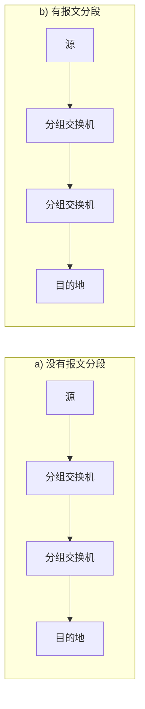

**复习题 (Review Questions):**

R4. HFC 包括哪种接入技术。将它们分类为住宅接入、公司接入或广域无线接入。

R11. 假定在主机和接收主机间只有一台分组交换机。发送主机和交换机间以及交换机和接收主机间的传输速率分别是 $R_s$ 和 $R_r$。假定该分组交换机使用存储转发分组交换方式，发送一个长度为 $L$ 的分组的端到端延迟是多少？(忽略排队延迟、传播延迟和处理延迟。)

R18. 什么导致网络核心有两种不同的主要功能？

R23. 因特网协议栈中的 5 个层次都有哪些？在这些层次中，每层的主要任务是什么？

R25. 路由器处理因特网协议栈中的哪些层次？链路层交换机处理的是那些层次？主机处理的是那些层次？

**习题 (Problems):**

P5. 假定某旅行队行驶在一条长为 100km 的公路上，起始于收费站 A，终止于收费站 B。旅行队包括 10 辆汽车，每辆汽车长 5 米。在一条直道上，车队中的汽车首尾相接，排成一列。旅行队以恒定的 100km/h 的速率行驶。
a. 假定旅行队旅行 150km；在一个收费站前就开始，通过第二个收费站，并且正好在第三个收费站后面结束。计算端到端延迟是多少？
b. 重复 (a)，现在假定车队中有 8 辆汽车而不是 10 辆。

P6. 这个习题开始探讨排队延迟和传输延迟。这是数据网络中的两个重要概念。考虑两台主机 A 和 B 由一条速率为 $R$ bps 的链路相连。假定这两台主机相隔 $m$ 米，沿该链路的传播速率为 $s$ m/s。主机 A 向主机 B 发送长度为 $L$ 比特的分组。
a. 用 $m$ 和 $s$ 来表示传播延迟 $d_{prop}$。
b. 用 $L$ 和 $R$ 来确定该分组的传输时间 $d_{trans}$。
c. 忽略处理和排队延迟，得出端到端延迟的表达式。
d. 假定主机 A 在时刻 $t=0$ 开始传输该分组。在时刻 $t=d_{trans}$，该分组的最后一个比特在什么地方？
e. 假定 $d_{prop} > d_{trans}$。在时刻 $t=d_{trans}$，该分组的第一个比特在何处？
f. 假定 $d_{prop} < d_{trans}$。在时刻 $t=d_{trans}$，该分组的第一个比特在何处？
g. 假定 $s=2.5 \times 10^8$, $L=120$ 比特, $R=56$ kbps。求出 $d_{prop}$, $d_{trans}$ 以及端到端延迟。

P10. 考虑一个长度为 $L$ 的分组从源系统 A 开始，经 3 段链路传送到目的端系统。令 $d_{proc,i}, d_{q,i}, d_{trans,i}$ 和 $d_{prop,i}$ 分别表示链路 $i$ 的处理延迟、排队延迟、传输延迟和传播延迟，其中 $i=1, 2, 3$。假定对每一个分组，交换机 $i$ (连接链路 $i$ 和链路 $i+1$) 的排队延迟是 $d_{q,i}$。因此，$d_{q,1}$ 是在第一台交换机上的排队延迟，$d_{q,2}$ 是在第二台交换机上的排队延迟。假定 $d_{proc,i}=0$, $d_{prop,i}=0$ (对所有 $i$)。假定第一个比特在 $t=0$ 时从源主机发出。
a. 在传输第一个分组时，第二个交换机什么时刻能收到第一个比特？
b. 假定对后续分组来说，$d_q=0$。第一个分组的端到端延迟是多少？
c. 假定对后续分组来说，$d_{q,1} = 10$ms。第二个分组的端到端延迟是多少？

P11. 在上述习题中，假定 $R_1=R_2=R_3=R$ 且 $d_{proc}=0$。进一步假定该分组交换机不存储转发分组，而是在等待分组到达前立即传输它收到的每个比特。这时端到端延迟为多少？

P20. 考虑对应于图 1-20b 的吞吐量的例子。现在假定有 $M$ 对客户-服务器而不是 10 对。用 $R_s$, $R_c$ 和 $R$ 分别表示服务器链路、客户链路和网络链路的速率。假定所有的其他链路都有充足容量，并且除了由这 $M$ 对客户-服务器产生的流量外，网络中没有其他流量。推导出由 $R_s$, $R_c$, $R$ 和 $M$ 表示的通用吞吐量表达式。
*（注：题目中提到的图 1-20b 未在提供的图片中。）*

P21. 考虑图 1-19b。现在假定在服务器和客户之间有 $M$ 条路径。任两条路径都不共享任何链路。路径 $k (k=1, ..., M)$ 由传输速率为 $R_{k,1}, R_{k,2}, ..., R_{k,N_k}$ 的 $N_k$ 条链路组成。如果服务器仅仅使用一条路径向客户发送数据，则该服务器能够取得的最大吞吐量是多少？如果该服务器使用所有 $M$ 条路径发送数据，则该服务器能够取得的最大吞吐量是多少？
*（注：题目中提到的图 1-19b 未在提供的图片中。）*

P31. 在包括因特网的现代分组交换网中，源主机将长应用层报文 (如一个图像或音乐文件) 分为较小的分组的分组并向网络发送。接收方则将这些分组重新装配为初始报文。我们称这个过程为报文分段。图 1-27 显示了一个报文在报文不分段或报文分段情况下的端到端传输。考虑一个长度为 $8 \times 10^6$ 比特的报文，它在图 1-27 中从源发送到目的。假定在该图中的每段链路都是 2Mbps。忽略传播、排队和处理时延。

图 1-27 示意图如下：

a. 考虑从源到目的发送该报文且没有报文分段。从源主机到第一台分组交换机移动报文需要多长时间？记住，每台交换机均使用存储转发分组交换，从源主机移动该报文到目的主机需要多长时间？
b. 现在假定该报文被分段为 800 个分组，每个分组 10 000 比特长。从源主机移动第一个分组到第一台交换机需要多长时间？从第一台交换机发送第一个分组到第二台交换机，从源主机发送第二个分组到第一台交换机各需要多长时间？什么时候第二个分组能被第一台交换机全部收到？
c. 当进行报文分段时，从源主机向目的主机移动该文件需要多长时间？将该结果与 (a) 的答案进行比较并解释之。
d. 除了减小时延外，使用报文分段还有什么原因？
e. 讨论报文分段的缺点。

---

**R 分组**

R5. 运行在一台主机上的一个进程，使用什么信息来标识运行在另一台主机上的进程？

R11. 为什么 HTTP、SMTP 及 POP3 都运行在 TCP，而不是 UDP 上？

R13. 描述 Web 缓存器是如何减少接收请求对象的时延的。Web 缓存器将减少一个用户请求的所有对象或是其中的某些对象的时延吗？为什么？

**P 分组**

P7. 假定你在浏览器中点击一条超链接获得 Web 页面。相关联的 URL 的 IP 地址没有缓存在本地主机上，因此必须使用 DNS lookup 以获得该 IP 地址。如果主机从 DNS 得到 IP 地址之前已经访问了 $n$ 个 DNS 服务器；相继产生的 RTT 依次为 $\text{RTT}_1$、……、$\text{RTT}_n$。进一步假定与链路相关的 Web 页面只包含一个对象，即由少量的 HTML 文本组成。令 $\text{RTT}_0$ 表示本地主机和包含对象的服务器之间的 RTT 值。假定该对象传输时间为零，则从该客户点击该超链接到它接收到该对象需要多长时间？

P8. 参照习题 P7，假定在同一服务器上某 HTML 文件引用了 8 个非常小的对象。忽略发送时间，在下列情况下需要多长时间：
a. 没有并行 TCP 连接的非持续 HTTP。
b. 配置有 5 个并行连接的非持续 HTTP。
c. 持续 HTTP。

---

好的，根据您提供的要求，提取的题目如下：

**R 分组**

R3. 考虑在主机 A 和主机 B 之间有一条 TCP 连接。假设从主机 A 传送到达主机 B 的 TCP 报文段具有源端口号 x 和目的端口号 y。对于从主机 B 传送到达主机 A 的报文段，源端口号和目的端口号分别是多少？

R4. 描述应用程序开发人员为何可能选择在 UDP 上运行应用程序而不是在 TCP 上运行的原因。

R5. 在今天的因特网中，为什么语音和图像流量常常是经过 TCP 而不是经 UDP 发送的？（提示：我们寻找的答案与 TCP 的拥塞控制机制没有关系。）

R7. 假定在主机 C 上有一个进程具有一个端口号 6789 的 UDP 套接字。假定主机 A 和主机 B 都用目的端口号 6789 向主机 C 发送一个 UDP 报文段。这两个主机的这些报文段在主机 C 都被描述为相同的套接字吗？如果说是这样的话，在主机 C 的该进程将怎样知道源于两台不同主机的这两个报文段？

R8. 假定在主机 C 端口 80 上运行一个 Web 服务器。假定这个 Web 服务器使用持续连接，并且正在接收来自两台不同主机 A 和 B 的请求。被发送的所有请求都通过位于主机 C 的相同套接字吗？如果它们通过不同的套接字传递，这两个套接字都具有端口 80 吗？讨论和解释之。

R11. 为什么 HTTP、SMTP 及 POP3 都运行在 TCP，而不是 UDP 上？

R13. 描述 Web 缓存器是如何减少接收请求对象的时延的。Web 缓存器将减少一个用户请求的所有对象或是其中的某些对象的时延吗？为什么？

R15. 假设主机 A 通过一条 TCP 连接向主机 B 发送两个紧接着的 TCP 报文段。第一个报文段的序号为 90，第二个报文段序号为 110。
a. 第一个报文段中有多少数据？
b. 假设第一个报文段丢失而第二个报文段到达主机 B。那么在主机 B 发往主机 A 的确认报文中，确认号应该会是多少？

**P 分组**

P1. 假定客户 A 向服务器 S 发起一个 Telnet 会话。与此同时，客户 B 也向服务器 S 发起一个 Telnet 会话。给出下面报文段的源端口号和目的端口号：
a. 从 A 向 S 发送的报文段。
b. 从 B 向 S 发送的报文段。
c. 从 S 向 A 发送的报文段。
d. 从 S 向 B 发送的报文段。
e. 如果 A 和 B 是不同的主机，那么从 A 向 S 发送的报文段的源端口号是否可能与从 B 向 S 发送的报文段的源端口号相同？
f. 如果它们是同一台主机，情况会怎么样？

P7. 假定你在浏览器中点击一条超链接获得 Web 页面。相关联的 URL 的 IP 地址没有缓存在本地主机上，因此必须使用 DNS lookup 以获得该 IP 地址。如果主机从 DNS 得到 IP 地址之前已经访问了 $n$ 个 DNS 服务器；相继产生的 RTT 依次为 $\text{RTT}_1$、……、$\text{RTT}_n$。进一步假定与链路相关的 Web 页面只包含一个对象，即由少量的 HTML 文本组成。令 $\text{RTT}_0$ 表示本地主机和包含对象的服务器之间的 RTT 值。假定该对象传输时间为零，则从该客户点击该超链接到它接收到该对象需要多长时间？

P8. 参照习题 P7，假定在同一服务器上某 HTML 文件引用了 8 个非常小的对象。忽略发送时间，在下列情况下需要多长时间：
a. 没有并行 TCP 连接的非持续 HTTP。
b. 配置有 5 个并行连接的非持续 HTTP。
c. 持续 HTTP。

P22. 考虑一个 GBN 协议，其发送窗口为 4，序号范围为 1024。假定在时刻 $t$，接收方期待的下一个有序组的序号是 $k$。假设媒体不会对报文重新排序。回答以下问题：
a. 在 $t$ 时刻，发送方窗口内的报文段序号可能有多少？论证你的回答。
b. 在 $t$ 时刻，在当前传播发送方的所有可能报文中，ACK 字段的有序可能有多少？论证你的回答。

P26. 考虑主机 A 向主机 B 传输一长度为 L，传输速率为 R bps 的大文件。假设 MSS 为 536 字节。
a. 为了使得 TCP 序号不至于用完，L 的最大值是多少？前面讲过 TCP 的序号字段为 4 字节。
b. 对于你在 (a) 中得到的 L，求出传输此文件要用多长时间？假定运输层、网络层和数据链路层首部总共为 66 字节，并加在每个报文段上，然后经 155 Mbps 链路发送得到的分组。忽略流量控制和拥塞控制，使主机 A 能够一个接一个地连续不断地发送这些报文段。

P27. 主机 A 和 B 经一条 TCP 连接通信，并且主机 B 已经收到了来自 A 的最长为 126 字节的所有字节。假定主机 A 随后向主机 B 发送两个紧接着的报文段。第一个和第二个报文段分别包含了 80 字节和 40 字节的数据。在第一个报文段中，序号是 127，源端口号是 302，目的端口号是 80。无论何时主机 B 接收到来自主机 A 的报文段，它都会发送确认。
a. 在从主机 A 发往 B 的第二个报文段中，序号、源端口号和目的端口号各是什么？
b. 如果第一个报文段在第二个报文段之前到达，在第一个到达报文段的确认中，确认号、源端口号和目的端口号各是什么？
c. 如果第二个报文段在第一个报文段之前到达，在第一个到达报文段的确认中，确认号是什么？
d. 假定由 A 发送的两个报文段按序到达 B。第一个报文段丢失而第二个报文段在一个很短时间之后到达。画出时序图，显示这些报文段和发送的所有其他报文段和确认。（假设没有其他分组丢失。） 对于图上每个报文段、标出序号和数据的字节数量；对于你增加的每个应答，标出确认号。

---

**R 分组**

R3. 我们对网络层执行的转发功能和路由选择功能进行区别。路由选择和转发的主要区别是什么？

R6. 在 4.2 节中，我们看到路由器通常由输入端口、输出端口、交换结构和路由选择处理器组成。其中哪些是用硬件实现的，哪些是用软件实现的？为什么？转到网络层的数据平面和控制平面的概念，哪些是用硬件实现的，哪些是用软件实现的？为什么？

R24. 假设在一个源主机和一个目的主机之间有 3 台路由器。不考虑分片，一个从源主机发送给目的主机的 IP 数据报将通过多少个接口？为了将数据报从源移动到目的地需要检索多少个转发表？

R25. 假设某应用每 20ms 生成一个 40 字节的数据块，每块封装在一个 TCP 报文段中，TCP 报文段再封装在一个 IP 数据报中。每个数据报的开销有多大？应用数据所占百分比是多少？

R29. 什么是专用网络地址？具有专用网络地址的数据报会出现在大型公共因特网中吗？解释理由。

**P 分组**

P6. 考虑使用 8 比特主机地址的某数据网络。假定一台路由器使用最长前缀匹配并具有下列转发表：

| 前缀匹配 | 接口  |
| :--- | :-- |
| 00   | 0   |
| 010  | 1   |
| 011  | 2   |
| 10   | 2   |
| 11   | 3   |

对这 4 个接口中的每个，给出给定的目的主机地址的范围和在该范围中的地址数量。

P8. 考虑互联网 3 个子网（子网 1、子网 2 和子网 3）的一台路由器。假定这 3 个子网的所有接口要求具有前缀 223.1.17/24。假定子网 1 要求支持多达 60 个接口，子网 2 要求支持多达 90 个接口，子网 3 要求支持多达 12 个接口。提供 3 个满足这些限制的网络地址（形式为 a.b.c.d/x）。

P9. 在 4.2.2 节中给出了一个转发表（使用最长前缀匹配）的例子。使用 a.b.c.d/x 记法代替二进制字符串记法，重写该转发表。

P11. 考虑一个具有前缀 128.119.40.128/26 的子网。给出能被分配给该网络的一个 IP 地址（形式为 xxx.xxx.xxx.xxx）的例子。（假定一个 ISP 拥有形式为 128.119.40.64/26 的地址块。假定它要从该地址块生成 4 个子网，每个子网具有相同数量的 IP 地址。这 4 个子网（形式为 a.b.c.d/x）的前缀是什么？

P15. 假定在源主机 A 和目的主机 B 之间的数据报被限制为 1500 字节（包括首部）。假设 IP 首部为 20 字节，要发送一个 5MB 的 MP3 文件需要多少个数据报？解释你的答案是如何计算的。

P16. 考虑在图 4-25 中建立的网络。假定 ISP 现在为路由器分配地址 24.34.112.235，家庭网络的网络地址是 192.168.1.24/24。
a. 在家庭网络中为所有接口分配地址。
b. 假定每台主机具有两个进行中的 TCP 连接，所有都是针对主机 128.119.40.86 的 80 端口的。在 NAT 转换表中提供 6 个对应项。